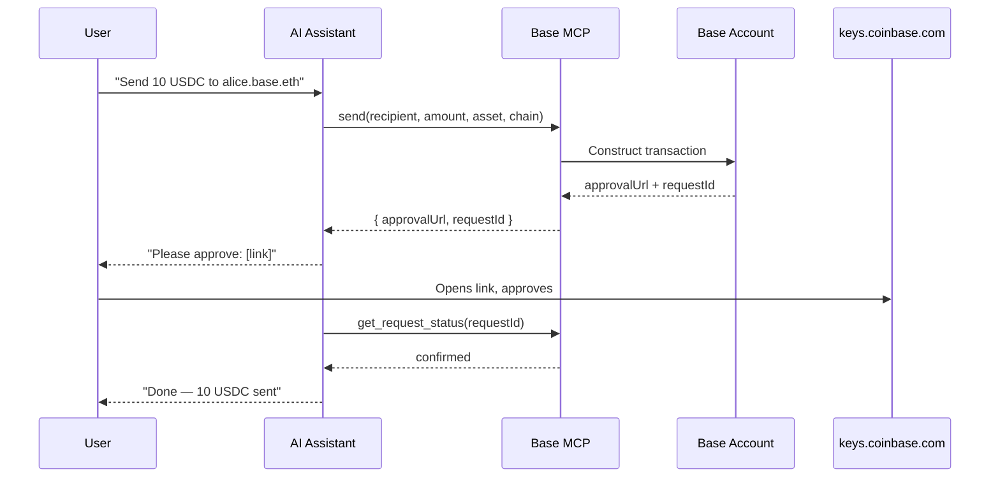

import { WalletSetupDemo } from "/snippets/WalletSetupDemo.jsx"

Base MCP gives your AI assistant direct access to your [Base Account](https://base.org/account) — a smart wallet on Base. Connect once and your assistant can check balances, send funds, swap tokens, and sign messages. Every transaction requires your approval.

## Demo

<WalletSetupDemo />

## How it works

## What you can do

<CardGroup cols={2}>
  <Card title="Check balances" icon="wallet">
    View your portfolio, token balances, and transaction history across any address on Base.
  </Card>
  <Card title="Send & receive" icon="paper-plane">
    Send ETH or any ERC-20 token to addresses, ENS names, basenames, and cb.id names.
  </Card>
  <Card title="Swap tokens" icon="arrows-rotate">
    Swap between any tokens via the Coinbase swap service directly from your assistant.
  </Card>
  <Card title="Sign messages" icon="pen">
    Sign EIP-712 typed data and personal messages for authentication and protocol interactions.
  </Card>
</CardGroup>

## Get started

<CardGroup cols={2}>
  <Card title="Quickstart" icon="bolt" href="/ai-agents/quickstart">
    Connect mcp.base.org to your AI assistant in under 2 minutes.
  </Card>
  <Card title="Guides" icon="book-open" href="/ai-agents/guides">
    Step-by-step guides for sending, swapping, checking balance, and more.
  </Card>
  <Card title="Plugins" icon="puzzle-piece" href="/ai-agents/plugins/morpho">
    Extend with protocol plugins like Morpho for lending and vaults.
  </Card>
  <Card title="Skills" icon="graduation-cap" href="/ai-agents/skills">
    Install the base-mcp skill to give your coding assistant deep context on MCP tools.
  </Card>
</CardGroup>
