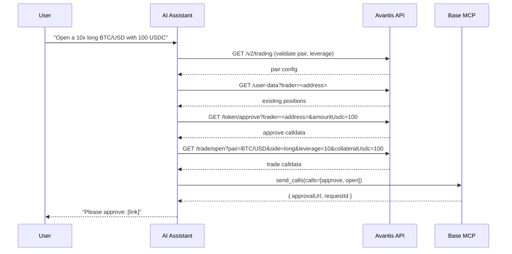

import { TradeExecutionDemo } from "/snippets/TradeExecutionDemo.jsx"

[Avantis](https://avantisfi.com) is a perpetual futures DEX on Base mainnet. Your assistant uses `web_request` to fetch unsigned calldata from the Avantis tx-builder, then executes via Base MCP's `send_calls` — no additional MCP server required.

## Demo

<TradeExecutionDemo />

## How it works

Avantis prepares the trade calldata. Your Base Account handles signing.



<Note>
The following domains must be in the Base MCP `web_request` allowlist: `tx-builder.avantisfi.com`, `data.avantisfi.com`, `core.avantisfi.com`, and `api.avantisfi.com`. No API key is required.
</Note>

## API services

| Service | Base URL | Purpose |
|---------|----------|---------|
| tx-builder | `https://tx-builder.avantisfi.com` | Unsigned calldata for all trade actions |
| data | `https://data.avantisfi.com/v2/trading` | Pair configs, leverage rules, open interest |
| core | `https://core.avantisfi.com` | Live positions and limit orders |
| history | `https://api.avantisfi.com` | Trade history, PnL, referral stats |

## Example prompts

**Open a long position:**
```text
Open a 10x long BTC/USD position with 100 USDC on Avantis
```

**Check positions:**
```text
Show my open Avantis positions on Base
```

**Close a position:**
```text
Close my BTC/USD long on Avantis
```

**Set take profit and stop loss:**
```text
Set take profit at $120,000 and stop loss at $80,000 on my BTC/USD position
```

## Orchestration pattern

<Steps>
  <Step title="Validate pair and leverage">
    Call `GET https://data.avantisfi.com/v2/trading` to confirm the pair is listed, leverage is within range, and the position size meets the minimum notional (`collateralUsdc × leverage ≥ pairMinLevPosUSDC`).
  </Step>
  <Step title="Check existing positions">
    Call `GET https://core.avantisfi.com/user-data?trader=<address>` to see live positions and limit orders. Use the real `index` values from this response for any management actions.
  </Step>
  <Step title="Approve USDC">
    Call `GET https://tx-builder.avantisfi.com/token/approve?trader=<address>&amountUsdc=<amount>` to get approval calldata.
  </Step>
  <Step title="Prepare trade calldata">
    Call the relevant tx-builder endpoint for the desired action.
  </Step>
  <Step title="Execute via Base Account">
    Batch approval and trade calls into a single `send_calls` call. You'll get an `approvalUrl`.
  </Step>
</Steps>

## Trade operations

All tx-builder responses use the shape `{ ok, data: { to, value, data, chainId } }`. Map `data.to`, `data.value`, and `data.data` to a call object in `send_calls`.

| Action | Endpoint |
|--------|---------|
| Open position | `GET /trade/open?trader=&pair=BTC/USD&side=long&orderType=market&collateralUsdc=100&leverage=10` |
| Close position | `GET /trade/close?trader=&pairIndex=&tradeIndex=` |
| Cancel limit order | `GET /trade/cancel?trader=&pairIndex=&tradeIndex=` |
| Deposit/withdraw margin | `GET /margin/update?trader=&pairIndex=&tradeIndex=&action=deposit&collateralUsdc=10` |
| Set TP/SL | `GET /tpsl/update?trader=&pairIndex=&tradeIndex=&takeProfit=120000&stopLoss=80000` |
| Approve USDC | `GET /token/approve?trader=&amountUsdc=100` |

<Note>
Always read `core /user-data` before any management action (close, cancel, margin, TP/SL). The tx-builder can encode calldata for a non-existent index without error — verify the position exists first.
</Note>

## Related

<CardGroup cols={2}>
  <Card title="Execute contract calls" icon="code" href="/ai-agents/guides/batch-calls">
    Full guide to `send_calls` and batching protocol interactions.
  </Card>
  <Card title="Avantis docs" icon="arrow-up-right" href="https://avantisfi.com">
    Full Avantis protocol documentation.
  </Card>
</CardGroup>
