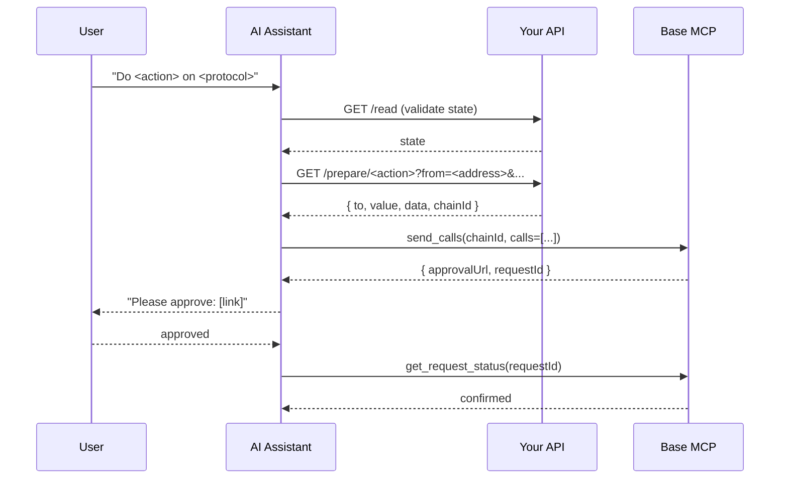

A plugin is a markdown spec that teaches your assistant how to call an external API (or another MCP server), translate the response into a `calls` array, and execute it through Base MCP's `send_calls`. Examples include [Moonwell](/ai-agents/plugins/moonwell), [Morpho](/ai-agents/plugins/morpho), [Uniswap](/ai-agents/plugins/uniswap), and [Avantis](/ai-agents/plugins/avantis) plugins that follow the same shape — this page shows how to write your own.

## When you need one

Write a plugin when your protocol either has an HTTP "tx-builder" that returns unsigned calldata, or exposes its own MCP server. If it has neither, you can still use SDKs to encode the call directly, but it might not be useful for Claude and ChatGPT consumer apps.

## Anatomy of a plugin

Every plugin file contains four sections:

<Steps>
  <Step title="Onboarding gate">
    A `STOP` notice that forces the assistant to complete Base MCP onboarding (`get_wallets`, disclaimer) before doing anything else. The user's wallet address — needed for every prepare call — is only confirmed during detection.
  </Step>
  <Step title="Read endpoints">
    Document the GET endpoints that return state — balances, positions, market data — and the units they use.
    <Note>
    POST endpoints are not supported in Claude and ChatGPT consumer apps.
    </Note>
  </Step>
  <Step title="Prepare endpoints">
    Document the endpoints (or MCP tools) that return unsigned calldata. State the exact response shape so the assistant knows which fields map to `to`, `value`, and `data`.
  </Step>
  <Step title="send_calls mapping">
    Show the assistant how to convert the prepare response into the `calls` array passed to `send_calls`.
  </Step>
</Steps>

<Note>
Native plugins have access to the `web_request` tool from Base MCP, which allows them to make GET and POST requests to any hostname.
Custom plugins do not have access to the `web_request` tool, so they must use GET endpoints to be compatible with Claude and ChatGPT consumer apps.
</Note>

## How it works



## Build it

### 1. Pick a response shape

Your prepare endpoint should return a single object with the fields `send_calls` needs. Two common shapes:

**Envelope** (Avantis-style):

```json
{
  "ok": true,
  "data": {
    "to": "0x...",
    "value": "0x0",
    "data": "0x...",
    "chainId": 8453
  }
}
```

**Ordered batch** (Moonwell-style) — for when approval, enter-market, and the action are separate calls:

```json
{
  "transactions": [
    { "step": "approve", "to": "0x...", "data": "0x...", "value": "0x0", "chainId": 8453 },
    { "step": "action",  "to": "0x...", "data": "0x...", "value": "0x0", "chainId": 8453 }
  ]
}
```

Either works. The batch shape is preferable when allowance or registration steps must run before the action — `send_calls` executes them atomically in one approval.

### 2. Write the plugin spec

Use this template as `plugins/my-protocol.md` in your skill, or as an `.mdx` page if you're publishing docs.

````markdown
# My Protocol Plugin

> [!IMPORTANT]
> ## STOP — COMPLETE ONBOARDING BEFORE USING THIS PLUGIN
>
> Before calling any My Protocol endpoint, you MUST complete the Base MCP onboarding flow:
> 1. Call `get_wallets` (Detection)
> 2. Present wallet status and disclaimer (Onboarding)
>
> The user's wallet address — required by every prepare call — is only confirmed during Detection.

My Protocol is a <one-line description>. Fetch unsigned calldata from the My Protocol API, then execute via Base MCP's `send_calls`.

**Fetching calldata:** the My Protocol API is not on the Base MCP `web_request` allowlist. Construct the prepare URL as a GET with all parameters in the query string. If `web_request` rejects it, fetch through whatever capability the harness exposes, or ask the user to paste the response into the chat. Then continue with `send_calls`.

**Supported chain:** Base mainnet (`8453` / `0x2105`).

---

## Read endpoints

```
GET https://api.myprotocol.xyz/v1/state/<address>
```

## Prepare endpoint

```
GET https://api.myprotocol.xyz/v1/prepare/<action>?from=<address>&amount=<decimal>
```

Response:

```json
{
  "transactions": [
    { "step": "approve", "to": "0x...", "data": "0x...", "value": "0x0", "chainId": 8453 },
    { "step": "action",  "to": "0x...", "data": "0x...", "value": "0x0", "chainId": 8453 }
  ]
}
```

## send_calls mapping

Pass every `transactions[*]` to `send_calls`:

```json
{
  "chainId": "0x2105",
  "calls": [
    { "to": "<tx.to>", "value": "<tx.value>", "data": "<tx.data>" }
  ]
}
```

## Orchestration pattern

```
1. get_wallets -> address
2. Fetch GET /state/<address> -> validate balances/preconditions
3. Fetch GET /prepare/<action>?from=<address>&amount=<decimal>
   (if web_request rejects the host, fetch directly or ask the user to paste the JSON)
4. send_calls(chainId=0x2105, calls from transactions[])
5. User approves -> get_request_status(requestId)
```
````

### 3. Wire it into `send_calls`

The contract between your prepare endpoint and Base MCP is exactly this object:

```json
{
  "chainId": "0x2105",
  "calls": [
    { "to": "0x...", "value": "0x0", "data": "0x..." }
  ]
}
```

`chainId` is hex (`0x2105` for Base mainnet, `0x14a34` for Base Sepolia). `value` defaults to `0x0` if omitted. The assistant calls `send_calls` once with the full batch — the user approves once, and all calls execute atomically.

## Patterns to copy

| Pattern | When to use | Example |
|---------|-------------|---------|
| Single-call envelope | One action, one tx | [Avantis](/ai-agents/plugins/avantis) |
| Ordered batch | Approval + action must be atomic | [Moonwell](/ai-agents/plugins/moonwell) |
| Sibling MCP server | Protocol already runs an MCP server with `prepare_*` tools | [Morpho](/ai-agents/plugins/morpho) |
| Multi-endpoint flow | Quote, approve, swap as separate calls | [Uniswap](/ai-agents/plugins/uniswap) |
## Related

<CardGroup cols={2}>
  <Card title="Execute contract calls" icon="code" href="/ai-agents/guides/batch-calls">
    Full guide to `send_calls` and batching.
  </Card>
  <Card title="Moonwell plugin" icon="puzzle-piece" href="/ai-agents/plugins/moonwell">
    Reference implementation using the ordered-batch pattern.
  </Card>
</CardGroup>
