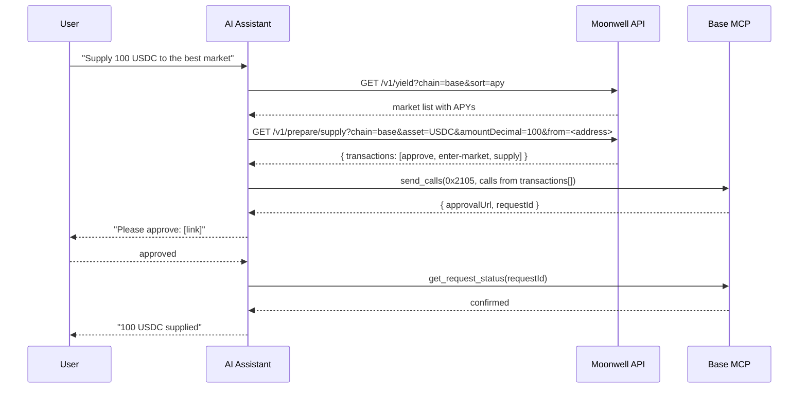

import { AgentPaymentDemo } from "/snippets/AgentPaymentDemo.jsx"

[Moonwell](https://moonwell.fi) is a Compound v2 lending protocol on Base and Optimism. Your assistant uses `web_request` to call the Moonwell HTTP API and prepare unsigned calldata, then executes via Base MCP's `send_calls` — no additional MCP server required.

## Demo

<AgentPaymentDemo />

## How it works

Moonwell handles the protocol layer. Your Base Account handles signing.



<Note>
`api.moonwell.fi` must be in the Base MCP `web_request` allowlist. If requests are rejected, inform the user that this hostname is not yet whitelisted on this MCP instance.
</Note>

## Supported chains

Base (8453) and Optimism (10).

## Install

No additional MCP server is required. Ensure `api.moonwell.fi` is allowlisted in your Base MCP config, then use Base MCP alone:

<Tabs>
  <Tab title="Claude Desktop">
    ```json claude_desktop_config.json
    {
      "mcpServers": {
        "base": {
          "url": "https://mcp.base.org"
        }
      }
    }
    ```
  </Tab>
  <Tab title="Claude Code">
    ```bash Terminal
    claude mcp add --transport http base https://mcp.base.org
    ```
  </Tab>
  <Tab title="Codex">
    ```toml codex.toml
    [mcp_servers.base]
    url = "https://mcp.base.org/"
    ```
  </Tab>
</Tabs>

## Read endpoints

```text
GET https://api.moonwell.fi/v1/markets?chain=base
GET https://api.moonwell.fi/v1/markets/USDC?chain=base
GET https://api.moonwell.fi/v1/yield?chain=base&sort=apy&min-tvl=1000000&limit=5
GET https://api.moonwell.fi/v1/positions/<address>?chain=base&active=true
GET https://api.moonwell.fi/v1/health/<address>?chain=base
GET https://api.moonwell.fi/v1/rewards/<address>?chain=base
GET https://api.moonwell.fi/v1/token-balance/<address>?chain=base&asset=USDC
```

Market reads are edge-cached for 30 seconds. Position, health, and balance reads are never cached.

## Prepare endpoints

All write operations go through prepare endpoints that return ordered, unsigned transactions.

```text
GET https://api.moonwell.fi/v1/prepare/supply?chain=base&asset=USDC&amountDecimal=100&from=<address>
GET https://api.moonwell.fi/v1/prepare/withdraw?chain=base&asset=USDC&amountDecimal=100&from=<address>
GET https://api.moonwell.fi/v1/prepare/borrow?chain=base&asset=USDC&amountDecimal=50&from=<address>
GET https://api.moonwell.fi/v1/prepare/repay?chain=base&asset=USDC&amountDecimal=50&from=<address>
```

### Response → send_calls mapping

```json
{
  "data": {
    "transactions": [
      { "step": "approve",         "to": "0x...", "data": "0x...", "value": "0x0", "chainId": 8453 },
      { "step": "enter-market",    "to": "0x...", "data": "0x...", "value": "0x0", "chainId": 8453 },
      { "step": "moonwell-supply", "to": "0x...", "data": "0x...", "value": "0x0", "chainId": 8453 }
    ]
  }
}
```

Pass all items as the `calls` array to `send_calls`, using `0x2105` as `chainId` for Base mainnet.

## Example prompts

**Supply USDC:**
```text
Find the best USDC market on Base by APY and supply 100 USDC
```

**Borrow against collateral:**
```text
Borrow 500 USDC against my collateral on Moonwell
```

**Check positions:**
```text
Show all my active Moonwell positions on Base
```

**Check health:**
```text
What's my Moonwell health factor?
```

**Repay:**
```text
Repay all my Moonwell USDC debt
```

## Orchestration pattern

<Steps>
  <Step title="Read (optional)">
    Use `/v1/yield` to find the best market by APY. Use `/v1/positions/<address>?active=true` to see existing positions.
  </Step>
  <Step title="Check health (for borrows)">
    Call `/v1/health/<address>` before borrowing. Proceed only when the health factor is above 1.5.
  </Step>
  <Step title="Prepare">
    Call the prepare endpoint. Moonwell returns an ordered `transactions[]` array including any required approvals.
  </Step>
  <Step title="Execute via Base Account">
    Pass all transactions as the `calls` array to `send_calls`. You'll get an `approvalUrl`.
  </Step>
  <Step title="Approve and confirm">
    Open the `approvalUrl`, approve the transaction, then your assistant polls `get_request_status`.
  </Step>
</Steps>

## Health factor guide

| Value | Status |
|-------|--------|
| `> 1.5` | Healthy |
| `1.1 – 1.5` | Caution |
| `< 1.1` | Liquidation risk |
| `null` | No borrows |

## Related

<CardGroup cols={2}>
  <Card title="Execute contract calls" icon="code" href="/ai-agents/guides/batch-calls">
    Full guide to `send_calls` and batching protocol interactions.
  </Card>
  <Card title="Moonwell docs" icon="arrow-up-right" href="https://moonwell.fi/docs">
    Full Moonwell protocol documentation.
  </Card>
</CardGroup>
