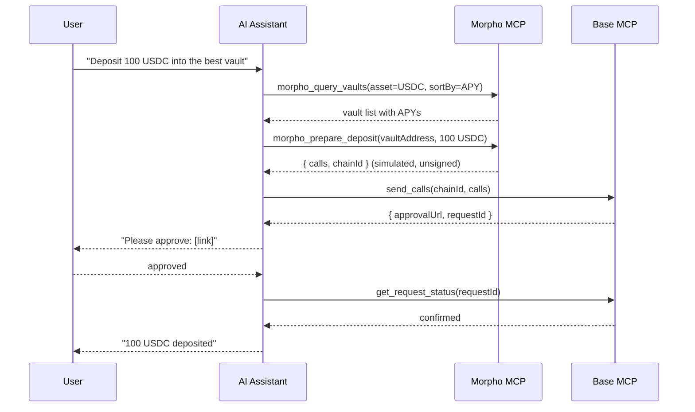

import { AcceptingPaymentsDemo } from "/snippets/AcceptingPaymentsDemo.jsx"

[Morpho](https://morpho.org) is a lending protocol on Base. The Morpho MCP server gives your assistant tools to query vaults, check markets, and prepare lending operations — which are then signed and sent through Base MCP.

## Demo

<AcceptingPaymentsDemo />

## How it works

Morpho handles the protocol layer. Your Base Account handles signing.



<Note>
Morpho's `prepare_*` tools simulate the transaction before returning. Review the simulation output before approving — it shows expected state changes, health factors, and any warnings.
</Note>

## Install

Add both MCPs to your assistant:

<Tabs>
  <Tab title="Claude Desktop">
    ```json claude_desktop_config.json
    {
      "mcpServers": {
        "base": {
          "url": "https://mcp.base.org"
        },
        "morpho": {
          "url": "https://mcp.morpho.org/"
        }
      }
    }
    ```
  </Tab>
  <Tab title="Claude Code">
    ```bash Terminal
    claude mcp add --transport http base https://mcp.base.org
    claude mcp add morpho --transport http https://mcp.morpho.org/
    ```
  </Tab>
  <Tab title="Codex">
    ```toml codex.toml
    [mcp_servers.base]
    url = "https://mcp.base.org/"

    [mcp_servers.morpho]
    url = "https://mcp.morpho.org/"
    ```
  </Tab>
  <Tab title="Cursor / VS Code / Windsurf">
    Add a second entry alongside `base` in your MCP config:

    ```json
    {
      "mcpServers": {
        "base": { "url": "https://mcp.base.org" },
        "morpho": { "url": "https://mcp.morpho.org/" }
      }
    }
    ```
  </Tab>
</Tabs>

## Morpho tools

17 tools across read, write (prepare), and simulate.

### Read

| Tool | What it does |
|------|-------------|
| `morpho_health_check` | Check server connectivity |
| `morpho_get_supported_chains` | List supported chains |
| `morpho_query_vaults` | List vaults with filtering and sorting |
| `morpho_get_vault` | Details for a specific vault |
| `morpho_query_markets` | List markets with filtering |
| `morpho_get_market` | Details for a specific market |
| `morpho_get_positions` | All positions for an address (vaults + markets) |
| `morpho_get_token_balance` | Token balance and approval state |

### Prepare (write via `send_calls`)

These tools return unsigned call data. Pass the result to Base MCP's `send_calls` to execute.

| Tool | What it does |
|------|-------------|
| `morpho_prepare_deposit` | Prepare vault deposit with token approvals |
| `morpho_prepare_withdraw` | Prepare vault withdrawal (supports max) |
| `morpho_prepare_supply` | Prepare market supply with approvals |
| `morpho_prepare_borrow` | Prepare market borrow with health check |
| `morpho_prepare_repay` | Prepare market repay (supports max) |
| `morpho_prepare_supply_collateral` | Supply collateral to a market |
| `morpho_prepare_withdraw_collateral` | Withdraw collateral with health check |

### Simulate

| Tool | What it does |
|------|-------------|
| `morpho_simulate_transactions` | Simulate transactions with post-state analysis |

## Example prompts

**Deposit into a vault:**
```text
Find the best USDC vault on Base by APY and deposit 100 USDC
```

**Check positions:**
```text
Show all my Morpho positions on Base
```

**Borrow against collateral:**
```text
Supply 1 ETH as collateral on Morpho and borrow 2000 USDC
```

**Check health:**
```text
What's my Morpho borrow health factor?
```

**Withdraw:**
```text
Withdraw all my USDC from Morpho vaults
```

## Orchestration pattern

Every Morpho write operation follows the same pattern:

<Steps>
  <Step title="Query (optional)">
    Use a read tool to find the right vault or market: `morpho_query_vaults`, `morpho_get_market`, etc.
  </Step>
  <Step title="Prepare">
    Call a `prepare_*` tool. Morpho simulates the operation and returns `{ calls, chainId }`.
  </Step>
  <Step title="Execute via Base Account">
    Pass `calls` and `chainId` to Base MCP's `send_calls`. You'll get an `approvalUrl`.
  </Step>
  <Step title="Approve and confirm">
    Open the `approvalUrl`, approve the transaction, then your assistant polls `get_request_status`.
  </Step>
</Steps>

## Related

<CardGroup cols={2}>
  <Card title="Execute contract calls" icon="code" href="/ai-agents/guides/batch-calls">
    Full guide to `send_calls` and batching protocol interactions.
  </Card>
  <Card title="Morpho docs" icon="arrow-up-right" href="https://agents.morpho.org">
    Full Morpho MCP documentation and prompt library.
  </Card>
</CardGroup>
