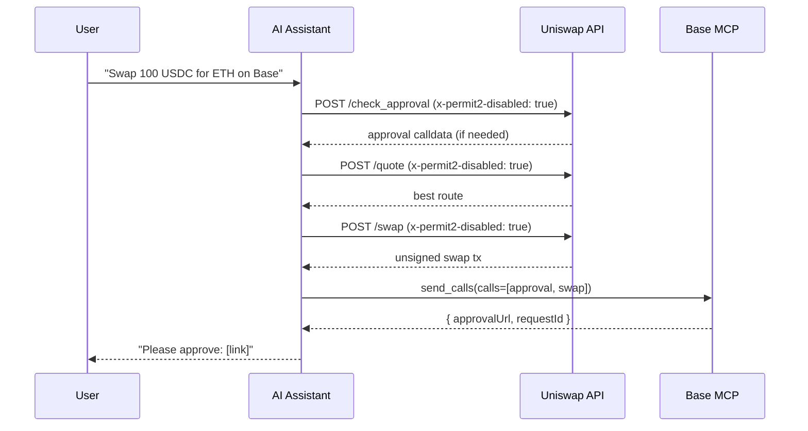

import { TradingQuickstartDemo } from "/snippets/TradingQuickstartDemo.jsx"

[Uniswap](https://uniswap.org) on Base: token swaps using the proxy-approval flow and LP position management for V2, V3, and V4. Your assistant uses `web_request` to fetch unsigned calldata from the Uniswap API, then executes via Base MCP's `send_calls` — no additional MCP server required.

## Demo

<TradingQuickstartDemo />

## How it works

Uniswap API prepares the swap or LP calldata. Your Base Account handles signing.



<Note>
`trade-api.gateway.uniswap.org` and `liquidity.api.uniswap.org` must be in the Base MCP `web_request` allowlist.
</Note>

## Auth headers

Include these headers on all requests:

```json
{
  "Content-Type": "application/json",
  "x-api-key": "NeoYO3V50_koJAipDEalYWbMO1XMaFPAQmpOm6_Npo0"
}
```

For the swap flow, also include `"x-permit2-disabled": "true"` on `/check_approval`, `/quote`, and `/swap`.

## Example prompts

**Swap tokens:**
```text
Swap 100 USDC for ETH on Base
```

**Create an LP position:**
```text
Create a V4 ETH/USDC LP position on Base with 0.1 ETH
```

**Add liquidity:**
```text
Add liquidity to my existing Uniswap V4 ETH/USDC position
```

**Collect fees:**
```text
Collect my Uniswap LP fees on Base
```

**Remove liquidity:**
```text
Remove 50% of my Uniswap V3 liquidity position
```

## Swap flow

Base URL: `https://trade-api.gateway.uniswap.org/v1`

<Steps>
  <Step title="Check approval">
    `POST /check_approval` with `x-permit2-disabled: true`. If `approval` is non-null, include it in the `send_calls` batch.
  </Step>
  <Step title="Get quote">
    `POST /quote` with `x-permit2-disabled: true`. Returns the best route.
  </Step>
  <Step title="Build swap tx">
    `POST /swap` using the quote response as the body. Remove null `permitData`, `permitTransaction`, and `signature` fields before sending.
  </Step>
  <Step title="Execute via Base Account">
    Batch approval (if present) and swap calldata into a single `send_calls` call.
  </Step>
</Steps>

## LP flow

Base URL: `https://liquidity.api.uniswap.org/lp`

<Steps>
  <Step title="Discover pool (V3/V4)">
    `POST /lp/pool_info` to find the pool reference. Required before creating V3/V4 positions.
  </Step>
  <Step title="Check LP approval">
    `POST /lp/check_approval` with `lpTokens` array and the relevant action (`CREATE`, `INCREASE`, `DECREASE`).
  </Step>
  <Step title="Prepare LP operation">
    Call `/lp/create`, `/lp/increase`, `/lp/decrease`, `/lp/claim_fees`, or `/lp/create_classic`.
  </Step>
  <Step title="Execute via Base Account">
    Batch all approval transactions plus the operation transaction into a single `send_calls` call.
  </Step>
</Steps>

## LP operations

| Action | Endpoint |
|--------|---------|
| Create V3/V4 position | `POST /lp/create` |
| Create V2 position | `POST /lp/create_classic` |
| Add liquidity | `POST /lp/increase` |
| Remove liquidity | `POST /lp/decrease` |
| Collect fees | `POST /lp/claim_fees` |

No approval step is needed for fee collection.

## Key addresses on Base

| Token | Address |
|-------|---------|
| Native ETH | `0x0000000000000000000000000000000000000000` |
| USDC | `0x833589fCD6eDb6E08f4c7C32D4f71b54bdA02913` |
| WETH | `0x4200000000000000000000000000000000000006` |

Token amounts are in base units: USDC = 1e6 per token, ETH/WETH = 1e18 per token.

## Related

<CardGroup cols={2}>
  <Card title="Execute contract calls" icon="code" href="/ai-agents/guides/batch-calls">
    Full guide to `send_calls` and batching protocol interactions.
  </Card>
  <Card title="Uniswap docs" icon="arrow-up-right" href="https://docs.uniswap.org">
    Full Uniswap protocol documentation.
  </Card>
</CardGroup>
