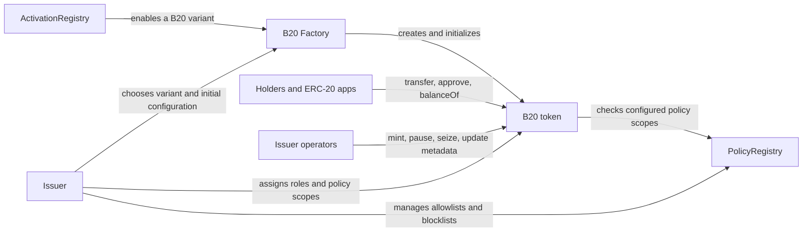

## What is B20?

B20 is Base's native token standard for stablecoins, real-world assets (RWAs), and other fungible tokens. It retains ERC-20 compatibility, so wallets, exchanges, and apps can use B20 tokens through standard ERC-20 flows. Issuers can add B20 controls without requiring those integrations to use a new token interface.

The [B20 Factory](/base-chain/specs/reference/b20#factory) establishes a token's operational configuration. The factory applies the configuration atomically, so the token starts with the selected controls. The issuer supplies roles, policies, supply limits, pause controls, and metadata for that configuration.

After creation, the token applies its configuration to each operation. [Roles](/base-chain/specs/reference/b20#roles-model) control privileged issuer actions. The token queries the [PolicyRegistry](/base-chain/specs/reference/b20#policy-registry) for configured authorization checks. Holders can transfer and approve tokens. Apps and indexers continue to use standard ERC-20 calls and events.

## Why B20?

Token issuers may need controls beyond ordinary transfers. Examples include mint permissions, transfer restrictions, operation pauses, and payment references. A standard ERC-20 requires issuers to implement these controls in a custom contract. B20 standardizes the controls that issuers configure for a token.

The standard includes:

- **Issuer controls:** B20 includes [roles](/base-chain/specs/reference/b20#roles-model), [policy scopes](/base-chain/specs/reference/b20#policy-integration), [supply caps](/base-chain/specs/reference/b20#supply-cap), [pauses](/base-chain/specs/reference/b20#pause), [memos](/base-chain/specs/reference/b20#memos), and [signed approvals](/base-chain/specs/reference/b20#erc-2612-permit--eip-712).
- **Integration surface:** B20 retains [ERC-20 compatibility](/base-chain/specs/reference/b20#erc-20-compatibility). B20-specific functionality uses a consistent interface.
- **Execution model:** B20 runs as a precompile. [Precompile addresses](/base-chain/specs/reference/b20#precompile-addresses) define the protocol entry points.

## How B20 works

The diagram shows the B20 lifecycle. The issuer configures the token during creation. The token applies that configuration during later operations. Use the diagram to identify the component that controls each part of the lifecycle.

In practice, the flow is:

1. **Choose a variant.** Check [activation](/get-started/launch-b20-token#verify-the-activation-registry-is-enabled) for the selected variant.
2. **Create the token.** The issuer calls the factory with creation parameters and bootstrap calls. [Factory creation](/base-chain/specs/reference/b20#factory) defines the call. [Address derivation](/base-chain/specs/reference/b20#address-derivation) defines the token address.
3. **Configure operations.** Built-in roles gate sensitive operations. [Policy scopes](/base-chain/specs/reference/b20#policy-integration) authorize or deny accounts for each operation.
4. **Use the token.** Holders and applications use ordinary ERC-20 methods. B20 methods can add a memo or perform an issuer operation.

## What can I do with B20?

<CardGroup cols={2}>
  <Card title="Issue and manage a token" icon="coins">
    Create a token. Set a supply cap. Assign roles for minting, pausing, seizure, and metadata. [Manage roles](/base-chain/specs/reference/b20#roles-model).
  </Card>
  <Card title="Apply transfer rules" icon="shield-check">
    Connect allowlists, blocklists, or composite policies to transfer, mint, and seizure scopes. Scopes allow every account by default. [Set policies](/base-chain/specs/reference/b20#policy-integration).
  </Card>
  <Card title="Control token operations" icon="circle-pause">
    Pause transfers, mints, burns, or seizures independently. Authorized operators can mint, burn, or seize balances. [Review pauses](/base-chain/specs/reference/b20#pause) and [seizures](/base-chain/specs/reference/b20#seize).
  </Card>
  <Card title="Reconcile activity" icon="receipt">
    Memo-enabled operations emit a `bytes32` reference. The reference can identify an order or invoice. [Review memo events](/base-chain/specs/reference/b20#memos).
  </Card>
  <Card title="Use signed approvals" icon="signature">
    Use ERC-2612 [`permit`](/base-chain/specs/reference/b20#erc-2612-permit--eip-712) for signed approvals. Standard `approve` and allowance flows remain available.
  </Card>
  <Card title="Handle asset lifecycle events" icon="chart-line-up">
    Asset tokens support scaled UI balances, announcements, batch minting, and extra metadata. [Review Asset features](/base-chain/specs/reference/b20#asset).
  </Card>
</CardGroup>

### Choose the right variant

Every B20 token uses one of two variants. The issuer chooses the variant during creation. The choice determines the token's decimals and additional methods. Use the table to select the variant for the token's use case.

| Variant | Best for | Key differences |
|---|---|---|
| **Asset** | RWAs, equities, funds, and long-tail assets | Configurable 6 to 18 decimals. Multipliers, announcements, batch minting, and extra metadata. |
| **Stablecoin** | Fiat-referenced stablecoins | Fixed 6 decimals. An immutable uppercase currency code such as `USD`. The code validates format only. It does not validate reserves, legal status, or registration. |

This overview does not define method-level behavior. Read the [B20 technical specification](/base-chain/specs/reference/b20) for methods, events, errors, and configuration rules. Read the [generated interface reference](/base-chain/specs/reference/b20/interfaces/IB20) when you need the full callable interface.

## How can I get started?

### Explore the issuer flow

The B20 demo runs issuer flows in the browser. Use the demo to explore token creation and issuer controls before you integrate B20. The demo does not require a wallet or setup.

<Frame caption="The B20 demo at chain.base.org/demos/b20">
  <iframe
    width="100%"
    height="640"
    src="https://chain.base.org/demos/b20"
    title="B20 demo"
    frameborder="0"
    allow="clipboard-write"
    referrerpolicy="strict-origin-when-cross-origin"
  ></iframe>
</Frame>

[Open the demo in a new tab](https://chain.base.org/demos/b20).

<Note>
Standard `forge` cannot simulate B20 precompile calls. B20 precompile addresses have no contract bytecode. Use Base's Foundry build: `base-forge`, `base-cast`, and `base-anvil`. The tools register B20 precompiles in their EVM.
</Note>

## Availability

| Network | Live since |
|---|---|
| Base mainnet | 2026-06-25 (Beryl) |
| Base Sepolia | 2026-06-18 (Beryl) |

## Next steps

<CardGroup cols={2}>
  <Card title="Launch a B20 token" icon="rocket" href="/get-started/launch-b20-token">
    Create a token with one factory call.
  </Card>
  <Card title="Accept B20 payments" icon="credit-card" href="/apps/guides/accept-b20-payments">
    Integrate memo-tagged payments. Handle B20-specific reverts.
  </Card>
  <Card title="Read the B20 spec" icon="book" href="/base-chain/specs/reference/b20">
    Read the normative standard.
  </Card>
  <Card title="View constants" icon="hashtag" href="/base-chain/specs/reference/b20/constants-and-addresses">
    Find protocol constants and addresses.
  </Card>
  <Card title="Browse interfaces" icon="code" href="/base-chain/specs/reference/b20/interfaces/IB20">
    Browse B20 and registry methods.
  </Card>
  <Card title="Review changes" icon="clock-rotate-left" href="/base-chain/specs/reference/b20/changelog">
    Review standard changes by release.
  </Card>
</CardGroup>
