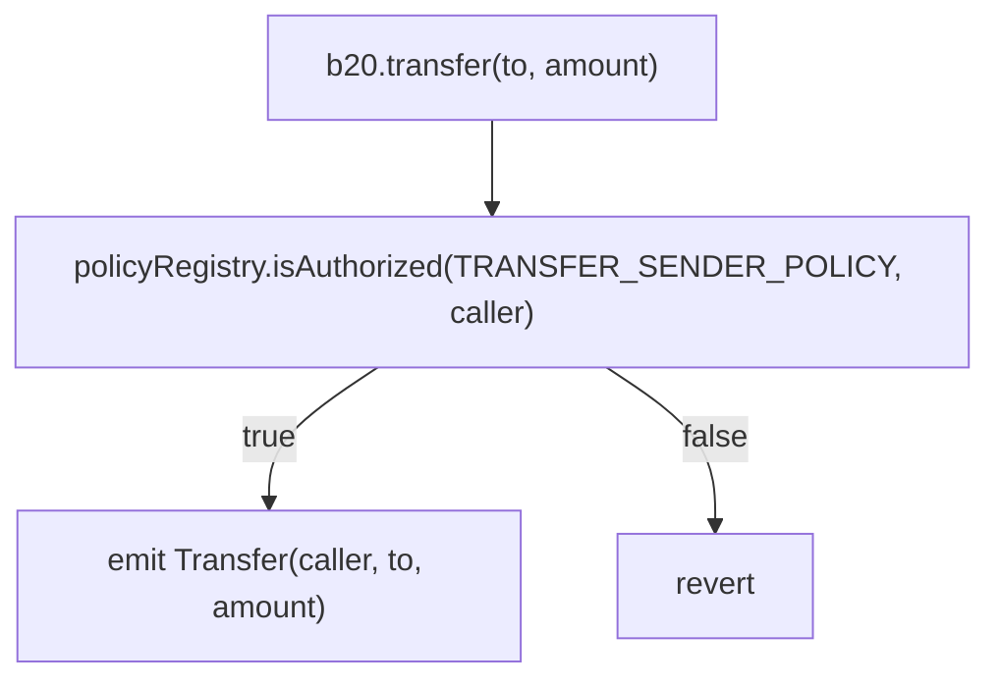
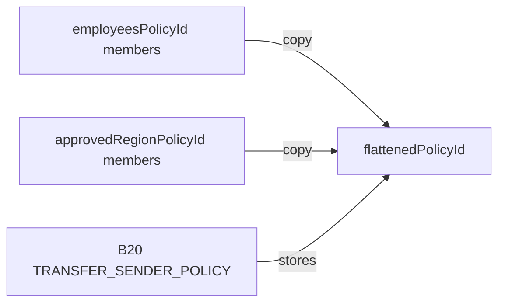

## Summary

[Cobalt](/upgrades/cobalt/overview) adds composite policies to `PolicyRegistry`. A composite
combines two to four existing simple `ALLOWLIST` or `BLOCKLIST` policies under a `UNION` (OR) or
`INTERSECT` (AND) gate. Create a composite with `createCompositePolicy` and replace its complete
child set with `updateComposite`.

The change is additive. Existing Beryl selectors, events, errors, and simple-policy behavior remain
dialable at Cobalt. `createPolicy` and `createPolicyWithAccounts` add one revert path:
`IncompatiblePolicyType` when called with a composite `policyType`.

## Motivation

Asset issuers often reuse authorization policies across assets, such as a KYC allowlist or a
sanctions blocklist. Before Cobalt, combining more than one policy required copying their members
into a flattened policy and operating offchain infrastructure to synchronize every source update.
That duplication can become stale: a valid account can be rejected, or a removed account can remain
authorized, until the copied list is updated.

Authorization can also require an explicit OR or AND relationship. For example, a policy can admit
an account that is on either a shared or token-specific allowlist, or it can require an account to
be both KYC-verified and in a Pro User allowlist. Composite policies express those relationships
without copying membership data. Each authorization check uses the current state of every evaluated
child policy.

## What Changed

### Policy Context

B20 stores a `PolicyRegistry` policy ID for each restricted operation. When an operation is
attempted, B20 calls `isAuthorized(policyId, account)` and rejects the operation if the account is
not authorized.



`BLOCKLIST` and `ALLOWLIST` remain simple policies. They are the only valid composite children.

### Interface Changes

`PolicyType` is append-only: `UNION = 2` and `INTERSECT = 3` follow `BLOCKLIST = 0` and
`ALLOWLIST = 1`. This preserves the existing packed policy-ID encoding.

```solidity IPolicyRegistry.sol lines expandable wrap highlight={13-22}
enum PolicyType {
    BLOCKLIST,
    ALLOWLIST,
    UNION,
    INTERSECT
}

error ChildPoliciesOutsideOfRange();
error InvalidChildPolicy(uint64 childPolicyId);

event CompositePolicyUpdated(uint64 indexed policyId, address indexed updater, uint64[] childPolicyIds);

function createCompositePolicy(address admin, PolicyType policyType, uint64[] calldata childPolicyIds)
    external
    returns (uint64 newPolicyId);

function updateComposite(uint64 policyId, uint64[] calldata childPolicyIds) external;

function compositePolicyChildIds(uint64 policyId) external view returns (uint64[] memory);

function MIN_COMPOSITE_CHILD_POLICIES() external view returns (uint256);
function MAX_COMPOSITE_CHILD_POLICIES() external view returns (uint256);
```

| Symbol | Selector / Topic0 | Status | Behavior |
| --- | --- | --- | --- |
| `createCompositePolicy(address,uint8,uint64[])` | `0x6fdd1491` | New | Creates a `UNION` or `INTERSECT` composite. `PolicyType` ABI-encodes as `uint8`. |
| `updateComposite(uint64,uint64[])` | `0xbfe142c0` | New | Replaces the complete child set. |
| `compositePolicyChildIds(uint64)` | `0x7c40df74` | New view | Returns child IDs in stored order, or an empty array for a non-composite. |
| `MIN_COMPOSITE_CHILD_POLICIES()` | `0xb3ae29f7` | New view | Returns `2`. |
| `MAX_COMPOSITE_CHILD_POLICIES()` | `0x54309870` | New view | Returns `4`. |
| `ChildPoliciesOutsideOfRange()` | `0x697ec868` | New error | The child count is outside `[2, 4]`; this is distinct from the 64-account `BatchSizeTooLarge` limit. |
| `InvalidChildPolicy(uint64)` | `0x46508ef6` | New error | A child is a composite or a built-in sentinel. |
| `CompositePolicyUpdated(uint64,address,uint64[])` | `0x4ff6adaab31b0df87aa7b8b7320c52b8b3b5eede3bf28a6baaaa8b8b7e1d6363` | New event | Emitted on composite creation and every update with the complete post-update set. |
| `isAuthorized(uint64,address)` | `0x55a1179e` | Extended | Dispatches composite policies using live child evaluation. |
| `createPolicy(address,uint8)` | `0xca5d55f6` | Extended | Rejects `UNION` and `INTERSECT` with `IncompatiblePolicyType`. |
| `createPolicyWithAccounts(address,uint8,address[])` | `0xa2d3044f` | Extended | Rejects `UNION` and `INTERSECT` with `IncompatiblePolicyType`. |

For the complete current interface, see the [IPolicyRegistry reference](/specifications/b20/reference/interfaces/i-policy-registry/index).

#### Composite Policy Creation

`createCompositePolicy(admin, policyType, childPolicyIds)` creates a `UNION` or `INTERSECT` policy,
assigns `admin` as its initial administrator, and returns a new policy ID. It stores references to
its children rather than copying their membership.

The child set must contain two to four existing simple policies. Child policies cannot be composites
or the `ALWAYS_ALLOW` and `ALWAYS_BLOCK` built-in sentinels. Each evaluated child requires a
membership storage read, so gas increases with the number of children evaluated.

Validation runs in this order:

1. `ZeroAddress` — `admin` is `address(0)`.
2. `IncompatiblePolicyType` — `policyType` is not `UNION` or `INTERSECT`.
3. `ChildPoliciesOutsideOfRange` — the child count is outside `[2, 4]`.
4. `PolicyNotFound` — one or more children do not exist; the registry completes this pass before
   checking child types.
5. `InvalidChildPolicy` — a child is a composite or built-in sentinel.

On success, the registry emits `PolicyCreated(policyId, creator, policyType)`,
`PolicyAdminUpdated(policyId, address(0), admin)`, and
`CompositePolicyUpdated(policyId, creator, childPolicyIds)`, in that order.

#### Composite Policy Updates

`updateComposite(policyId, childPolicyIds)` atomically replaces a composite's complete child set.
It does not support a partial update or an empty child set. The event
`CompositePolicyUpdated(policyId, updater, childPolicyIds)` is emitted on success; an update does
not emit `PolicyAdminUpdated` because the administrator does not change.

Validation runs in this order:

1. `PolicyNotFound` — `policyId` does not exist.
2. `IncompatiblePolicyType` — `policyId` is not a `UNION` or `INTERSECT` policy.
3. `Unauthorized` — the caller is not the current administrator. A renounced composite cannot be
   updated.
4. `ChildPoliciesOutsideOfRange` — the new child count is outside `[2, 4]`.
5. `PolicyNotFound` — one or more new children do not exist.
6. `InvalidChildPolicy` — a new child is a composite or built-in sentinel.

### Behavioral Changes

#### Existing Constructor Reverts

`createPolicy` and `createPolicyWithAccounts` continue to create only simple policies. Both now
revert with `IncompatiblePolicyType` if their `policyType` is `UNION` or `INTERSECT`.

#### Authorization Evaluation

`isAuthorized` evaluates composites as follows:

```text Authorization Evaluation lines expandable wrap highlight={1-12}
isAuthorized(policyId, account):
    if policy is ALLOWLIST:
        return account is in the policy

    if policy is BLOCKLIST:
        return account is not in the policy

    if policy is UNION:
        return true when any child authorizes the account

    if policy is INTERSECT:
        return false when any child does not authorize the account
```

Composite children must be simple policies, so evaluation has a maximum depth of one and cannot
recurse or form cycles. Authorization is live rather than a membership snapshot: changes to a child
policy apply to every referencing composite on its next authorization check.

Evaluation short-circuits. `UNION` stops at the first authorizing child and `INTERSECT` stops at the
first non-authorizing child. Child ordering cannot change the authorization result, but it can change
gas usage; place the child most likely to short-circuit first.

The registry preserves child order and permits duplicate child IDs. It neither sorts nor
deduplicates them. A child remains effective after its administrator renounces administration:
renunciation freezes future membership updates but does not delete the policy or change its current
authorization result.

A well-formed but never-created `UNION` ID has no children and returns `false`; a well-formed but
never-created `INTERSECT` ID has no children and returns `true`. Consumers that store policy IDs
must call `policyExists(policyId)` before storing them. Otherwise, an invalid `INTERSECT` ID can
behave like `ALWAYS_ALLOW`.

#### State Changes

The change adds a `children` mapping at offset `4` in the `base.policy_registry` ERC-7201 namespace.
It is additive: existing offsets `0` through `3` are unchanged and no storage migration is required.
The offset is relative to the namespace location, not literal EVM storage slot `4`.

| Field | Value |
| --- | --- |
| Namespace location | `0x00503aeb06982fa1fe3151dc68f90b3946c55c449dfd447e49dcaece71ba4a00` |
| Offset | `CHILDREN_OFFSET = 4` |
| Field type | `mapping(uint64 policyId => uint64[] childPolicyIds) children` |

Each mapping entry stores the dynamic-array length. Its elements begin at the hash of that entry and
pack four `uint64` child IDs into one 256-bit storage slot, which covers the two-to-four-child limit.

| Bits | Array Index | Field |
| --- | --- | --- |
| `0–63` | `0` | `childPolicyIds[0]` |
| `64–127` | `1` | `childPolicyIds[1]` |
| `128–191` | `2` | `childPolicyIds[2]` |
| `192–255` | `3` | `childPolicyIds[3]` |

Simple and composite policies share the global `nextCounter`, which starts at `2` because `0` and
`1` are reserved for `ALWAYS_ALLOW` and `ALWAYS_BLOCK`. A composite policy ID stores its
`PolicyType` in the top byte and the next counter value in the low 56 bits; composites do not use a
separate counter.

## Examples

Assume `employeesPolicyId` and `approvedRegionPolicyId` are existing `ALLOWLIST` policies. Both
examples authorize an account that appears in either list for transfers.

### Before: Flattened Policy

B20 stores one policy ID per scope, so both source lists must be copied into a flattened allowlist.
Offchain infrastructure then watches both sources and propagates membership changes to the copy.

```solidity Flattened Policy
uint64 flattenedPolicyId = policyRegistry.createPolicyWithAccounts(
    admin,
    PolicyType.ALLOWLIST,
    /* union of employees and approved-region addresses */
);

b20.updatePolicy(TRANSFER_SENDER_POLICY, flattenedPolicyId);
```



```mermaid Flattened Policy Synchronization lines expandable wrap highlight={1-12}
sequenceDiagram
    participant SourceAdmin
    participant Employees as employeesPolicyId
    participant Listener as Sync infrastructure
    participant Flat as flattenedPolicyId
    participant B20

    SourceAdmin->>Employees: updateAllowlist(true, [Alice])
    Employees-->>Listener: AllowlistUpdated(..., true, [Alice])
    Note over B20,Flat: Alice cannot transfer yet
    Listener->>Flat: updateAllowlist(true, [Alice])
    Note over B20,Flat: Alice can transfer
```

### After: Composite Policy

Create a `UNION` composite that references the source policies and assign its ID to B20. B20 needs
no composite-specific logic: it continues to pass the stored policy ID to `PolicyRegistry`.

```solidity Composite Policy
uint64 compositePolicyId = policyRegistry.createCompositePolicy(
    admin,
    PolicyType.UNION,
    [employeesPolicyId, approvedRegionPolicyId]
);

b20.updatePolicy(TRANSFER_SENDER_POLICY, compositePolicyId);
```

The creation call emits `PolicyCreated(policyId, admin, UNION)`, then
`PolicyAdminUpdated(policyId, address(0), admin)`, then
`CompositePolicyUpdated(policyId, admin, childPolicyIds)`. Adding Alice to `employeesPolicyId`
authorizes her on the next check without copying members into another policy.

```mermaid Composite Policy Authorization lines expandable wrap highlight={1-15}
sequenceDiagram
    participant Admin
    participant Employees as employeesPolicyId
    participant Region as approvedRegionPolicyId
    participant Union as UNION composite
    participant B20

    Admin->>Union: createCompositePolicy(UNION, [employees, approvedRegion])
    Admin->>B20: updatePolicy(TRANSFER_SENDER_POLICY, compositePolicyId)

    Note over Employees: Alice added to employeesPolicyId
    B20->>Union: isAuthorized(compositePolicyId, Alice)
    Union->>Employees: isAuthorized(employeesPolicyId, Alice)
    Employees-->>Union: true
    Union-->>B20: true
```

## Design Decisions and Alternatives Considered

Cobalt uses two explicit policy types, a single `createCompositePolicy` function, and full
replacement through `updateComposite`.

### One Generic Composite Type

A generic composite type with a separately stored operator such as AND, OR, NOT, or XOR would add
storage and authorization complexity without a requirement for additional operators. Explicit
`UNION` and `INTERSECT` types keep the policy ID encoding, gas profile, and audit surface smaller.

### Token-Level Policy Groups

Storing multiple policy IDs and an operator on each B20 token would prevent reusable composites and
spread the change across token variants, factories, and authorization hot paths. A reusable
PolicyRegistry policy keeps B20's policy slot as an opaque `uint64` ID.

### Incremental Child Updates

Separate add/remove operations would need array-mutation, length, and deduplication behavior. A
composite has at most four children, so atomic full replacement is simpler and inexpensive.

### Separate Creator Functions

Separate `createUnionPolicy` and `createIntersectPolicy` functions would duplicate the creation API.
A single `createCompositePolicy` supports both operators consistently.

### Nested Composites

Allowing composites to reference composites requires depth limits, cycle protections, and potentially
unbounded authorization traversal. Restricting children to simple policies guarantees depth-1
evaluation and bounds worst-case gas.

## Migration

This change is non-breaking. Existing simple `ALLOWLIST` and `BLOCKLIST` policies continue to work,
and integrations that do not need composite behavior require no action.

To replace a flattened policy:

1. Identify the existing simple policies to combine.
2. Create a `UNION` or `INTERSECT` composite with `createCompositePolicy`.
3. Write the composite ID to the relevant B20 policy scope with `b20.updatePolicy`.
4. Remove the old flattened policy if it is no longer needed.

B20 treats the composite ID as the same opaque `uint64` policy ID it uses for simple policies, so no
B20 contract change is required.
