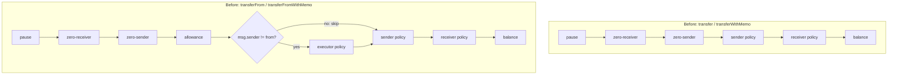
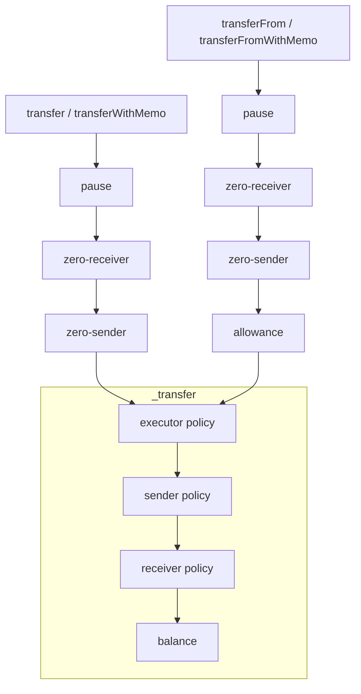

## Abstract

The Denim hardfork extends `TRANSFER_EXECUTOR_POLICY` to cover every transfer path. The executor gate now checks `msg.sender` on `transfer`, `transferFrom`, `transferWithMemo`, and `transferFromWithMemo`, including when `msg.sender == from`. Previously the check ran only on delegated `transferFrom` paths, and only when `msg.sender != from`.

This is a purely behavioral change — no new selectors, events, errors, or storage. Tokens that never set `TRANSFER_EXECUTOR_POLICY` keep the always-allow default and are unaffected. Tokens that already set a restrictive executor policy and relied on either bypass must authorize affected holders before this change activates.

## Motivation

An issuer of a restricted security token may need every transfer to go through a registered transfer agent. Only the transfer agent's contract may initiate a move; a holder cannot call `transfer` themselves even to an already-eligible counterparty. The holder approves the transfer agent, and the transfer agent calls `transferFrom`. `TRANSFER_EXECUTOR_POLICY` is the initiator allowlist for that pattern.

The previous scope could not enforce this consistently with `TRANSFER_SENDER_POLICY` and `TRANSFER_RECEIVER_POLICY`, which already run on every transfer path. Two initiator-side gaps remained:

1. **`transfer` was never gated.** The initiator of `transfer` is `msg.sender`, which is also `from`, but the executor check lived only inside `transferFrom`. A holder could always move their own tokens through `transfer` regardless of the executor allowlist.
2. **`transferFrom` skipped the check when `msg.sender == from`.** A holder could route a self-`transferFrom(from, to, amount)` call to reach the same unchecked path, even without being on the executor allowlist.

Both gaps let a non-allowlisted holder move tokens by choosing a different entrypoint. Centralizing the check on `msg.sender` and removing the `msg.sender == from` carve-out closes both gaps and brings `TRANSFER_EXECUTOR_POLICY` to parity with the sender and receiver scopes.

## What Changed

### Check location and scope

The executor check moves from the `transferFrom` and `transferFromWithMemo` bodies into `_transfer`, where it runs first — before the existing sender and receiver checks — under the same `_isPrivileged()` bootstrap bypass. The `msg.sender == from` carve-out that previously skipped the check is removed. Because `transfer` and `transferWithMemo` already route through `_transfer`, they gain the executor check with no entrypoint-specific code.

Pause, zero-actor, and allowance checks remain in the entrypoints. Allowance is still consumed in `transferFrom` / `transferFromWithMemo` bodies before reaching `_transfer`, so revert order is unchanged for allowance failures.

### Check order: before vs. after

**Before** — by entrypoint:



**After** — shared `_transfer` helper handles all three policy checks:



Canonical check order after this change:

- `transfer` / `transferWithMemo`: pause → zero-receiver → zero-sender → **executor policy** → sender policy → receiver policy → balance.
- `transferFrom` / `transferFromWithMemo`: pause → zero-receiver → zero-sender → allowance → **executor policy** → sender policy → receiver policy → balance.

When more than one check would fail, the caller sees the first revert in that order.

### Gas

`_transfer` reads all three transfer-side policy IDs from the existing packed slot in a single `SLOAD`. On `transferFrom` and `transferFromWithMemo`, the previous implementation read the executor lane in the entrypoint body and then re-read the same packed slot in `_transfer` (warm); the helper now performs the only `SLOAD`.

On `transfer` and `transferWithMemo`, the paths previously did not consult the executor policy. Those paths now check `msg.sender` under `TRANSFER_EXECUTOR_POLICY`. When `TRANSFER_EXECUTOR_POLICY` and `TRANSFER_SENDER_POLICY` share the same policy ID — including both slots unset (`ALWAYS_ALLOW_ID`) — `_transfer` reuses the executor result and skips the redundant `isAuthorized` call for the sender. An unset executor slot remains `ALWAYS_ALLOW_ID` (`0`), so a default `transfer` still makes two `isAuthorized` calls (one reused for executor + sender, one for receiver).

### Examples

A holder moving their own tokens is now gated by the executor policy even through direct `transfer`:

```solidity Title="Executor policy blocks direct transfer"
token.updatePolicy(TRANSFER_EXECUTOR_POLICY, ALWAYS_BLOCK_ID);

vm.prank(alice);
token.transfer(bob, amount); // reverts PolicyForbids(TRANSFER_EXECUTOR_POLICY, ALWAYS_BLOCK_ID)
```

An executor allowlist restricts initiation to approved accounts (e.g., a transfer agent). A holder who is not allowlisted cannot bypass it by calling `transfer` or self-`transferFrom`:

```solidity Title="Executor allowlist: approved vs. non-approved initiators"
uint64 executorAllowlist = policyRegistry.createPolicyWithAccounts(admin, ALLOWLIST, [transferAgent]);
token.updatePolicy(TRANSFER_EXECUTOR_POLICY, executorAllowlist);

vm.prank(transferAgent);
token.transferFrom(alice, bob, amount); // succeeds: transferAgent is allowlisted

vm.prank(alice);
token.transfer(bob, amount); // reverts PolicyForbids(TRANSFER_EXECUTOR_POLICY, ...): alice is not allowlisted
```

The factory bootstrap bypass still applies — a token's `initCalls` can mint and transfer even when the freshly configured executor policy would otherwise block the factory:

```solidity Title="Bootstrap window bypasses executor check"
initCalls = [
    abi.encodeCall(IB20.mint, (address(factory), amount)),
    abi.encodeCall(IB20.updatePolicy, (TRANSFER_EXECUTOR_POLICY, ALWAYS_BLOCK_ID)),
    abi.encodeCall(IB20.transfer, (to, amount))
];
factory.createB20(..., initCalls); // succeeds: bootstrap window bypasses the executor check
```

## Migration

**Not breaking** for tokens that never configured `TRANSFER_EXECUTOR_POLICY`. The unset policy slot stays always-allow, and the factory bootstrap bypass is unchanged.

**Breaking** for a token that has already set a restrictive `TRANSFER_EXECUTOR_POLICY` and relied on either of the closed bypasses:

1. If holders were moving their own tokens with `transfer`, they must now be authorized under `TRANSFER_EXECUTOR_POLICY` to keep doing so.
2. If holders were relying on `msg.sender == from` to skip the executor check in `transferFrom`, the same authorization requirement now applies to that self-call path.

An issuer who wants to keep allowing holders to self-initiate transfers should add those holders — or a policy covering them — to the executor allowlist before this change activates.

## Alternatives Considered

### Keep the check in `transferFrom` only; add it to `transfer` separately

This would add a matching executor check to `transfer` while leaving the existing `transferFrom` check — including the `msg.sender != from` carve-out — in place. Rejected because it does not close the self-`transferFrom` bypass: a holder could still route around an executor allowlist by calling `transferFrom(self, to, amount)`. It also duplicates the check across two entrypoints rather than centralizing it in `_transfer`.

### Fold pause, zero-actor, and allowance into `_transfer`

This option would move every remaining transfer-family check into the helper. Rejected because allowance is entrypoint-specific. Folding it in would require a consume-allowance flag, and moving zero-actor checks after allowance would change revert order. This change only relocates the executor policy check.

## Test Cases

Key scenarios pinned by the updated test suite:

- **Executor sentinel on `transfer`** — `ALWAYS_BLOCK_ID` as executor policy reverts `transfer` with `PolicyForbids(TRANSFER_EXECUTOR_POLICY, ALWAYS_BLOCK_ID)`.
- **External allowlist on `transfer`** — only allowlisted `msg.sender` can call `transfer`; non-allowlisted holders revert.
- **Privileged bypass** — factory bootstrap window passes executor check regardless of policy.
- **Memo parity** — `transferWithMemo` and `transferFromWithMemo` behave identically to their non-memo counterparts under the executor policy.
- **Closed self-caller loophole** — `transferFrom(self, to, amount)` from a non-allowlisted `msg.sender` now reverts (`test_transferFrom_revert_selfCaller_executorPolicyForbids`).
- **Revert order** — all 21 pairs of check combinations across `transfer`, `transferFrom`, and memo variants confirm the canonical order: executor → sender → receiver → balance.
