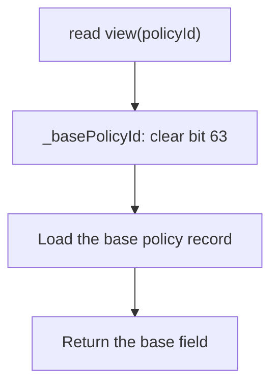
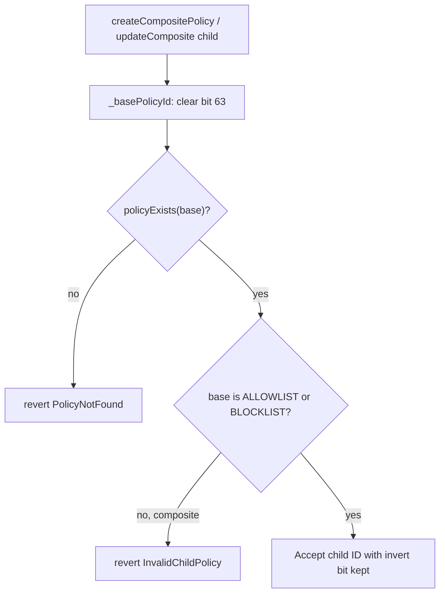

## Abstract

The Denim hardfork adds an invert flag to the Policy Registry's `uint64` policy ID. When bit 63 (`INVERTED_POLICY_BIT`) is set, `isAuthorized` resolves the base policy and returns the **opposite** of its result. No new storage is allocated; the flag is query-time only. Every existing policy type — `ALLOWLIST`, `BLOCKLIST`, `UNION`, and `INTERSECT` — can be inverted. Existing IDs are unaffected because bit 63 was previously unused.

## Motivation

The Policy Registry is increasingly used as a shared registry of addresses that other policies compose around. Without invert, expressing "NOT policy A" requires a second policy of the opposite type containing a copy of A's membership. Any membership change must then land on both policies; a lagging update admits invalid accounts or rejects valid ones. A composite that needs "A AND NOT X" cannot reuse X — it must point at a separately-maintained mirror.

Encoding inversion in the policy reference solves this. The same registry entry supports expressions such as `A OR B`, `A AND NOT B`, or `NOT A` without additional policies. One address list, managed once, represents either side of a rule depending on how it is referenced.

## What Changed

### New constant and helper

```solidity title="PolicyRegistryConstants"
uint64 internal constant INVERTED_POLICY_BIT = uint64(1) << 63;
```

```solidity title="IPolicyRegistry"
function invertedPolicyId(uint64 policyId) external view returns (uint64);
```

`invertedPolicyId` returns `policyId ^ INVERTED_POLICY_BIT`. It is pure (reads no state), never reverts, and is involutive: `invertedPolicyId(invertedPolicyId(id)) == id`.

### Updated selector table

| Symbol | Selector | Status | Notes |
|---|---|---|---|
| `invertedPolicyId(uint64)` | `0x6b468933` | NEW | Pure XOR of bit 63; never reverts, reads no state |
| `isAuthorized(uint64,address)` | unchanged | Extended | Inverted ID resolves the base and returns the negated result; fail-closed on unknown/malformed base |
| `policyExists(uint64)` | unchanged | Extended | Strips to base: `policyExists(invertedPolicyId(id)) == policyExists(id)` |
| `policyAdmin(uint64)` | unchanged | Extended | Strips to base |
| `pendingPolicyAdmin(uint64)` | unchanged | Extended | Strips to base |
| `compositePolicyChildIds(uint64)` | unchanged | Extended | Strips the queried composite's own flag; child IDs returned verbatim, including any per-child invert bit |
| `createCompositePolicy(address,uint8,uint64[])` | unchanged | Extended | A child ID may carry the invert bit ("A AND NOT X"); validated against its base |
| `updateComposite(uint64,uint64[])` | unchanged | Extended | Same per-child invert handling |

### Authorization behavior

`isAuthorized` gains a leading invert branch. All non-inverted paths are byte-identical to the previous behavior.

```text title="isAuthorized pseudocode"
isAuthorized(policyId, account):
    if policyId has INVERTED_POLICY_BIT set:
        base = policyId & ~INVERTED_POLICY_BIT
        if not policyExists(base):      // fail-closed guard
            return false
        return not isAuthorized(base, account)

    ... existing ALLOWLIST / BLOCKLIST / UNION / INTERSECT dispatch ...
```

An inverted ID over an unknown or malformed base returns `false` — it never becomes allow-everyone. This guards against a typo'd or garbage ID with bit 63 set from bypassing mint, transfer, or seize checks.

### Getter strip semantics

Read views strip bit 63 via `_basePolicyId(id) = id & ~INVERTED_POLICY_BIT` and load the base record. An inverted ID has no independent storage record; it mirrors the base's existence, admin, pending admin, and child set.



### Composite child invert

A child ID in `createCompositePolicy` or `updateComposite` may carry the invert bit. The registry validates the child against its base: an inverted simple child (`ALLOWLIST` or `BLOCKLIST`) is accepted; an inverted composite child is rejected with `InvalidChildPolicy` to preserve the flat-tree invariant. Across the whole child set, `PolicyNotFound` takes precedence over `InvalidChildPolicy`.



### Storage and gas

No new storage slots. Invert is query-time only — one boolean flip in memory. There is no extra `SLOAD`.

### Examples

Invert a sanctions blocklist so the policy reads "not sanctioned":

```solidity title="Standalone invert"
uint64 notSanctions = policyRegistry.invertedPolicyId(sanctionsId);
// notSanctions == sanctionsId ^ (uint64(1) << 63)
```

"Allowed to transfer = on KYC list AND not sanctioned" via an `INTERSECT` composite:

```solidity title="Composite with inverted child"
uint64 notSanctions = policyRegistry.invertedPolicyId(sanctionsId);
policyRegistry.createCompositePolicy(admin, INTERSECT, [kycId, notSanctions]);
```

Fail-closed guarantee: for any never-created base ID, `isAuthorized(base | INVERTED_POLICY_BIT, account)` returns `false`.

## Migration

This change is not breaking. All existing selectors, events, and errors are unchanged. Existing IDs have bit 63 unset, so all existing behavior is identical.

<Steps>
  <Step title="Compute the inverted ID">
    Call `invertedPolicyId(policyId)` on the registry, or set bit 63 directly with `policyId | (uint64(1) << 63)`.
  </Step>
  <Step title="Bind it to a B20 scope">
    Pass the inverted ID to `updatePolicy` for a standalone scope, or include it as a child in `createCompositePolicy` / `updateComposite`. B20 treats the ID as an opaque `uint64` and requires no changes.
  </Step>
  <Step title="Validate at write time">
    Consumers that store policy IDs must still call `policyExists(policyId)` at write time. This works for inverted IDs because existence resolves to the base.
  </Step>
</Steps>

## Alternatives Considered

### Alternative 1 — New `NOT` policy type

`createNot(admin, base)` allocates a fresh record pointing at a base. A first-class NOT node wraps any policy and offers the clearest explorer legibility. Rejected: standalone NOT costs about 3 `SLOAD`s versus 1 for a mirror blocklist; "A AND NOT X" costs about 6 versus the chosen approach's 4. It also adds a new create path and deepens hot-path recursion as a composite child.

### Alternative 2 — Per-child invert bitmask on the composite

A bitmask packed into the children length word flips individual children. `mask = 0` reproduces today's behavior with no migration. Rejected: the flag only works inside a composite — a simple policy cannot be inverted without wrapping it in a composite with a minimum of two children. There is no standalone referenceable inverse of an arbitrary policy.

## Test Cases

The new suite (`test/unit/PolicyRegistry/isAuthorizedInvert.t.sol`, 16 cases) covers:

- Fail-closed invariants: inverted unknown base returns `false`
- Simple/built-in truth tables for `ALLOWLIST` and `BLOCKLIST`
- `INTERSECT[A, ~X]` composite evaluation
- Child validation: inverted simple child accepted, inverted composite child rejected
- Getter strip semantics: `policyExists`, `policyAdmin`, `pendingPolicyAdmin`, `compositePolicyChildIds`
- `invertedPolicyId` round-trip involution
