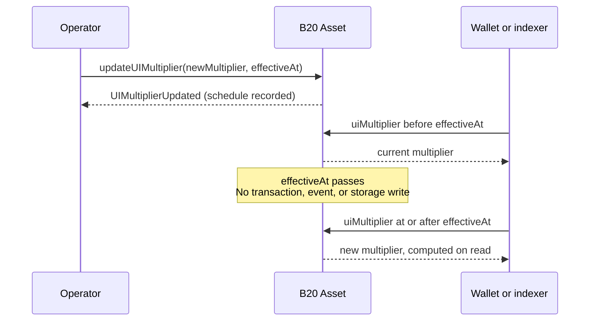

# Multipliers

*Mental model for the B20 Asset UI multiplier ([ERC-8056](https://eips.ethereum.org/EIPS/eip-8056)). How-to, events, and errors live in [Schedule a stock split](../guides/scheduling-stock-splits.md). Asset-only; Stablecoin has no multiplier. See [Token Types](token-types.md).*

Audience: integrators and indexers.

---

## Why multipliers exist

Issuers need stock splits that change displayed share counts. If a split rewrote every holder's raw ERC-20 balance, vaults and other DeFi protocols that call `balanceOf` and `transfer` would see those amounts change even though no tokens moved.

B20 Asset stores holder balances as raw ERC-20 units. The multiplier changes the displayed scale without rewriting those balances, so the ERC-20 surface does not move.

Wallets and indexers read a derived UI view so they can show share counts after a split.

A reverse split is the same primitive with `multiplier < 1e18`.

## How they work

### How the UI works

Every holder has two amounts: a stored **raw** balance and a derived **UI** balance. The UI balance is what wallets and indexers show as share count. It is `raw * multiplier / WAD_PRECISION`.

Because that formula divides by `WAD_PRECISION` (`1e18`), the multiplier must be scaled by the same amount. A scale of `1.0` is `1 * 1e18`. That is the default, so UI equals raw. A stored `0` reads as `WAD_PRECISION`.

A 2-for-1 split is a scale of `2.0`, so the multiplier is `2 * 1e18`, which is `2e18`. For a raw balance of `100`, UI is `200`. Passing `2` would compute `raw * 2 / 1e18` and round that same balance down to `0`.

A reverse split uses the same encoding. A 1-for-2 is a scale of `0.5`, so the multiplier is `0.5 * 1e18`, which is `5e17`. For a raw balance of `100`, UI is `50`.

The operator writes that scaled value as an **absolute** multiplier, not a ratio on the current one. A second 2-for-1 is `4e18`, not "apply ×2 again." A ratio would hide the current scale and make chained splits easy to mis-set.

The same division is integer and rounds down. A round trip through `toUIAmount` then `fromUIAmount` can lose one unit in the last place (ULP) when `multiplier != WAD_PRECISION`. Prefer 18 decimals for equities so that effect stays small. Further rounding detail stays in the Asset spec and the stock-split guide.

### Viewing and reading multiplier changes

Indexers and integrators read these views. They do not write the multiplier. ERC-8056 names are aliases of the B20 names. Prefer the ERC-8056 names.

The current scale is `uiMultiplier()` (`multiplier()`). It returns the effective multiplier at `block.timestamp`.

A pending change is visible on `newUIMultiplier()` and `effectiveAt()`. The change is live while `effectiveAt() > block.timestamp`. After the flip, `uiMultiplier()` returns the new value. There is no second event.

The holder's UI share count is `balanceOfUI(account)` (`scaledBalanceOf`): `balanceOf(account) * uiMultiplier() / WAD_PRECISION`. `totalSupplyUI()` is the same formula on `totalSupply()`.

Convert a single amount with `toUIAmount(raw)` and `fromUIAmount(ui)` at that effective multiplier. `toScaledBalance` and `toRawBalance` are deprecated aliases of those two.

### What it preserves

`balanceOf`, `transfer` amounts, `totalSupply`, and allowances stay raw. Protocols that use that ERC-20 surface do not see the split.

The UI views above are opt-in. Protocols that call `balanceOfUI`, `scaledBalanceOf`, or `totalSupplyUI` do see the split.

### Scheduling

Operators typically wrap the schedule in `announce` so the split is a disclosed corporate action. See [Announce a corporate action](../guides/announcing-corporate-actions.md).

That wrap does not merge the two concepts. The multiplier event means a scale change was recorded. The announcement means the operator disclosed a corporate action.

The canonical path is `updateUIMultiplier(newMultiplier, effectiveAt)`, not the instant setter. An account with `OPERATOR_ROLE` records a pending multiplier and a future `effectiveAt`. The asset allows one live pending update at a time.

While `effectiveAt() > block.timestamp`, `uiMultiplier()` still returns the current multiplier. `newUIMultiplier()` returns the scheduled value. `effectiveAt()` returns the flip time.

When `block.timestamp >= effectiveAt`, reads return the new multiplier. Maturation does not emit an event and does not write storage. Indexers must not wait for a "split happened" log at `effectiveAt`. `UIMultiplierUpdated` fires when the update is **recorded**.

After the flip, detect a live pending update with `effectiveAt() > block.timestamp`. Do not check `effectiveAt() == 0`.

`cancelUIMultiplierUpdate` clears a live pending update before `effectiveAt`. Details in the stock-split guide.

Deprecated `updateMultiplier` applies a value immediately and clears any pending update. Emergency override only. Prefer `updateUIMultiplier` for routine splits. Details in the stock-split guide.

## Example

A 2-for-1 doubles what wallets show. Raw units do not change, and the flip does not emit an event.

A holder starts at raw `100` and multiplier `1e18`, so UI is `100`. The operator schedules `updateUIMultiplier(2e18, T)`.

Until `T`, nothing has flipped: raw stays `100` and `uiMultiplier()` stays `1e18`. The pending split is visible on `newUIMultiplier()` (`2e18`) and `effectiveAt()` (`T`).

When `T` passes, UI becomes `200`. Raw is still `100`. There is no second event.

A reverse split uses the same path. A 1-for-2 uses `5e17`.

## Related

- [Token Types](token-types.md) — Asset vs Stablecoin; multiplier is Asset-only.
- [Roles and Pause](roles-and-pause.md) — `OPERATOR_ROLE`.
- [Schedule a stock split](../guides/scheduling-stock-splits.md) — how to schedule, cancel, override; events and errors.
- [Announce a corporate action](../guides/announcing-corporate-actions.md) — disclosure wrapper around the schedule.

