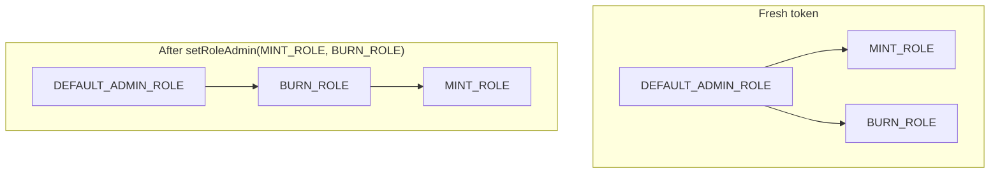
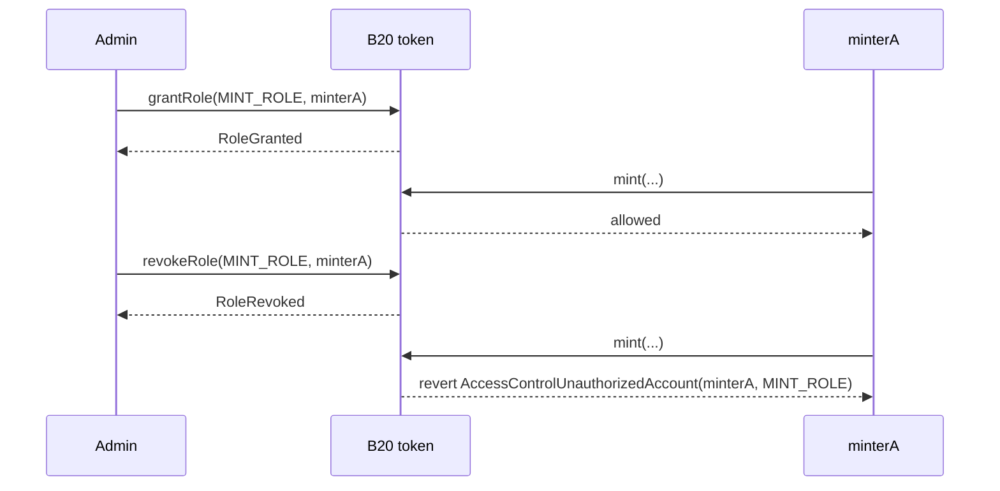
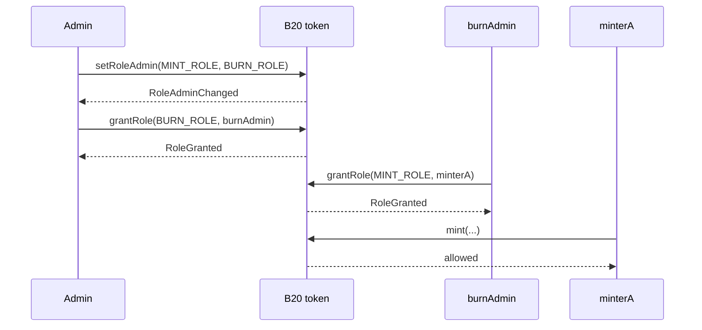
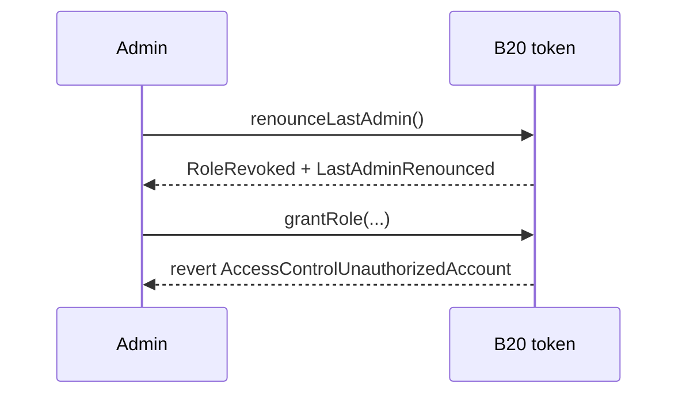
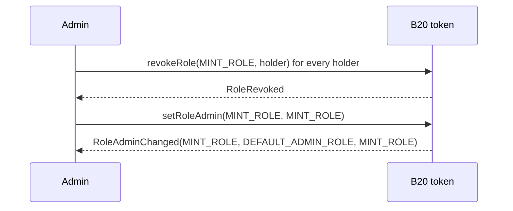
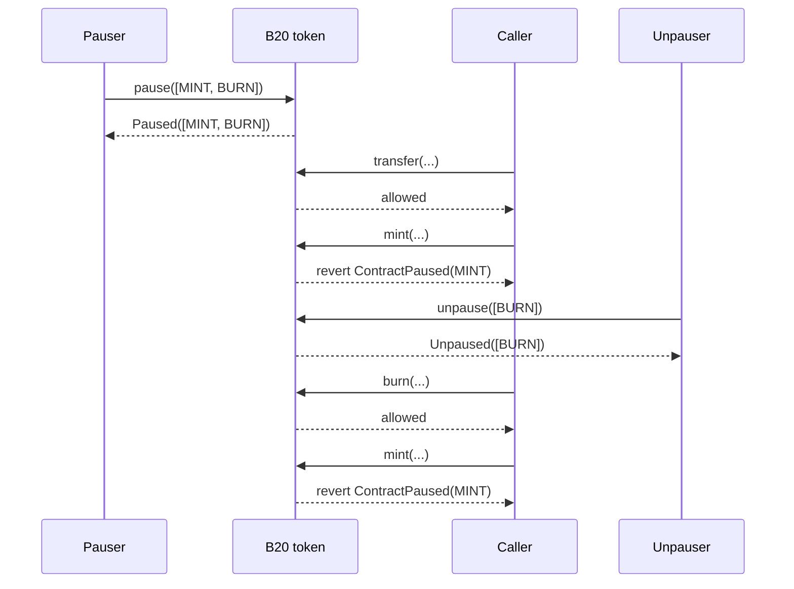

# Roles and Pause

*How B20 gates privileged operations with roles, and how pause freezes one class of operations without stopping the rest of the token. Policy checks are a separate authorization layer; see [Policies](policies.md).*

## 1. Why roles and pause exist

Roles let an issuer assign each privileged operation to a specific account. Minting, seizing, and pausing are different jobs, so they are different roles. Each role gates a specific set of admin functions. The mapping is in [§2](#2-roles).

Pause is a second, independent control. A role answers who may call a function. A `PausableFeature` answers whether that class of operation is live. Issuers pause one feature without pausing the rest of the token. The features are in [§3](#3-pause).

## 2. Roles

B20 implements roles with [OpenZeppelin AccessControl](https://docs.openzeppelin.com/contracts/5.x/access-control) on the token. There is no separate role registry.

### 2.1 The default admin

`createB20` grants `DEFAULT_ADMIN_ROLE` to `initialAdmin`. That holder is the root administrator. They assign each privileged operation to other accounts by granting an operating role: minter, burner, pauser, metadata editor. They can also grant `DEFAULT_ADMIN_ROLE` itself, so more than one address shares root control.

Any number of addresses can hold the same role. `hasRole` is a membership check, not a single-holder slot.

Two functions always require `DEFAULT_ADMIN_ROLE`: `updatePolicy` and `updateSupplyCap`. Those checks do not follow a reassigned admin.

### 2.2 Available roles


| Role                 | Gates                                                                                                   |
| -------------------- | ------------------------------------------------------------------------------------------------------- |
| `DEFAULT_ADMIN_ROLE` | `updatePolicy`, `updateSupplyCap`, `renounceLastAdmin`; default admin of every other role               |
| `MINT_ROLE`          | `mint`, `mintWithMemo`; Asset also gates `batchMint`                                                    |
| `BURN_ROLE`          | `burn`, `burnWithMemo`                                                                                  |
| `BURN_BLOCKED_ROLE`  | `burnBlocked` (deprecated)                                                                              |
| `SEIZE_ROLE`         | `seizeWithMemo`                                                                                         |
| `PAUSE_ROLE`         | `pause`                                                                                                 |
| `UNPAUSE_ROLE`       | `unpause`                                                                                               |
| `METADATA_ROLE`      | `updateName`, `updateSymbol`, `updateContractURI`; Asset also gates `updateExtraMetadata`               |
| `OPERATOR_ROLE`      | Asset-only: `announce`, `updateUIMultiplier`, `cancelUIMultiplierUpdate`, deprecated `updateMultiplier` |


`OPERATOR_ROLE` exists only on Asset. See [Token Types](token-types.md). `approve` is not role-gated. Holder `transfer` is not role-gated. A holder can always move their own balance, subject to pause and policy.

### 2.3 Granting and revoking

Every role has an admin role. `getRoleAdmin(role)` returns it. On a fresh token, that admin is `DEFAULT_ADMIN_ROLE` for every role. The current admin calls `grantRole(role, account)` to add a holder and `revokeRole(role, account)` to remove one. A holder can also drop a role themselves with `renounceRole(role, callerConfirmation)`. `callerConfirmation` must equal `msg.sender` or the call reverts `AccessControlBadConfirmation`.

`grantRole` and `revokeRole` are idempotent. A call that does not change membership emits nothing. `RoleGranted` and `RoleRevoked` fire only when membership actually changes.

`revokeRole` and `renounceRole` on `DEFAULT_ADMIN_ROLE` refuse to remove the last default admin. They revert `LastAdminCannotRenounce`. The path that clears the last admin is [§2.6.1](#261-all-admin).

### 2.4 Delegating administration

The admin of a role is not fixed. `setRoleAdmin(role, newAdminRole)` reassigns it to any other role, including a custom one. After that call, `grantRole` and `revokeRole` follow the new admin. They are not hardcoded to `DEFAULT_ADMIN_ROLE`. An issuer can make `BURN_ROLE` holders the admin of `MINT_ROLE` without changing `DEFAULT_ADMIN_ROLE`. Only the role's current admin can call `setRoleAdmin`. The call emits `RoleAdminChanged(role, previousAdminRole, newAdminRole)`.




### 2.5 Example

#### 2.5.1 Default admin grants and revokes

The default admin grants `MINT_ROLE` to `minterA`. `minterA` can mint. The admin revokes the role. The next `mint` reverts.




#### 2.5.2 A delegated admin grants

The default admin makes `BURN_ROLE` the admin of `MINT_ROLE`, then grants `BURN_ROLE` to `burnAdmin`. `burnAdmin` grants `MINT_ROLE` to `minterA`. The default admin does not have to make that grant.




### 2.6 Giving up admin

`renounceLastAdmin` is all-or-nothing. It removes root administration for every role at once. To retire one capability instead — for example, close minting forever — keep `DEFAULT_ADMIN_ROLE` and lock that one role.

#### 2.6.1 All admin

A token reaches zero admins in two ways.

At creation, pass `initialAdmin = address(0)` to `createB20`. The Factory skips the initial grant. The token is adminless from creation.

After creation, the only path is `renounceLastAdmin()`. The caller must be the sole remaining `DEFAULT_ADMIN_ROLE` holder. Otherwise the call reverts `NotSoleAdmin`. The call emits `RoleRevoked(DEFAULT_ADMIN_ROLE, admin, admin)` and `LastAdminRenounced(admin)`.

`DEFAULT_ADMIN_ROLE` tracks an internal holder count only to enforce these last-admin guards. The count does not cap membership. There is no setter that assigns `DEFAULT_ADMIN_ROLE` to `address(0)`.




Once there are zero admins, `grantRole`, `revokeRole`, and `setRoleAdmin` revert for every role. Custom admin chains freeze too. `updatePolicy` and `updateSupplyCap` become permanently unreachable. A `METADATA_ROLE` holder can still update name, symbol, and URI.

#### 2.6.2 A single capability

To close minting, compose `revokeRole` and `setRoleAdmin`:

1. Call `revokeRole(MINT_ROLE, holder)` for every current `MINT_ROLE` holder.
2. Call `setRoleAdmin(MINT_ROLE, MINT_ROLE)`. The role becomes its own admin.

A holder left in place keeps minting and can still grant `MINT_ROLE` to others. They are then the only administrators of that role.

The same two steps retire any operating role. The call emits `RoleAdminChanged(role, previousAdminRole, role)`. Watch for `newAdminRole == role`.




## 3. Pause

Pause freezes one class of operations without freezing the rest of the token. `pause` and `unpause` take `PausableFeature[]`. `PausableFeature` is an enum. The four values are `TRANSFER`, `MINT`, `BURN`, and `SEIZE`. Each value is one independent class.

A caller who still holds `MINT_ROLE` cannot mint while `MINT` is paused. `pause` requires `PAUSE_ROLE`. `unpause` requires `UNPAUSE_ROLE`. Those roles are separate, so the account that pauses does not have to be the account that resumes.

### 3.1 The features


| Feature    | Gates                                                    | Introduced |
| ---------- | -------------------------------------------------------- | ---------- |
| `TRANSFER` | `transfer`, `transferFrom`, and memo'd variants          | Beryl      |
| `MINT`     | `mint`, `mintWithMemo`, and Asset `batchMint`            | Beryl      |
| `BURN`     | `burn`, `burnWithMemo`, and the deprecated `burnBlocked` | Beryl      |
| `SEIZE`    | `seizeWithMemo`                                          | Cobalt     |


The paused set is one bit per feature in a single storage word. The bit is the `PausableFeature` ordinal:

```solidity
enum PausableFeature {
    TRANSFER, // bit 0
    MINT,     // bit 1
    BURN,     // bit 2
    SEIZE     // bit 3
}
```

`ALL_FEATURES_PAUSED` (`15`) means all four bits are on.

### 3.2 Pausing and unpausing

Call `pause(PausableFeature[] features)` to pause one or more features. Call `unpause(PausableFeature[] features)` to resume them. An empty array reverts `EmptyFeatureSet`.

A feature that is already in the requested state is a no-op. Duplicates in the array are a no-op. The call does not revert.

The call emits `Paused(updater, features)` or `Unpaused(updater, features)` with the exact array you passed. That array is not the resulting paused set. Read `isPaused(feature)` or `pausedFeatures()` for the current set.

If a later operation hits a paused feature, it reverts `ContractPaused(feature)`. The error names only the one feature that blocked the call.

### 3.3 Example

Pause `MINT` and `BURN` in one call. `transfer` still succeeds. `mint` and `burn` revert `ContractPaused`.

Then unpause `BURN` only. Burning works again. `MINT` stays paused, so `mint` still reverts.




## Events and Errors


| Event                                                     | Emitted by                                        |
| --------------------------------------------------------- | ------------------------------------------------- |
| `RoleGranted(role, account, sender)`                      | `grantRole`, initial-admin grant at creation      |
| `RoleRevoked(role, account, sender)`                      | `revokeRole`, `renounceRole`, `renounceLastAdmin` |
| `RoleAdminChanged(role, previousAdminRole, newAdminRole)` | `setRoleAdmin`                                    |
| `LastAdminRenounced(previousAdmin)`                       | `renounceLastAdmin`                               |
| `Paused(updater, features)`                               | `pause`                                           |
| `Unpaused(updater, features)`                             | `unpause`                                         |


| Error                                                   | Thrown when                                                                   |
| ------------------------------------------------------- | ----------------------------------------------------------------------------- |
| `AccessControlUnauthorizedAccount(account, neededRole)` | Caller lacks the role required for the call                                   |
| `AccessControlBadConfirmation()`                        | `renounceRole`'s confirmation argument doesn't match the caller               |
| `ContractPaused(feature)`                               | The attempted operation's feature is paused                                   |
| `EmptyFeatureSet()`                                     | `pause`/`unpause` called with an empty array                                  |
| `LastAdminCannotRenounce()`                             | `revokeRole`/`renounceRole` would remove the last `DEFAULT_ADMIN_ROLE` holder |
| `NotSoleAdmin()`                                        | `renounceLastAdmin` called while other admins still exist                     |


