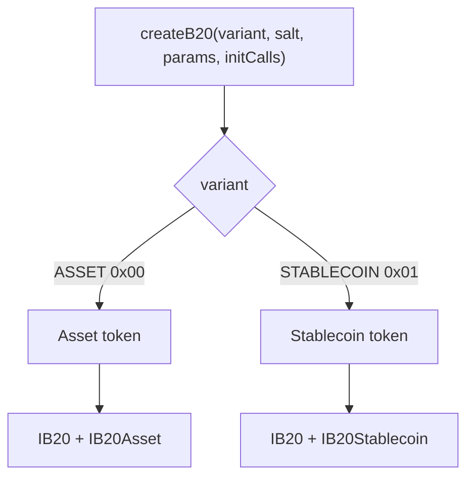
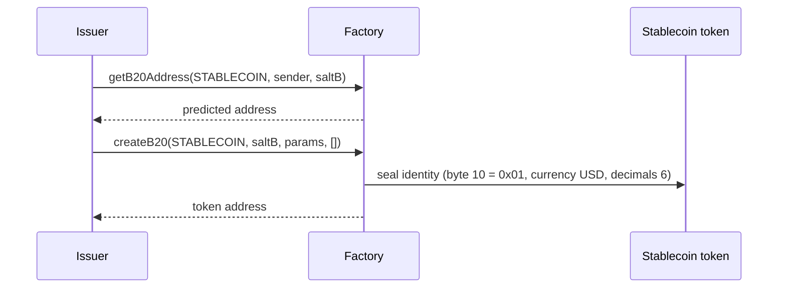
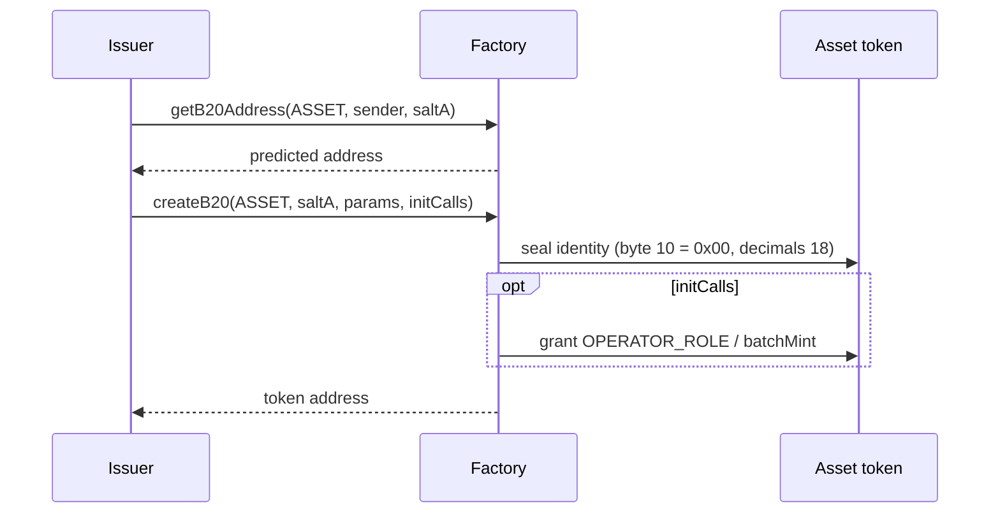
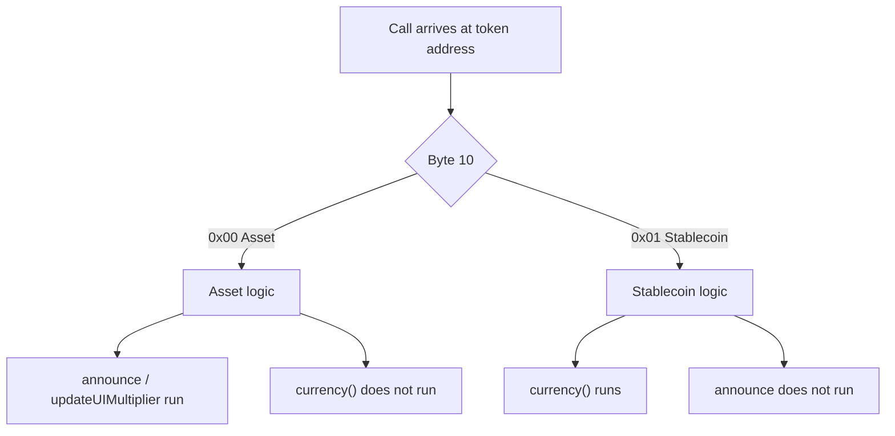

# Token Types

*What Asset and Stablecoin are, how `createB20` seals the type into the address, and what each type adds on top of `IB20`. Address encoding and node dispatch are in [Architecture](../architecture.md). Roles and policies are shared across types; see [Roles and Pause](roles-and-pause.md) and [Policies](policies.md).*

## 1. What a token type is

A B20 token type is the variant chosen at creation. The ABI name is `B20Variant`. Two variants ship:

| Variant | Address byte `[10]` | Interface at the token address |
| --- | --- | --- |
| Asset (`ASSET`) | `0x00` | `IB20` and `IB20Asset` |
| Stablecoin (`STABLECOIN`) | `0x01` | `IB20` and `IB20Stablecoin` |

Both variants implement `IB20`: ERC-20, roles, pause, policies, mint, burn, and seize. Each variant adds a disjoint capability set. Type-specific state uses a disjoint [ERC-7201](https://eips.ethereum.org/EIPS/eip-7201) namespace (`base.b20.asset` or `base.b20.stablecoin`) so those fields cannot collide with shared `base.b20` slots or with the other type.

The type is chosen once. `createB20` writes it into the token address. After that call returns, the type cannot change.

## 2. Why there are two

General-purpose tokens, including RWAs, and fiat-pegged tokens need different class-defining fields. One combined surface would put a currency code on every Asset and announcements on every Stablecoin. B20 splits the surface: Asset carries configurable decimals, announcements, a scheduled UI multiplier, extra metadata, and batched mint. Stablecoin carries an immutable currency code and a fixed `6` decimal convention.

If those extras were optional flags on one binary, class rules would be runtime checks. A Stablecoin address could then execute Asset selectors. B20 compiles each variant as a separate native implementation. The node reads address byte `[10]` and runs that variant's logic. A Stablecoin address never executes Asset selectors. An Asset address never executes Stablecoin selectors.

Wallets, indexers, and issuers still need one Factory, one policy model, and one ERC-20 surface. Duplicating that stack per type would split every integration. Shared infrastructure stays shared: Factory, Policy Registry, Activation Registry, and `IB20`. Callers that only need balances, transfers, roles, or policies use `IB20`. Type-specific calls use `IB20Asset` or `IB20Stablecoin` at the same address.

## 3. How the type is chosen

The issuer chooses the variant only in Factory `createB20(variant, salt, params, initCalls)`. The Factory encodes that choice into the token address. It derives the address from `(variant, sender, salt)`, writes `0xB2` at byte `[0]`, and writes the discriminant at byte `[10]`: Asset `0x00`, Stablecoin `0x01`. `getB20Address(variant, sender, salt)` returns that address before create. If the address is occupied, `createB20` reverts `TokenAlreadyExists`. After return the type cannot change: the address itself holds it.

`params` carries identity. Name, symbol, and `initialAdmin` are shared. Asset adds `decimals`. Stablecoin adds `currency`. The blob is ABI-encoded with a leading `version` byte (currently `1`): `B20AssetCreateParams` or `B20StablecoinCreateParams`. Optional `initCalls` run on the new token in the same transaction. Then the Factory drops access. If that variant is not activated (`B20Asset` / `B20Stablecoin`), `createB20` reverts `FeatureNotActivated`. Deactivating a variant blocks new creation. Existing tokens keep running.

After creation, the node reads the variant byte in the address and runs that variant's logic. How the node recognizes the `0xB2` prefix and the `0xef` stub, and how it dispatches on byte `[10]`, is in [Architecture §2](../architecture.md#2-how-a-token-is-created).

## 4. Asset

Asset is the general-purpose variant. That includes real-world assets (RWAs). It is not an RWA-only type. The type-specific surface is [`IB20Asset`](../../src/interfaces/IB20Asset.sol), which extends `IB20` at the same address.

Creation sets immutable `decimals` in `[6, 18]`. Values outside that range revert `InvalidDecimals`. Asset has no `currency()`.

It adds the Asset-only calls: `announce` for a corporate-action disclosure with a single-use `id` and optional inner calls, scheduled `updateUIMultiplier` / `cancelUIMultiplierUpdate` ([ERC-8056](https://eips.ethereum.org/EIPS/eip-8056)), an extra-metadata key/value store, and `batchMint`. `OPERATOR_ROLE` is Asset-only and gates `announce` and multiplier updates. Name, symbol, contract URI, and extra metadata still use inherited `METADATA_ROLE`.

Asset-specific state lives in `base.b20.asset`: `decimals`, `multiplier`, used announcement IDs, extra metadata, and the pending multiplier. Shared ERC-20, role, policy, and pause state stays in `base.b20`.

## 5. Stablecoin

Stablecoin is the fiat-pegged variant.

`currency` is required and immutable. It must be uppercase ASCII `A`–`Z` only, for example `"USD"`. An empty code reverts `MissingRequiredField`. Any other byte reverts `InvalidCurrency`.

`decimals` is hardcoded to `6`. The issuer does not pass decimals.

The extra surface on top of `IB20` is `currency()`. Stablecoin has no announce, multiplier, extra metadata, `batchMint`, or `OPERATOR_ROLE`.

Stablecoin-specific state lives in `base.b20.stablecoin` (`currency` only). Shared ERC-20, role, policy, and pause state stays in `base.b20`.

`B20Created.variantEventParams` carries ABI-encoded `currency` for Stablecoin. It is empty for Asset.

## 6. Example

The same issuer can create both types. Different salts produce different addresses. The type is visible in byte `[10]`. Type-specific selectors do not cross. Reusing the same `(variant, sender, salt)` reverts `TokenAlreadyExists`.

### 6.1 Creating a Stablecoin

Predict the address with `getB20Address(STABLECOIN, sender, saltB)`. Then call `createB20` with `B20StablecoinCreateParams`: `version` `1`, name, symbol, `initialAdmin`, and `currency: "USD"`.

After return, address byte `[10]` is `0x01`. `decimals()` is `6`. `currency()` is `"USD"`. The type-specific surface is [`IB20Stablecoin`](../../src/interfaces/IB20Stablecoin.sol). Calling `announce` on that address does not run Asset logic.

### 6.2 Creating an Asset

Predict the address with `getB20Address(ASSET, sender, saltA)`. Then call `createB20` with `B20AssetCreateParams`: `version` `1`, name, symbol, `initialAdmin`, and `decimals: 18`. Optional `initCalls` can grant `OPERATOR_ROLE` or call `batchMint` in the same transaction.

After return, address byte `[10]` is `0x00`. `decimals()` is `18`. [`IB20Asset`](../../src/interfaces/IB20Asset.sol) `announce` and `updateUIMultiplier` are live. There is no `currency()`.

### 6.3 A later call

A call to the token address does not choose the type again. The node reads byte `[10]` and runs that variant's logic.

