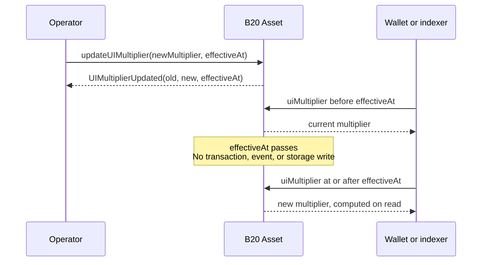
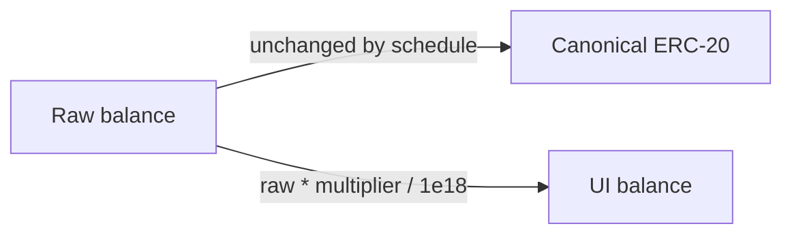
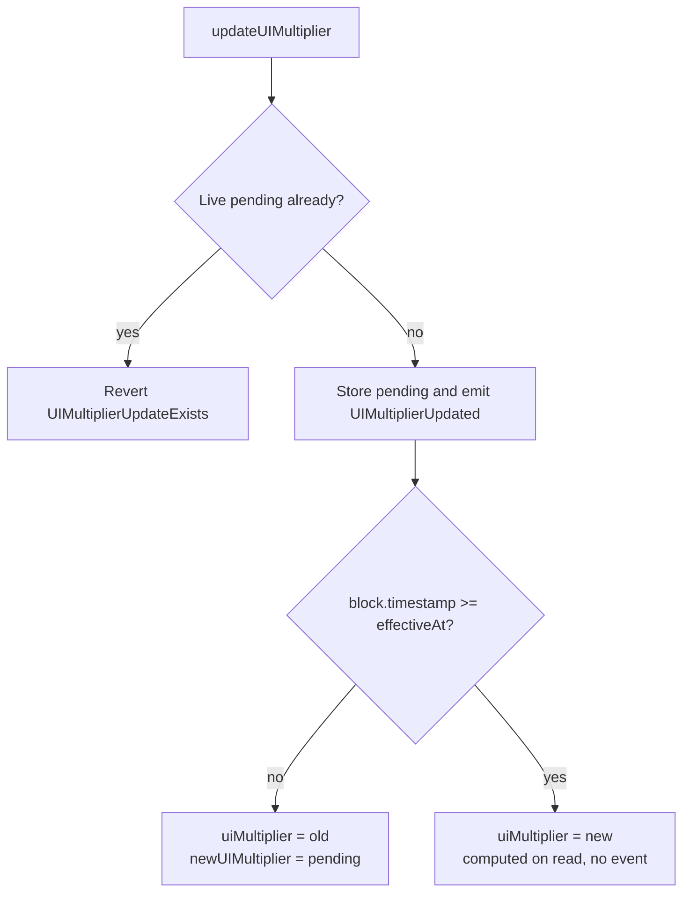
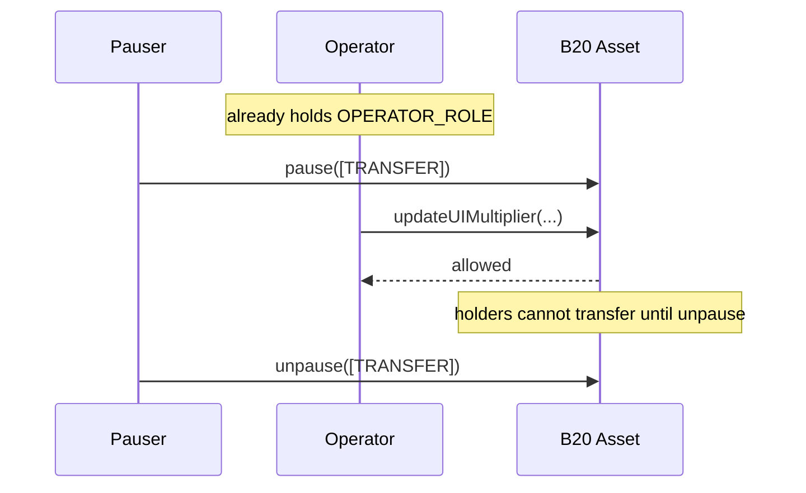
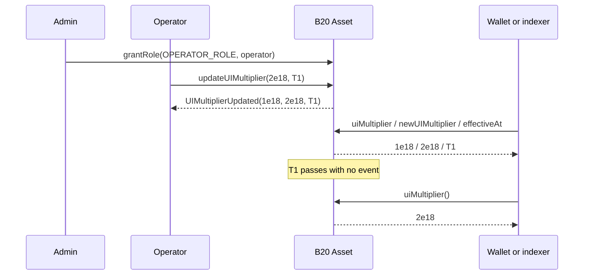

# Schedule a stock split

## Goal

At the agreed time, every holder's displayed balance doubles for a 2-for-1 split, or shrinks for a reverse split. Raw `balanceOf`, `totalSupply`, and transfer amounts stay the same, so DeFi that reads raw units keeps working.

Exchanges, custodians, wallets, and accounting systems need that time in advance so they can prepare UI balances, prices, and books. You schedule the split on-chain ahead of it.

`updateUIMultiplier` is the path for that schedule ([ERC-8056](https://eips.ethereum.org/EIPS/eip-8056)). The multiplier is an 18-decimal WAD: `1e18` is `1.0` (`WAD_PRECISION`). A 2-for-1 split uses `2e18`. A reverse split uses a value below `1e18`.



This surface exists only on **B20 Asset**. Stablecoin has no multiplier. The rest of this guide uses "the asset" for an Asset token.

## Before You Start

You need all of the following:

- A B20 Asset you administer.
- `DEFAULT_ADMIN_ROLE` on that asset, so you can grant `OPERATOR_ROLE`.
- An account that will call the multiplier setters (the operator).
- A future `effectiveAt` timestamp and a `newMultiplier` in `(0, MAX_UI_MULTIPLIER]`.

### Who may schedule

The caller of `updateUIMultiplier`, `cancelUIMultiplierUpdate`, and the deprecated `updateMultiplier` must hold `OPERATOR_ROLE`. Any other caller reverts `AccessControlUnauthorizedAccount`.

Pause does not gate those setters. `PausableFeature` freezes only `TRANSFER`, `MINT`, `BURN`, and `SEIZE`. Freezing transfers around a split is possible, but it is **not recommended** for routine corporate actions — see scenario 3 under Steps. If you do pause, you need `PAUSE_ROLE` / `UNPAUSE_ROLE` in addition to the operator.

### What a multiplier changes

Balances and transfer amounts stay in raw ERC-20 units. UI-specific reads apply the effective multiplier:

| Read | Meaning |
| --- | --- |
| `uiMultiplier()` / `multiplier()` | Effective multiplier at `block.timestamp` |
| `balanceOfUI(account)` / `scaledBalanceOf(account)` | `balanceOf(account) * uiMultiplier() / WAD_PRECISION` |
| `totalSupplyUI()` | `totalSupply() * uiMultiplier() / WAD_PRECISION` |
| `toUIAmount(raw)` / `fromUIAmount(ui)` | Convert at the effective multiplier |

Integer division rounds down. A round trip through `toUIAmount` and `fromUIAmount` can lose up to one unit in the last place (ULP) when `multiplier != WAD_PRECISION`. Prefer 18 decimals for equities to keep that effect small. Raw `balanceOf` does not apply the multiplier at all.



### How a schedule lives

The asset allows **one** pending multiplier at a time.

1. **Schedule.** `updateUIMultiplier(newMultiplier, effectiveAt)` stores the pending pair. `effectiveAt` must be strictly greater than `block.timestamp`.
2. **Live pending.** While `effectiveAt() > block.timestamp`, `uiMultiplier()` still returns the current multiplier, `newUIMultiplier()` returns the scheduled value, and `effectiveAt()` returns the flip time. A second schedule reverts `UIMultiplierUpdateExists`.
3. **Maturation.** When `block.timestamp >= effectiveAt`, reads return the new multiplier. Maturation does **not** write storage and does **not** emit an event.
4. **After maturity.** Until another update, `newUIMultiplier()` mirrors `uiMultiplier()`, and `effectiveAt()` keeps the past timestamp. Detect a live pending with `effectiveAt() > block.timestamp`. Do **not** check `effectiveAt() == 0`.



## Steps

Four scenarios. Start with the main schedule path. Use the others only when you need to cancel, freeze transfers, or correct a bad schedule.

1. Schedule a multiplier.
2. Schedule, then cancel.
3. Schedule while transfers are paused (not recommended).
4. Instant override when the schedule is wrong.

### 1. Schedule a multiplier

This is the routine corporate-action path.

#### Grant `OPERATOR_ROLE`

```solidity
asset.grantRole(asset.OPERATOR_ROLE(), operator);
```

Until this grant lands, every multiplier setter reverts `AccessControlUnauthorizedAccount`.

#### Call `updateUIMultiplier`

`effectiveAt` must be in the future. `newMultiplier` must be in `(0, MAX_UI_MULTIPLIER]`. Read `MAX_UI_MULTIPLIER()` if you need the ceiling without triggering `InvalidMultiplier`.

```solidity
uint256 newMultiplier = 2e18; // 2-for-1 split
uint256 effectiveAt = block.timestamp + 1 days;
asset.updateUIMultiplier(newMultiplier, effectiveAt);
```

On success the asset emits:

`UIMultiplierUpdated(oldMultiplier, newMultiplier, effectiveAtTimestamp)`

That event is the schedule success signal. It fires when the update is **recorded**, not when the multiplier becomes active. If `effectiveAtTimestamp > block.timestamp`, treat the update as pending until that time.

#### Read the live pending state

```solidity
asset.uiMultiplier();      // still the old (current) multiplier
asset.newUIMultiplier();   // scheduled target
asset.effectiveAt();       // flip timestamp
```

A second `updateUIMultiplier` while this pending is live reverts `UIMultiplierUpdateExists`.

#### Confirm after `effectiveAt`

When `block.timestamp >= effectiveAt`, `uiMultiplier()` returns the new multiplier. No second event fires at the flip. No storage write occurs at the flip.

### 2. Schedule, then cancel

Use this when a pending update should not take effect — wrong multiplier, wrong timestamp, or the corporate action is delayed.

Schedule as in scenario 1, then call before `effectiveAt`:

```solidity
asset.cancelUIMultiplierUpdate();
```

On success the asset emits:

`UIMultiplierUpdateCancelled(cancelledMultiplier, cancelledEffectiveAt)`

Discard the pending update when you see this event. `uiMultiplier()` stays at the old value. Cancel after maturity (or with no live pending) reverts `UIMultiplierUpdateDoesNotExist`.

To replace a pending update with a different one, cancel first, then schedule again. Both can run in one `announce` so they share `msg.sender` and the operator role:

```solidity
bytes[] memory calls = new bytes[](2);
calls[0] = abi.encodeCall(IB20Asset.cancelUIMultiplierUpdate, ());
calls[1] = abi.encodeCall(IB20Asset.updateUIMultiplier, (secondMultiplier, secondEffectiveAt));
asset.announce(calls, "reorder-2026-Q3", "reorder split", "https://disclosures.example/");
```

`announce` also emits `Announcement` then `EndAnnouncement` with the same `id`. The `id` is single-use for the asset's lifetime.

### 3. Schedule while transfers are paused

**Not recommended** for routine splits. Pausing `TRANSFER` stops every holder transfer for the window, which is heavier than most corporate actions need. Prefer scenario 1 and let wallets and custodians coordinate off the pending schedule.

If you still need a hard freeze (for example a reverse split where transfers during the window are unsafe), pause needs `PAUSE_ROLE` / `UNPAUSE_ROLE`. Pause does not block `updateUIMultiplier`.

```solidity
asset.pause([PausableFeature.TRANSFER]);
asset.updateUIMultiplier(newMultiplier, effectiveAt);
// ... after effectiveAt ...
asset.unpause([PausableFeature.TRANSFER]);
```



### 4. Instant override when the schedule is wrong

Use this when a live pending update is wrong and you cannot wait for `effectiveAt` — for example the scheduled multiplier is incorrect and books must flip now. Prefer cancel (scenario 2) when waiting is acceptable. Prefer a new schedule after cancel when the fix is still a future timestamp.

The deprecated `updateMultiplier(newMultiplier)` applies immediately and clears any pending update:

```solidity
asset.updateMultiplier(correctMultiplier);
```

Event order depends on pending state:

| Situation | Events (in order) |
| --- | --- |
| Live pending (`effectiveAt > block.timestamp`) | `UIMultiplierUpdateCancelled`, then `MultiplierUpdated(new)`, then `UIMultiplierUpdated(old, new, block.timestamp)` |
| Matured or no pending | `MultiplierUpdated(new)`, then `UIMultiplierUpdated(old, new, block.timestamp)` |

`MultiplierUpdated` is deprecated. Integrators should process only `UIMultiplierUpdated` so they do not handle the same update twice.

## Example

A 2-for-1 split scheduled for tomorrow (scenario 1). The grant and schedule are enough for the routine path.



```solidity
import {IB20Asset} from "base-std/interfaces/IB20Asset.sol";

IB20Asset asset = IB20Asset(assetAddr);

asset.grantRole(asset.OPERATOR_ROLE(), operator);

uint256 splitMultiplier = 2e18;
uint256 effectiveAt = block.timestamp + 1 days;
asset.updateUIMultiplier(splitMultiplier, effectiveAt);

// While live: uiMultiplier() is still WAD_PRECISION; newUIMultiplier() is 2e18.
// After effectiveAt: uiMultiplier() is 2e18. No second event at the flip.
```

## Verify

Look for `UIMultiplierUpdated(oldMultiplier, newMultiplier, effectiveAtTimestamp)` on the schedule transaction. That event is the success signal for recording a change.

Then confirm the three reads while the update is live:

- `uiMultiplier()` equals the old multiplier.
- `newUIMultiplier()` equals the scheduled multiplier.
- `effectiveAt()` equals the scheduled timestamp and is greater than `block.timestamp`.

After `effectiveAt`, confirm `uiMultiplier()` equals the new multiplier. Maturation emits nothing. Do not wait for a second event at the flip.

Integrator rules:

- Listen for `UIMultiplierUpdated`, not deprecated `MultiplierUpdated`.
- If `effectiveAtTimestamp > block.timestamp`, treat the update as pending until that time.
- On `UIMultiplierUpdateCancelled`, discard the pending update.
- When the instant setter emits both events, process only `UIMultiplierUpdated`.

## Common Errors

These errors follow the order `updateUIMultiplier` checks them. Cancel and announce errors follow.

| Error | Why it happened | What to do |
| --- | --- | --- |
| `AccessControlUnauthorizedAccount(caller, OPERATOR_ROLE)` | The caller does not hold `OPERATOR_ROLE`. | Grant `OPERATOR_ROLE` to the operator. |
| `InvalidMultiplier()` | `newMultiplier` is zero or above `MAX_UI_MULTIPLIER`. | Pass a value in `(0, MAX_UI_MULTIPLIER]`. |
| `EffectiveAtInPast(effectiveAt)` | `effectiveAt <= block.timestamp`. | Pass a strictly future timestamp. |
| `EffectiveAtTooFar(effectiveAt)` | `effectiveAt > type(uint64).max`. | Pass a timestamp that fits in `uint64`. |
| `UIMultiplierUpdateExists(effectiveAt)` | A live pending update already exists. | Cancel first, or cancel-then-reschedule in one `announce`. |
| `UIMultiplierUpdateDoesNotExist()` | `cancelUIMultiplierUpdate` with no live pending (including after maturity). | Schedule first, or cancel only while `effectiveAt() > block.timestamp`. |
| `AnnouncementIdAlreadyUsed(id)` | `announce` reused an `id`. | Choose a new single-use `id`. |
| `InternalCallFailed(call)` | An inner call in `announce` reverted (non-Panic). | Fix the encoded cancel/schedule calldata and retry. |

## Related Concepts

- [Token Types](../concepts/token-types.md)
- [Roles and Pause](../concepts/roles-and-pause.md)

## Reference

```solidity
function OPERATOR_ROLE() external view returns (bytes32);
function WAD_PRECISION() external view returns (uint256);
function MAX_UI_MULTIPLIER() external view returns (uint256);

function uiMultiplier() external view returns (uint256);
function multiplier() external view returns (uint256);
function newUIMultiplier() external view returns (uint256);
function effectiveAt() external view returns (uint256);

function updateUIMultiplier(uint256 newMultiplier, uint256 effectiveAt) external;
function cancelUIMultiplierUpdate() external;
function updateMultiplier(uint256 newMultiplier) external; // deprecated emergency override

function announce(
    bytes[] calldata internalCalls,
    string calldata id,
    string calldata description,
    string calldata uri
) external;

function grantRole(bytes32 role, address account) external;
function pause(PausableFeature[] features) external;
function unpause(PausableFeature[] features) external;
```

`updateUIMultiplier(uint256,uint256)` selector: `0x628e600f`.

`cancelUIMultiplierUpdate()` selector: `0x2c97a0f0`.

`updateMultiplier(uint256)` selector: `0x5ffe6146`.

`UIMultiplierUpdated(uint256 oldMultiplier, uint256 newMultiplier, uint256 effectiveAtTimestamp)` topic0: `0x2205df4534432b2f60654a3fdb48737ffdaf3e9edb1a498bd985bc026b15b055`.

`UIMultiplierUpdateCancelled(uint256 cancelledMultiplier, uint256 cancelledEffectiveAt)` topic0: `0x883856335ba5f60c18b9817c4505d3c7d3f6223dcf39516b30c508c46a5e1cad`.

### Events by call

| Call | Events (in order) |
| --- | --- |
| `updateUIMultiplier` | `UIMultiplierUpdated(old, new, effectiveAt)` only |
| `cancelUIMultiplierUpdate` | `UIMultiplierUpdateCancelled(cancelledMultiplier, cancelledEffectiveAt)` |
| `updateMultiplier` with a live pending | `UIMultiplierUpdateCancelled`, then `MultiplierUpdated(new)`, then `UIMultiplierUpdated(old, new, block.timestamp)` |
| `updateMultiplier` with a matured pending or none | `MultiplierUpdated(new)`, then `UIMultiplierUpdated(old, new, block.timestamp)` |
| Maturation (`block.timestamp >= effectiveAt`) | none |

`updateMultiplier` remains callable and unchanged in availability. It is deprecated. Prefer `updateUIMultiplier` for routine corporate actions.
