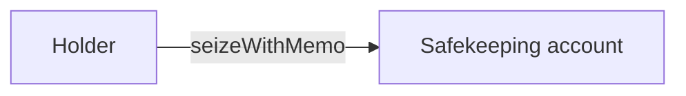
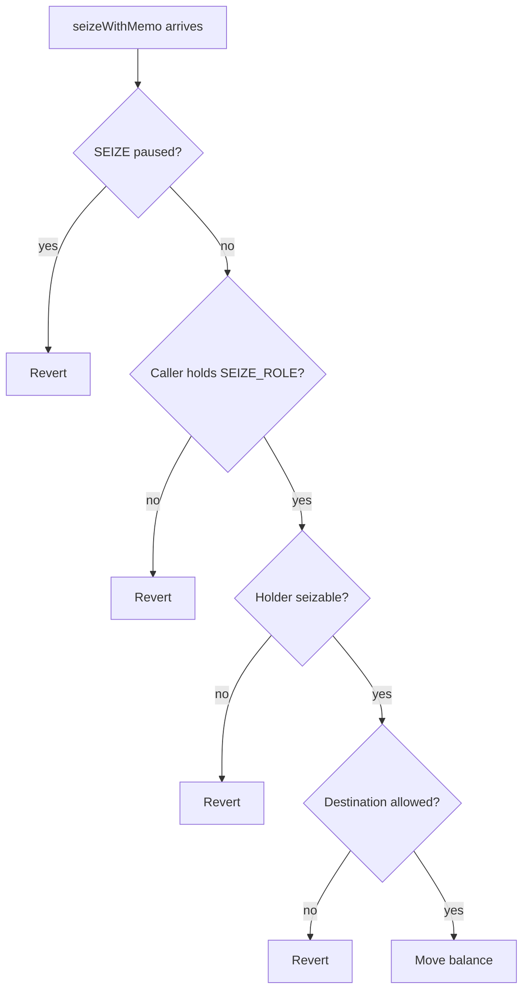
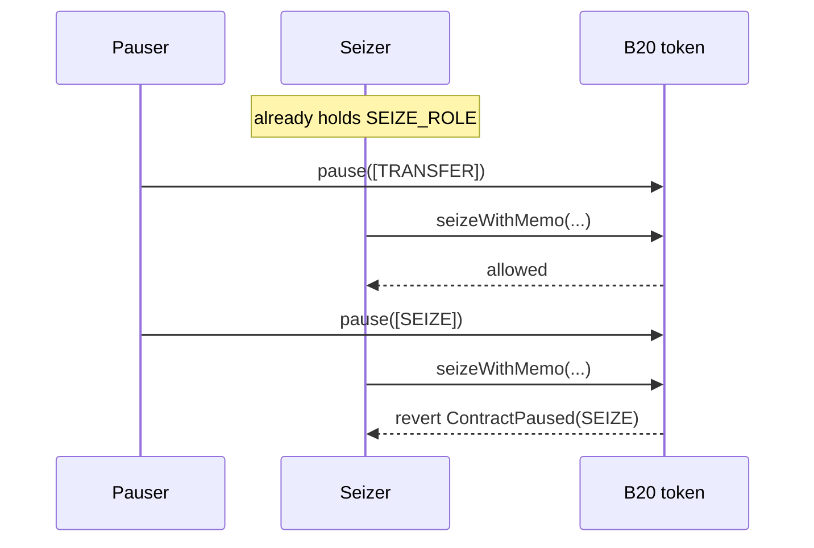
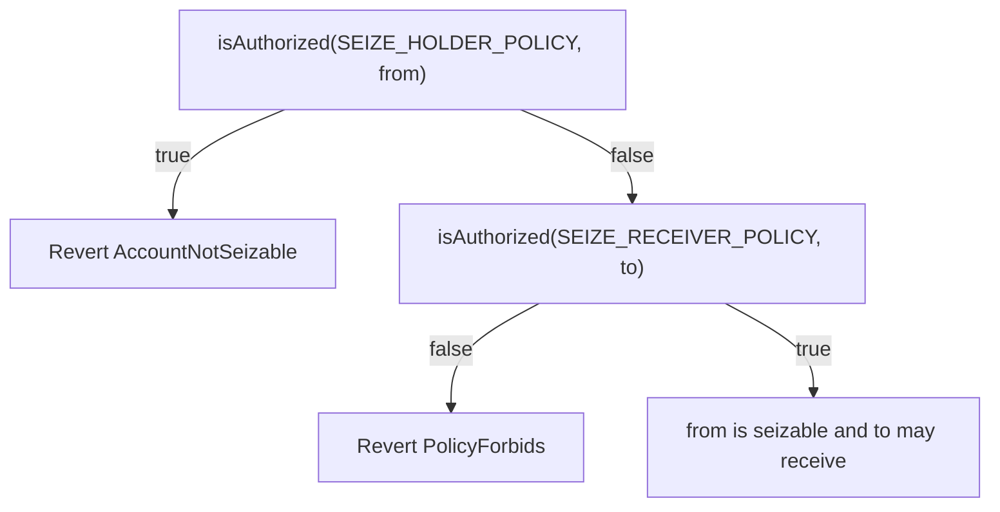
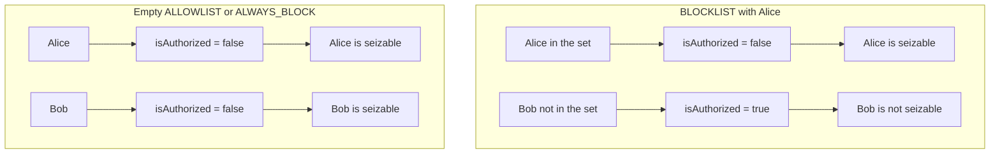
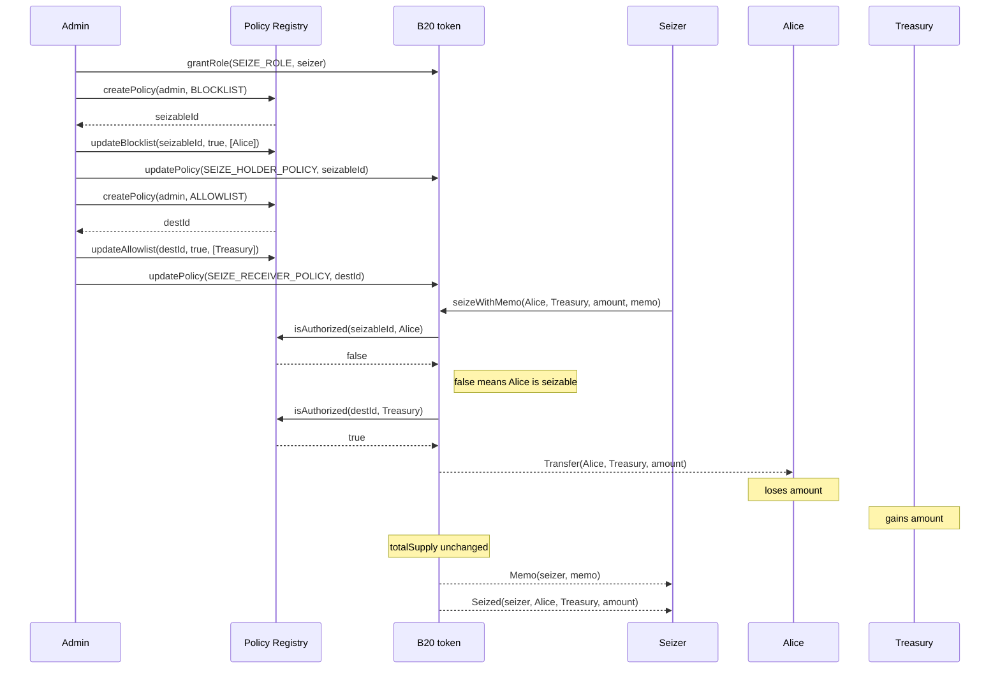
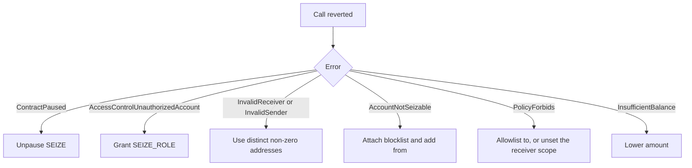

# Seize a holder's B20 balance

## Goal

Move tokens from one holder to a safekeeping account in a single admin call. `totalSupply` does not change.

`seizeWithMemo` is the dedicated path for court orders, sanctions, and freeze-and-reissue workflows. It is not a burn and not a mint. Tokens leave `from` and arrive at `to` in one transfer. After the call, `to` is an ordinary holder: it can transfer, burn, or hold the tokens.




Asset and Stablecoin share this surface. The rest of this guide uses "the token" for either variant.

## Before You Start

You need all of the following:

- A B20 token you administer.
- `DEFAULT_ADMIN_ROLE` on that token, so you can grant roles and attach policies.
- An account that will call `seizeWithMemo` (the seizer).
- A non-zero destination that is not the holder (typically a treasury).
- `SEIZE` not paused. `pause([SEIZE])` blocks every seize until `unpause([SEIZE])`.

Three independent controls then decide whether a seize can run. In this order, the steps later configure them in the same order.




### Who may seize

The caller of `seizeWithMemo` must hold `SEIZE_ROLE`. Any other caller reverts `AccessControlUnauthorizedAccount`.

Pause is a second switch on the same function. A caller with `SEIZE_ROLE` still cannot seize while `PausableFeature.SEIZE` is paused. The call reverts `ContractPaused(SEIZE)`. Pausing `TRANSFER`, `MINT`, or `BURN` leaves seize live.




### Which accounts are in scope

Seize uses two scopes, and they answer different questions:


| Scope                   | Account | Question                     | Default when unset (`0`)                               |
| ----------------------- | ------- | ---------------------------- | ------------------------------------------------------ |
| `SEIZE_HOLDER_POLICY`   | `from`  | Is this holder seizable?     | No. Every account is authorized, so none are seizable. |
| `SEIZE_RECEIVER_POLICY` | `to`    | May seized tokens land here? | Yes. Any destination is allowed.                       |


`SEIZE_HOLDER_POLICY` is inverted relative to transfer and mint scopes. The call proceeds only when `isAuthorized` is **false**. That is why the default (always authorized) blocks every seize until you attach a policy.

`SEIZE_RECEIVER_POLICY` is a normal allow check. The call proceeds only when `isAuthorized` is **true**.




Because the holder check is inverted, pick a policy that returns `false` only for the accounts you intend to seize. A `BLOCKLIST` does that. It authorizes every account that is **not** in the set. Adding a holder makes `isAuthorized` return `false` for that holder, and they become seizable. Everyone else stays authorized and is not seizable.

An `ALLOWLIST` and the `ALWAYS_BLOCK` sentinel do the opposite of what this scope needs. An empty allowlist authorizes nobody: `isAuthorized` is `false` for every account, so every account is seizable. `ALWAYS_BLOCK` is the same result with no member set. Attach neither to `SEIZE_HOLDER_POLICY`.




Seize also does not read the transfer scopes. `TRANSFER_SENDER_POLICY` and `TRANSFER_RECEIVER_POLICY` gate `transfer` and `transferFrom`. They are separate slots. Adding a holder to a transfer blocklist does not change `isAuthorized` under `SEIZE_HOLDER_POLICY`, so that holder is not seizable. Adding a treasury to a transfer allowlist does not change `isAuthorized` under `SEIZE_RECEIVER_POLICY`, so that address is not a seize destination unless you attach it there.

## Steps

Configure the three controls, then seize.

1. Grant `SEIZE_ROLE` to the seizer.
2. Create a `BLOCKLIST` for seizable holders.
3. Add the holder to that blocklist.
4. Attach the blocklist to `SEIZE_HOLDER_POLICY`.
5. Optionally restrict destinations with `SEIZE_RECEIVER_POLICY`.
6. Call `seizeWithMemo(from, to, amount, memo)`.
7. Confirm the `Seized` event.

### 1. Grant `SEIZE_ROLE`

```solidity
token.grantRole(token.SEIZE_ROLE(), seizer);
```

Until this grant lands, every `seizeWithMemo` reverts `AccessControlUnauthorizedAccount`.

### 2. Create a holder blocklist

```solidity
uint64 seizableId = POLICY_REGISTRY.createPolicy(policyAdmin, IPolicyRegistry.PolicyType.BLOCKLIST);
```

The registry assigns a new ID. The member set starts empty, so every account is still authorized and nobody is seizable yet.

`createPolicyWithAccounts` can create the policy and seed the first batch in one call. Batches are capped at 64 accounts.

### 3. Add the holder

Only the policy admin can change membership. Token admin and policy admin are separate.

```solidity
address[] memory holders = new address[](1);
holders[0] = alice;
POLICY_REGISTRY.updateBlocklist(seizableId, true, holders);
```

Alice is now unauthorized under this policy. She is not seizable on your token until the next step attaches the ID.

### 4. Attach the blocklist to `SEIZE_HOLDER_POLICY`

```solidity
token.updatePolicy(token.SEIZE_HOLDER_POLICY(), seizableId);
```

The write takes effect on the next `seizeWithMemo` and emits `PolicyUpdated`. You can reuse an existing blocklist. More than one token can point at the same policy ID.

### 5. Optionally restrict the destination

Skip this step if any safekeeping address is acceptable. The unset receiver scope already allows every `to`.

To lock destinations, create an `ALLOWLIST`, add the treasury, and attach it:

```solidity
uint64 destId = POLICY_REGISTRY.createPolicy(policyAdmin, IPolicyRegistry.PolicyType.ALLOWLIST);
address[] memory dests = new address[](1);
dests[0] = treasury;
POLICY_REGISTRY.updateAllowlist(destId, true, dests);
token.updatePolicy(token.SEIZE_RECEIVER_POLICY(), destId);
```

A treasury does not need to be on a transfer allowlist. Seize checks `SEIZE_RECEIVER_POLICY` only.

### 6. Call `seizeWithMemo`

The seizer calls the token. `from` and `to` must be distinct and non-zero. A `memo` of `bytes32(0)` is allowed.

```solidity
token.seizeWithMemo(alice, treasury, amount, memo);
```

On success the token emits, in order, `Transfer(from, to, amount)`, `Memo(caller, memo)`, and `Seized(caller, from, to, amount)`.

### 7. Confirm the seizure

Look for `Seized(caller, from, to, amount)` on the transaction. That event is the success signal. A revert means the seize did not happen.

## Example

Alice holds `amount`. You grant a seizer, mark Alice seizable with a blocklist, allow only `treasury` as the destination, then move the balance. `totalSupply` stays the same.




```solidity
import {IB20} from "base-std/interfaces/IB20.sol";
import {IPolicyRegistry} from "base-std/interfaces/IPolicyRegistry.sol";
import {StdPrecompiles} from "base-std/StdPrecompiles.sol";

IB20 token = IB20(tokenAddr);
IPolicyRegistry registry = StdPrecompiles.POLICY_REGISTRY;

token.grantRole(token.SEIZE_ROLE(), seizer);

uint64 seizableId = registry.createPolicy(policyAdmin, IPolicyRegistry.PolicyType.BLOCKLIST);
address[] memory holders = new address[](1);
holders[0] = alice;
registry.updateBlocklist(seizableId, true, holders);
token.updatePolicy(token.SEIZE_HOLDER_POLICY(), seizableId);

uint64 destId = registry.createPolicy(policyAdmin, IPolicyRegistry.PolicyType.ALLOWLIST);
address[] memory dests = new address[](1);
dests[0] = treasury;
registry.updateAllowlist(destId, true, dests);
token.updatePolicy(token.SEIZE_RECEIVER_POLICY(), destId);

token.seizeWithMemo(alice, treasury, amount, keccak256("court-order-123"));
```

Prefer this path over the deprecated `burnBlocked` workaround. That workaround blocks the holder under `TRANSFER_SENDER_POLICY`, burns to `address(0)`, then mints to the treasury. `totalSupply` dips and recovers, and there is no `Seized` event.

## Common Errors

These errors follow the order `seizeWithMemo` checks them.


| Error                                                  | Why it happened                                                                                                            | What to do                                                                         |
| ------------------------------------------------------ | -------------------------------------------------------------------------------------------------------------------------- | ---------------------------------------------------------------------------------- |
| `ContractPaused(SEIZE)`                                | `SEIZE` is paused.                                                                                                         | Call `unpause` with `PausableFeature.SEIZE`.                                       |
| `AccessControlUnauthorizedAccount(caller, SEIZE_ROLE)` | The caller does not hold `SEIZE_ROLE`.                                                                                     | Grant `SEIZE_ROLE` to the seizer.                                                  |
| `InvalidReceiver(to)`                                  | `to` is `address(0)`, or `from == to`.                                                                                     | Use a distinct, non-zero safekeeping address.                                      |
| `InvalidSender(from)`                                  | `from` is `address(0)`.                                                                                                    | Pass the holder's address.                                                         |
| `AccountNotSeizable(from)`                             | `from` is still authorized under `SEIZE_HOLDER_POLICY`. The slot is unset, or the holder is not on the attached blocklist. | Attach a blocklist and add `from`.                                                 |
| `PolicyForbids(SEIZE_RECEIVER_POLICY, policyId)`       | `to` is not authorized under `SEIZE_RECEIVER_POLICY`.                                                                      | Add `to` to the receiver allowlist, or set the scope back to `0` (`ALWAYS_ALLOW`). |
| `InsufficientBalance(from, balance, amount)`           | `from` holds less than `amount`.                                                                                           | Seize `balanceOf(from)` or less.                                                   |
| `PolicyNotFound(policyId)`                             | `updatePolicy` received an ID that is not a sentinel and does not exist in the registry.                                   | Create the policy first, then attach the returned ID.                              |
| `Unauthorized()`                                       | A non-admin called `updateBlocklist` or `updateAllowlist`.                                                                 | Call as the policy's `policyAdmin`.                                                |





## Related Concepts

- [Policies](../concepts/policies.md)
- [Roles and Pause](../concepts/roles-and-pause.md)

## Reference

```solidity
function SEIZE_ROLE() external view returns (bytes32);
function SEIZE_HOLDER_POLICY() external view returns (bytes32);
function SEIZE_RECEIVER_POLICY() external view returns (bytes32);

function seizeWithMemo(address from, address to, uint256 amount, bytes32 memo) external;

function grantRole(bytes32 role, address account) external;
function updatePolicy(bytes32 policyScope, uint64 newPolicyId) external;
function policyId(bytes32 policyScope) external view returns (uint64);
function hasRole(bytes32 role, address account) external view returns (bool);

// Policy Registry
function createPolicy(address admin, PolicyType policyType) external returns (uint64 newPolicyId);
function updateBlocklist(uint64 policyId, bool blocked, address[] calldata accounts) external;
function updateAllowlist(uint64 policyId, bool allowed, address[] calldata accounts) external;
function isAuthorized(uint64 policyId, address account) external view returns (bool);
```

`seizeWithMemo` selector: `0xf916d81b`.

`Seized(address indexed caller, address indexed from, address indexed to, uint256 amount)` topic0: `0xa9aec5d8b86e2fa2fd6ac3af62f2622e3dfdab1967d4cbbb56a5df7d74cb887c`.

`AccountNotSeizable(address)` selector: `0x91dbbc8d`.

`burnBlocked(address,uint256)` remains callable and unchanged. It is deprecated.