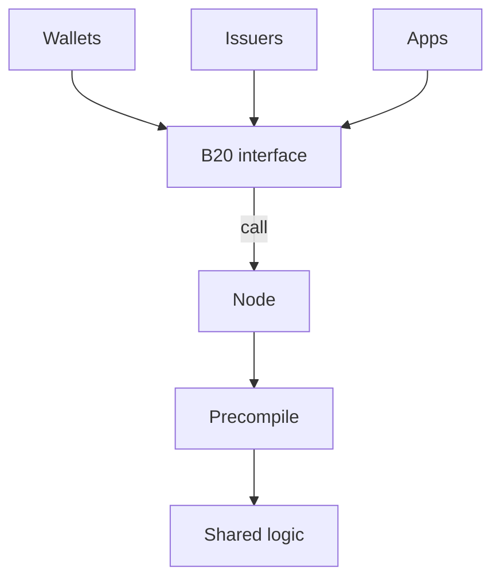
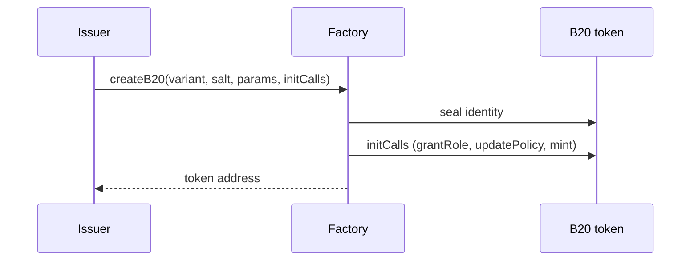
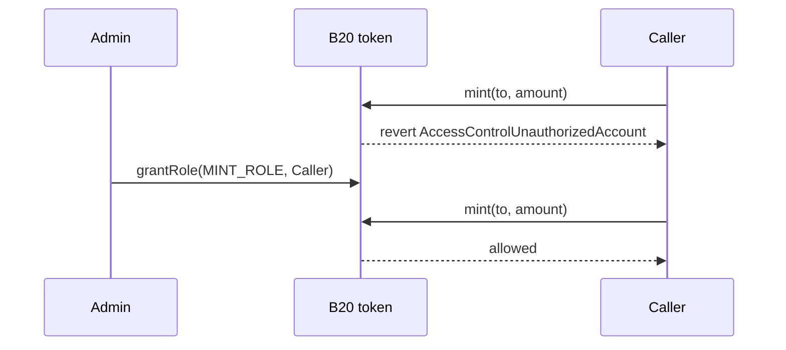
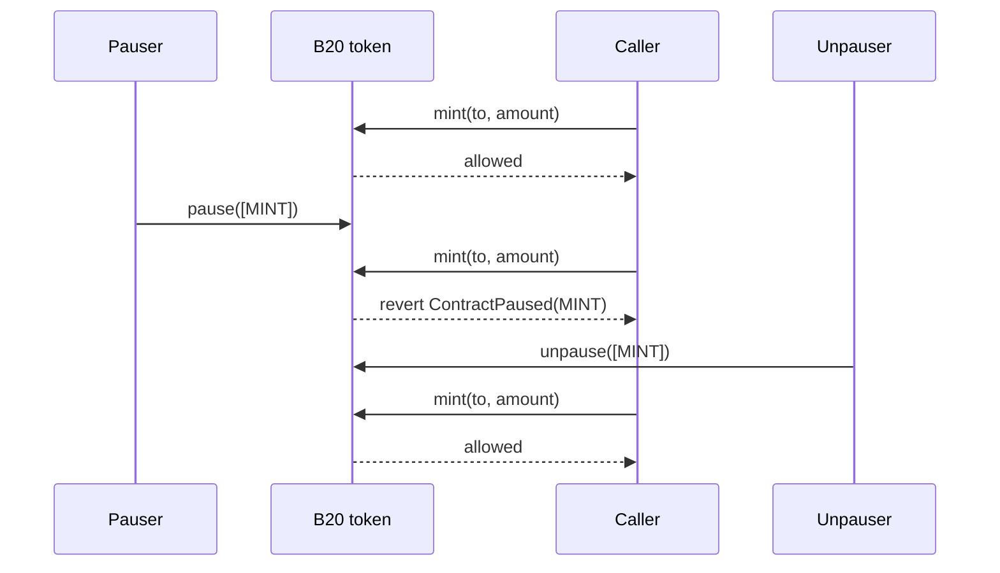
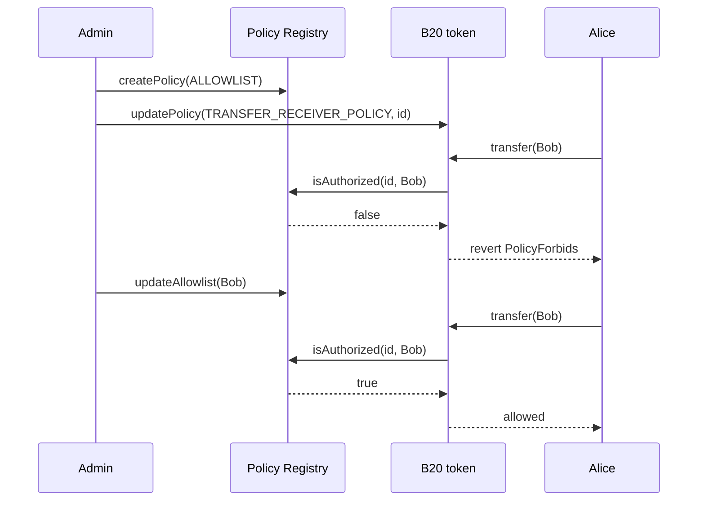

# B20 Overview

B20 is Base's native token standard for issuing and managing programmable assets onchain.

This document provides a high-level introduction to B20: what it is, why it exists, the core primitives it exposes, and how those pieces fit together.

For a deeper technical explanation, see [How B20 Works](./architecture.md).

---

## What is B20?

B20 is Base's native token standard for issuing and managing programmable assets onchain. Base created it to standardize real-world asset (RWA) and stablecoin issuance. B20 is an ERC-20 superset: balances, transfers, and approvals work like ERC-20, and every B20 asset shares the same additional interfaces and protocol logic rather than each issuer deploying a custom token implementation.

The standard also includes compliance and administrative controls. Issuers can configure roles and permissions, attach policies, mint and burn supply, pause operations, and perform other administrative actions that regulated-asset workflows typically require.

B20 runs as precompiles in the Base node, not as per-token Solidity. Wallets, issuers, and apps call ERC-20-style interfaces; the node runs the shared B20 logic natively. Base upgrades that logic through hardforks, so every caller gets consistent behavior and native execution across all B20 assets.

### At a Glance

You call a B20 asset the same way you call any other contract: through its interface at the asset address. Every B20 asset uses that same interface and the same precompile logic, so integrators have one source of truth.

---

## Why B20?

Real-world asset (RWA) issuance onchain needs a shared token standard with compliance built into the asset. ERC-20 covers balances, transfers, and approvals. Regulated assets also need eligibility checks, roles, mint and burn, pausing, and other administrative controls. Issuers rebuild those primitives for almost every tokenized asset.

Issuers who implement that stack themselves repeat the same logic, diverge in behavior, and force every wallet and app to integrate a custom token. B20 is the alternative: you create a B20 asset and configure its roles and policies instead of writing and maintaining a one-off token. Compliance is a first-class primitive, not an add-on each issuer designs around transfers.

A single standard also helps integrators and issuers. Wallets and apps integrate against one interface. Issuers can use shared services, such as oracles, without designing a new integration for each asset.

---

## Creating a B20 Asset

Every B20 token is created through the Factory, a singleton precompile. You submit `createB20` to a Base node the same way you submit any other contract call.

1. The issuer calls `createB20` with a variant, a salt, and creation parameters (name, symbol, initial admin, and variant-specific fields).
2. The Factory assigns a deterministic address from `(variant, sender, salt)` and seals the token's identity.
3. Optional `initCalls` run on the new token so the issuer can grant roles, attach policies, or mint in the same transaction.
4. `createB20` returns. The Factory retains no ongoing access to the token.

Choose **Asset** for general-purpose issuance, including RWAs, or **Stablecoin** for a fiat-pegged token with a fixed currency code. Both variants share roles, policies, and the ERC-20 surface. See [Token Types](./concepts/token-types.md).

The Activation Registry is a Base-operated safety switch that turns Factory and token features on. Issuers and apps do not operate it.

---

## Configuring Roles

Roles let an issuer assign each privileged operation to a specific account. An admin can grant minting to a minter, seizing to a compliance operator, and pausing of a single feature (`TRANSFER`, `MINT`, `BURN`, or `SEIZE`) without pausing the rest of the token.

B20 implements this with [OpenZeppelin AccessControl](https://docs.openzeppelin.com/contracts/5.x/access-control) on the token. Roles are not a separate registry. One `DEFAULT_ADMIN_ROLE` holder grants and revokes the operating roles. A privileged call checks the role first, then the matching pause vector. Holder `transfer` skips the role check; it still hits the `TRANSFER` pause vector and policy.

The full role list and what each role gates is in [Roles](./concepts/roles.md). A role-gated call looks like this:

1. At creation, `initialAdmin` holds `DEFAULT_ADMIN_ROLE`.
2. That admin grants operating roles such as `MINT_ROLE` and `PAUSE_ROLE`.
3. A caller without the required role is rejected with `AccessControlUnauthorizedAccount`.

---

## Pause Vectors

Pause vectors stop a class of operations on a token without pausing the rest of the asset. An issuer uses them when an off-chain workflow needs a feature frozen (for example a settlement window), or when a vulnerability is found and that path must stop immediately.

Pause is per feature, not global. The four vectors are `TRANSFER`, `MINT`, `BURN`, and `SEIZE`. Pausing `MINT` halts new issuance while transfers continue. `approve` is not pause-gated.

`pause` requires `PAUSE_ROLE`. `unpause` requires `UNPAUSE_ROLE`. Those roles are separate, so the account that pauses does not have to be the account that resumes.

A paused call looks like this:

1. A caller who holds `MINT_ROLE` can mint while `MINT` is unpaused.
2. An account with `PAUSE_ROLE` pauses `MINT`. Other features stay live.
3. The next `mint` reverts with `ContractPaused(MINT)`, even if the caller still holds `MINT_ROLE`.
4. An account with `UNPAUSE_ROLE` unpauses `MINT`. Minting works again.

---

## Integrating Compliance Checks

Most compliance checks reduce to a set of addresses and an allow-or-deny decision on a specific function. B20 uses that model instead of per-token hooks: you maintain an allowlist or blocklist, bind it to a function on the token, and the call proceeds or reverts.

Those lists live in the Policy Registry, a global singleton precompile, not on the token. Allowlists, blocklists, and composite policies (union or intersect) are stored there and referenced by policy ID. Because the registry is shared, one list can back many tokens: you maintain membership once, and every attached token sees the same result.

A token admin binds a policy ID to a policy scope with `updatePolicy`. A scope sits in a similar place to a hook: it runs on a specific function. When that function runs, the token asks the registry `isAuthorized(policyId, account)` and reverts with `PolicyForbids` if the check fails. Which scope runs on which function is in [Policies](./concepts/policies.md).

A policy-gated transfer looks like this:

1. Create an allowlist or blocklist on the registry.
2. The token admin binds that policy ID to a scope.
3. On `transfer`, the token asks the registry whether the receiver is authorized.
4. Authorized: the call continues. Denied: the call reverts with `PolicyForbids`.
5. Unset scopes default to always-allow. `approve` is not policy-gated.

---

## Where to Go Next

If you want to understand how B20 works internally:

→ [B20 Architecture](./architecture.md)

If you are integrating B20:

→ [Seize a holder's B20 balance](./guides/seizeing-assets.md)
→ [Schedule a stock split](./guides/scheduling-stock-splits.md)

For exact interfaces and protocol definitions:

→ [Reference](./reference/)
→ [Specifications](./specs/)
