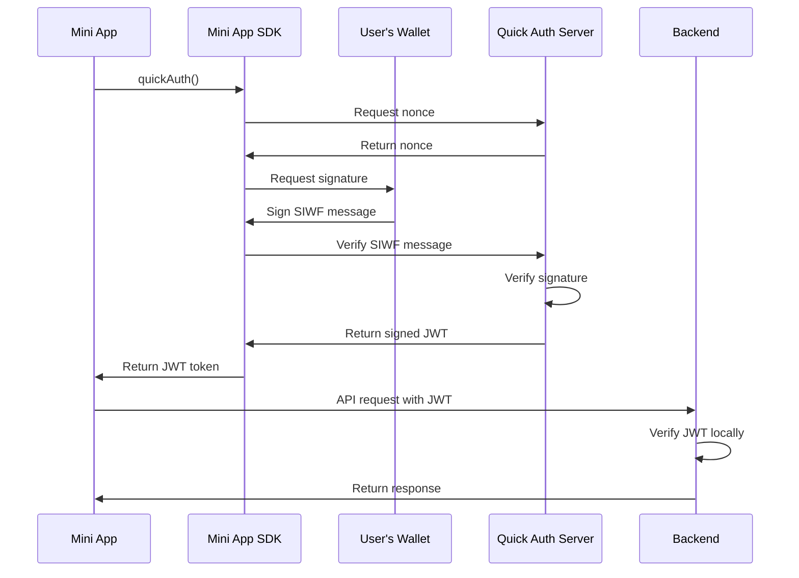

Quick Auth provides instant authentication for mini apps by leveraging Farcaster's identity system. Users authenticate with a single signature, and your app receives a secure JWT for session management - no passwords, email verification, or complex OAuth flows required.

## How It Works



The authentication flow:

1. Your mini app calls `sdk.actions.quickAuth()`
2. The SDK gets a nonce from Quick Auth Server
3. The user signs a SIWF message
4. Quick Auth Server verifies the signature and returns a signed JWT
5. Your app stores the JWT in memory
6. Your backend verifies the JWT locally using the public key


## Implementation

### Step 1: Frontend Authentication

This code authenticates the user with Quick Auth, stores the JWT in memory, and uses it to verify the user's identity with your backend.

 ```jsx App.tsx
import { useState } from "react";
import { sdk } from "@farcaster/miniapp-sdk";

export function App() {
  const [token, setToken] = useState<string | null>(null);
  const [userData, setUserData] = useState<{ fid: number; address: string } | null>(null);

  async function signIn() {
    try {
      const { token } = await sdk.actions.quickAuth();
      setToken(token);
      
      // Use the token to fetch user data
      const response = await fetch('/api/me', {
        headers: { "Authorization": `Bearer ${token}` }
      });
      
      const data = await response.json();
      setUserData(data);
    } catch (error) {
      console.error("Authentication failed:", error);
    }
  }

  function signOut() {
    setToken(null);
    setUserData(null);
  }

  if (!token) {
    return <button onClick={signIn}>Sign In</button>;
  }

  return (
    <div>
      <p>Authenticated as FID: {userData?.fid}</p>
      <button onClick={signOut}>Sign Out</button>
    </div>
  );
}
```


<Note>
Quick Auth returns a JWT that proves the user authenticated. Your backend then verifies this JWT to confirm the user's identity and returns their verified Farcaster data (FID and address). This two-step process ensures secure authentication.
</Note>

### Step 2: Backend Verification

Install the Quick Auth client:


```bash
npm install @farcaster/quick-auth
```

This API route verifies the JWT signature locally and returns the authenticated user's FID and address. The verification proves the user is who they claim to be and gives you their verified FID and address.

```jsx route.tsx
// app/api/me/route.ts
import { createClient, Errors } from '@farcaster/quick-auth';
import { NextRequest, NextResponse } from 'next/server';

const domain = 'your-domain.com'; // Must match your mini app's deployment domain
const client = createClient();

// This endpoint returns the authenticated user's FID and address
// Use this pattern for all authenticated endpoints in your app
export async function GET(request: NextRequest) {
  const authorization = request.headers.get('Authorization');
  if (!authorization?.startsWith('Bearer ')) {
    return NextResponse.json({ error: 'Unauthorized' }, { status: 401 });
  }

  const token = authorization.split(' ')[1];

  try {
    const payload = await client.verifyJwt({ token, domain });
    
    return NextResponse.json({
      fid: payload.sub,
      address: payload.address
    });
  } catch (e) {
    if (e instanceof Errors.InvalidTokenError) {
      return NextResponse.json({ error: 'Invalid token' }, { status: 401 });
    }
    throw e;
  }
}
```


The `verifyJwt` method verifies the JWT signature locally using the public key from the Quick Auth Server. No additional network calls are made.


## Schema

### JWT Payload


```json
{
  "sub": 6841,
  "address": "0xf9D3D372D0097BF26cbf2444B34F5B9522AfaA4b",
  "iss": "https://auth.farcaster.xyz",
  "aud": "your-domain.com",
  "iat": 1747764819,
  "exp": 1747768419
}
```
Payload fields:

<Card>
<ParamField path="sub" type="number" required>
User's Farcaster ID (FID)
</ParamField>

<ParamField path="address" type="string" required>
Ethereum address used to sign in
</ParamField>

<ParamField path="iss" type="string" required>
Quick Auth Server that issued the JWT
</ParamField>

<ParamField path="aud" type="string" required>
Your mini app's domain
</ParamField>

<ParamField path="iat" type="number" required>
Issued at timestamp
</ParamField>

<ParamField path="exp" type="number" required>
Expiration timestamp (1 hour from issuance)
</ParamField>
</Card>

### Self-Hosting

Specify a custom Quick Auth Server:

```tsx
const { token } = await sdk.actions.quickAuth({
  quickAuthServerOrigin: 'https://auth.example.com'
});
```

The default server (https://auth.farcaster.xyz) is deployed globally on the edge for optimal performance.

<CardGroup cols={2}>
<Card title="Search and Discovery" href="/mini-apps/technical-reference/minikit/hooks/useAuthenticate">
  use Minikit's useAuthenticate hook to authenticate users.
</Card>
<Card title="Context" href="/mini-apps/core-concepts/context">
  Understand how context is used in mini apps.
</Card>
</CardGroup>

