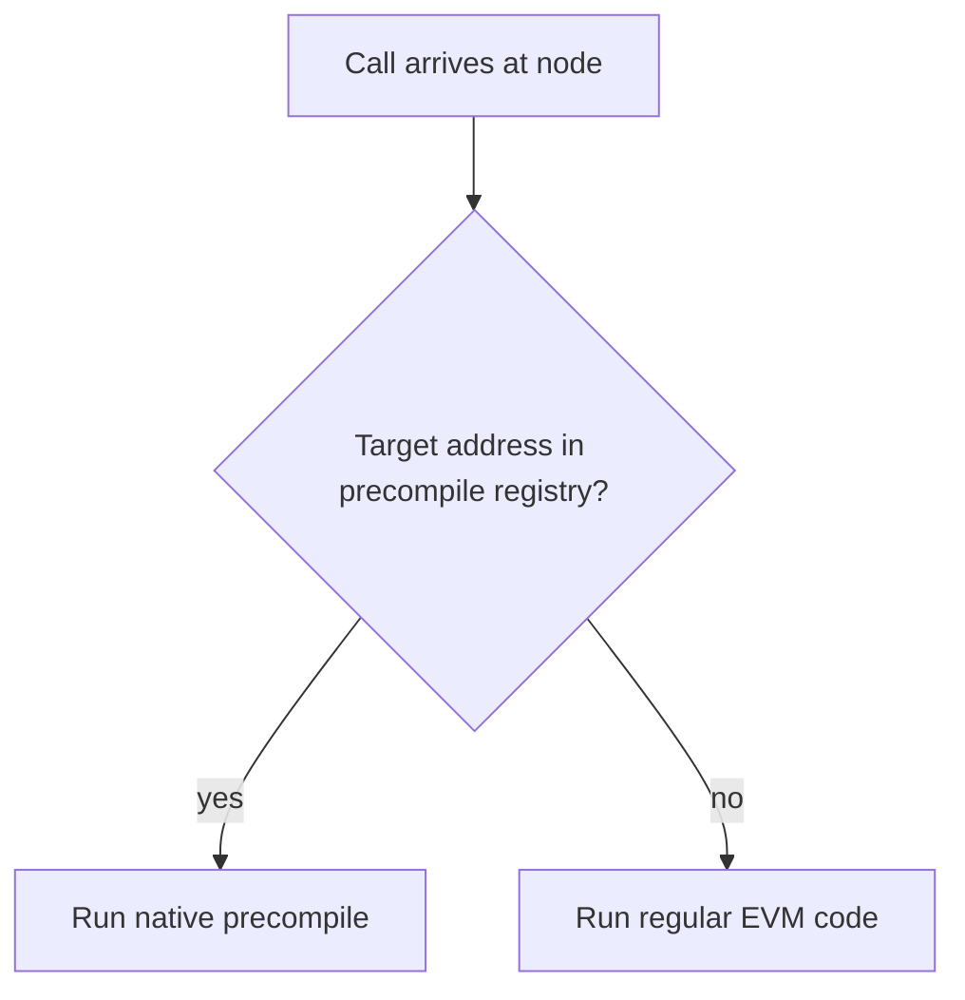
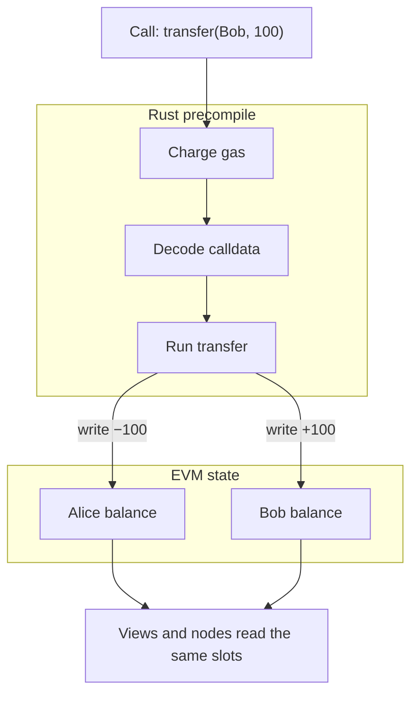
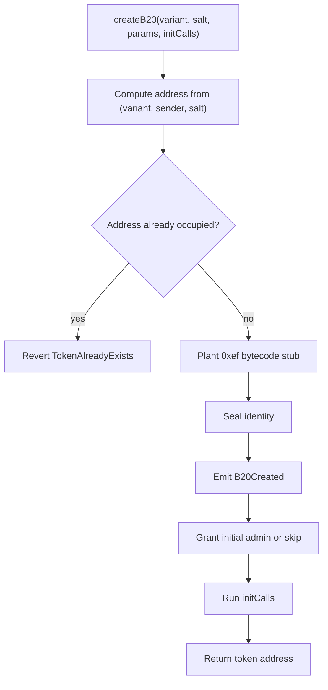
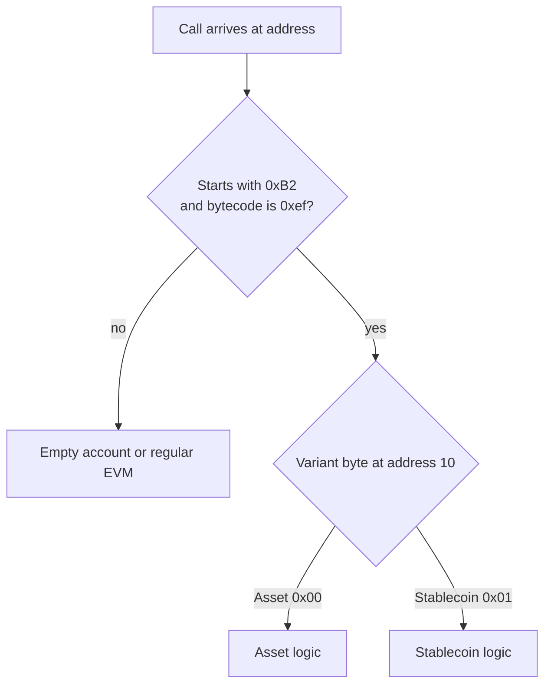
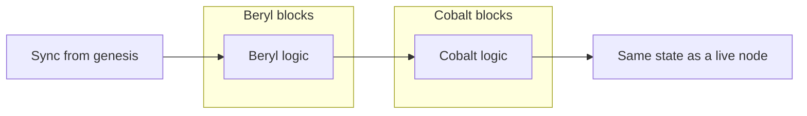

Learn how B20 uses precompiles, how a token is created and recognized, and how the protocol evolves while maintaining execution behavior for earlier hardforks. For assets, roles, and policies, see the [B20 overview](/specifications/b20/specification-overview).

## 1. How B20 Uses Precompiles

### 1.1 Normal Contracts vs Precompiles

Precompiles are code compiled into the node client. Unlike regular smart contracts, they are not deployed as EVM bytecode, and the EVM interpreter does not execute them. They run as native code and bypass the opcode-by-opcode interpreter loop: decode, execute, update stack and memory, then repeat. Ethereum uses precompiles for operations such as hashing and cryptographic primitives. Callers still use a contract-like interface.

Because the interpreter is not in the path, a precompile implements its own state access and gas accounting. State is still stored through the EVM state model, the same way regular contracts store state. Gas metering is defined by the precompile itself rather than by per-opcode interpreter costs.

The node decides which path to take. On every `CALL`, `STATICCALL`, and related opcode, the EVM checks a precompile registry before it loads bytecode at the target address. If the address is registered, native code runs and bytecode is never loaded or interpreted. If it is not registered, the node runs regular EVM code. The client identifies a precompile by a reserved address mapped in that registry.

Classic Ethereum precompiles (`ecrecover`, `sha256`, `ripemd160`, `modexp`, `ecadd`/`ecmul`/`ecpairing`, `blake2f`, and others) are looked up through this same registry. B20 does not bypass or extend the EVM dispatch path. It registers into that path. An address with no bytecode and no registry entry behaves like an empty account: the call returns immediately with no output. That is how a precompile address looks before the hardfork that introduces it.

From the outside, the two paths look the same until the EVM reaches the target. The actor submits a transaction, the node validates and gossips it, the block builder executes it, and the EVM calls the contract address. A regular contract then runs bytecode. A precompile runs native client code. Both paths read and write EVM state.

```mermaid Regular Contracts and Precompiles lines wrap expandable
flowchart TB
    classDef highlight fill:#fff3b0,stroke:#d4a017,color:#000

    subgraph regular [Regular]
        direction LR
        RA[Actor] -->|submits tx| RN[Node]
        RN -->|validate and gossip| RB[Block builder]
        RB -->|executes tx| RE[EVM]
        RE -->|call contract address| RC[Bytecode]
        RC -->|read/write| RS[EVM state]
    end

    subgraph precompile [Precompile]
        direction LR
        PA[Actor] -->|submits tx| PN[Node]
        PN -->|validate and gossip| PB[Block builder]
        PB -->|executes tx| PE[EVM]
        PE -->|call contract address| PC[Native client code]
        PC -->|read/write| PS[EVM state]
    end

    class RC,PC highlight
```

### 1.2 B20's Precompiles

The [Factory](/specifications/b20/reference/interfaces/ib20-factory), [Policy Registry](/specifications/b20/reference/interfaces/i-policy-registry), [Activation Registry](/specifications/b20/reference/interfaces/i-activation-registry), and every [B20 token](/specifications/b20/reference/interfaces/ib20) are precompiles: native, stateful logic at reserved addresses, not deployed bytecode.

- **Factory** — creates B20 tokens through a single `createB20` entrypoint.
- **Policy Registry** — holds shared allowlists, blocklists, and composite policies that tokens query for authorization.
- **Activation Registry** — a Base-operated switch that turns Factory and token features on or off.
- **B20 token** — the asset itself: balances and transfers, plus roles, pause, mint, burn, seize, and policy checks.

Unlike classic Ethereum precompiles, B20 precompiles hold persistent storage and emit events. They behave as system contracts, not one-shot pure functions. The storage they read and write is the same EVM state that regular contracts use.

There are two kinds of B20 precompile: singletons and many-to-many.

Singletons have one instance at a fixed address. The Factory, Policy Registry, and Activation Registry are registered in the node's static precompile table and matched there on every call.

Many-to-many precompiles share one native implementation across many addresses. Token addresses are created at runtime, so they cannot be entries in that fixed table. The node recognizes them dynamically by decoding the address itself. How that routing works is covered in [§2](#2-how-a-token-is-created).

### 1.3 State and Execution

Once the node recognizes the target as a precompile, it routes the call to the native code registered for that address. Bytecode is never loaded.

That registered code is responsible for gas and errors. It charges gas for calldata, `SLOAD`, `SSTORE`, and logs. Its gas metering is defined by the precompile rather than by per-opcode interpreter costs. It can return out-of-gas failures, reverts, and custom errors. A revert restores EVM state the same way a normal contract revert does.

The precompile charges gas, then decodes the calldata and runs the function that selector maps to. A `transfer` call runs transfer. A `createB20` call runs createB20.

Those functions have state to update. Precompiles share state with the EVM: they write straight into the account storage at their own address, the same slots a contract would use. There is no side database. A `transfer` updates that token's balances. A later `balanceOf` or `eth_getStorageAt` is an `SLOAD` of what that write committed.

Each precompile uses [ERC-7201](https://eips.ethereum.org/EIPS/eip-7201) layout at its own address. Its namespace root is `keccak256(namespace) - 1`, masked to a slot boundary. Fields sit at fixed offsets from that root, and keyed data such as balances and allowances use `keccak256(key, slot)`, the mapping formula Solidity uses. Each precompile writes only to its own account. Tokens do not share a storage account. Shared lists live on the Policy Registry, and a token stores only a policy ID.

Checks include activation, role, pause, and policy. Activation does not hide the address: once a hardfork introduces a precompile, the address stays in the routing table. Inactive writes revert with `FeatureNotActivated`. Reads stay available. Deactivating a variant blocks new Factory creation. Existing tokens keep running.

## 2. How a Token Is Created

### 2.1 Creating a Token

A B20 token is created through the [Factory](/specifications/b20/reference/interfaces/ib20-factory/create-b20). Its single entrypoint is `createB20(variant, salt, params, initCalls)`.

The caller supplies a variant (Asset or Stablecoin), a salt, and `params` that carry the token's metadata: name, symbol, decimals, and variant-specific fields. `initCalls` is optional. When present, it is a list of bootstrap calls the Factory runs on the new token in the same transaction.

The Factory computes the token's address deterministically from `(variant, sender, salt)`, then checks that nothing already exists there. If the address is occupied, `createB20` reverts with `TokenAlreadyExists`.

If the address is empty, the Factory plants a single `0xef` byte as the account's bytecode. B20 tokens are not EVM contracts, so they do not carry traditional bytecode. The node does not interpret that stub. Instead, it routes by address, as described in [§1.2](#12-b20s-precompiles). `0xef` is the [EIP-3541](https://eips.ethereum.org/EIPS/eip-3541) reserved prefix, so ordinary `CREATE` and `CREATE2` cannot produce it. An address with the `0xB2` prefix and that stub is created by the Factory.

The Factory then seals the token's identity — name, symbol, decimals, and variant-specific fields — emits `B20Created`, and grants the initial admin role. Passing `address(0)` as the initial admin skips that grant and creates an adminless token. It then runs `initCalls` against the new token and returns the token's address.

Once `createB20` returns, the Factory has no further access to the token. Creation is a one-shot, one-transaction event.

### 2.2 Recognizing a B20 Token

Token addresses cannot be entries in the node's static precompile table. They are created at runtime, so the node recognizes them by reading the address and the account's bytecode.

The address layout is a `0xB2` prefix (byte `[0]` is `0xB2`, bytes `[1:9]` are zero), a variant byte at position `[10]`, and a suffix derived from `keccak256(sender, salt)`. `isB20(address)` reads that prefix directly. It does not consult a registry.

`isB20` is prefix-only, so it can return true for an address the Factory has not created yet. `isB20Initialized` checks both the `0xB2` prefix and the `0xef` stub that the Factory plants in [§2.1](#21-creating-a-token).

Dynamic routing uses both checks. On every call, the node asks: does this address start with `0xB2`, and is the account bytecode the `0xef` stub? If either check fails, the target is not a live B20. The call follows the ordinary empty-account or regular-EVM path described in [§1.1](#11-normal-contracts-vs-precompiles).

If both checks pass, the node decodes the variant from address byte `[10]` and dispatches to the matching native logic. Asset (`0x00`) runs Asset logic. Stablecoin (`0x01`) runs Stablecoin logic.

Before a token is created, its predicted address matches the `0xB2` prefix but has no stub. Calling it is a no-op. After `createB20` returns, the `0xef` stub is what flips the address from "looks like a B20" to "is a live B20," and routing begins.

## 3. How B20 Evolves

B20 introduces new changes through protocol upgrades. On Base, those upgrades are hardforks: moments when consensus itself changes. For B20, a hardfork is when the protocol can update the logic that runs at a specific precompile address, or introduce a new precompile entirely.

### 3.1 Protocol Upgrades

Base ships protocol changes as hardforks (for example Beryl → Cobalt). That is the same gate that any other consensus change uses. A B20 hardfork can do one of two things:

- Introduce a new precompile. The Activation Registry itself exists only from Beryl onward.
- Update the logic that runs at a specific precompile address, by shipping a new logic version.

Callers still hit the same address. What changes is which native implementation the node runs for that address after the fork.

### 3.2 Execution Consensus

Every hardfork must preserve execution consensus with every earlier hardfork. Logic that ran at Beryl must still run as Beryl logic after Cobalt ships a different version. The code at each hardfork is fixed: later forks add new versions; they do not rewrite the old ones.

That invariant is what makes genesis sync work. A node that replays every block from genesis must arrive at the same state as a node that has been live the whole time. If Beryl-era logic were edited in place at the precompile's fixed address, historical blocks would execute differently, and the replayed chain would diverge.

Each shipped version is therefore frozen: self-contained, with no shared mutable state or traits across versions.

### 3.3 Fork / Version Resolution

A hardfork resolves to a specific logic version: fork → version enum → frozen implementation. The node resolves that mapping once per call. It uses the version selected by the active fork, not the latest implementation. A Beryl block runs Beryl logic after Cobalt has shipped.

A call reverts if no version is resolved for the active fork — for example, calling logic that does not exist yet. There is no silent fallback to a default version.
