# Policies

*How B20 reuses shared allowlists and blocklists for compliance checks. Roles and pause are a separate authorization layer; see [Roles and Pause](/specifications/b20/concepts/roles-and-pause). The Policy Registry precompile itself is in [Architecture](/specifications/b20/architecture).*

## 1. Why policies exist

Most token compliance reduces to a membership check on an address list: is this account allowed to send, receive, or be minted to? Issuers repeat those lists across many tokens. Copying the same KYC allowlist or sanctions blocklist onto every token creates drift. One list update has to land in every copy.

Policies move the list into one place. The Policy Registry is a singleton precompile. It stores each list once, with the membership logic that runs on it. A token stores only a policy ID in a slot. Before a gated function runs, the token asks the registry whether the relevant address is authorized. Many tokens can share one policy. An update to that policy is visible to every token that references it.

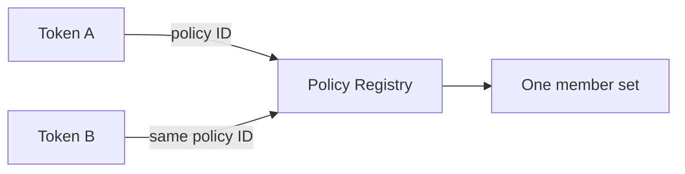

A role answers who may call a privileged function. Pause answers whether that class of operation is live. A policy answers whether a specific address is authorized for that operation. All three can apply to the same call.

## 2. How policies work

### 2.1 The registry and the token

The Policy Registry owns member sets and composite gates. Creation is permissionless. Each policy has an admin who updates membership, replaces a composite's children, or transfers administration. Tokens never write those lists. They store a `uint64` policy ID per [scope](#32-policy-scopes) and call `isAuthorized(policyId, account)` when that scope runs.

`isAuthorized` never reverts. It returns whether the account is authorized under that policy. The token decides what a `false` (or, for one scope, a `true`) means. Most scopes revert `PolicyForbids` when the result is `false`. The function then does not run.

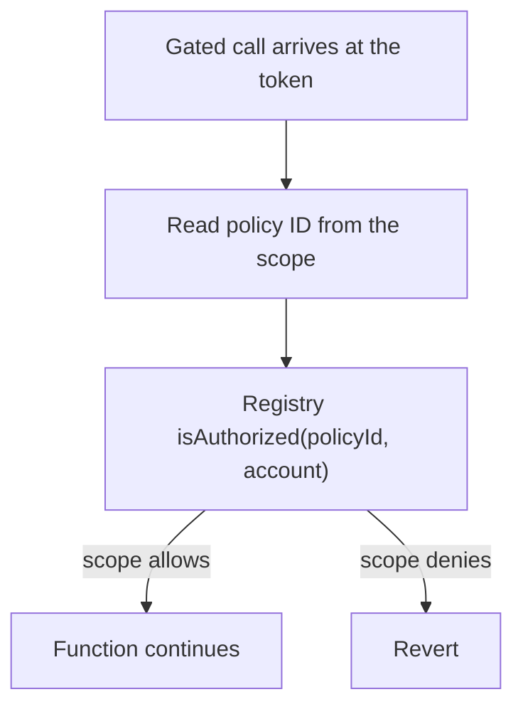

### 2.2 Policy types

A policy is either simple or composite.

A **simple** policy decides from one address set:

| Type        | Authorized when               |
| ----------- | ----------------------------- |
| `ALLOWLIST` | The account is in the set     |
| `BLOCKLIST` | The account is not in the set |

An empty allowlist authorizes nobody. An empty blocklist authorizes everybody.

A **composite** policy combines two to four existing simple policies. It does not copy their members. Each `isAuthorized` call reads each child's current set:

| Type        | Authorized when                    |
| ----------- | ---------------------------------- |
| `UNION`     | Any child authorizes the account   |
| `INTERSECT` | Every child authorizes the account |

Children must be existing `ALLOWLIST` or `BLOCKLIST` policies. Another composite is not a valid child. The built-in sentinels in [§2.5](#25-built-in-sentinels) are not valid children either. Updating a child's members changes every composite that references it. There is no flatten-and-copy step. Any of these types can also be inverted. See [§2.3](#23-inverting-a-policy).

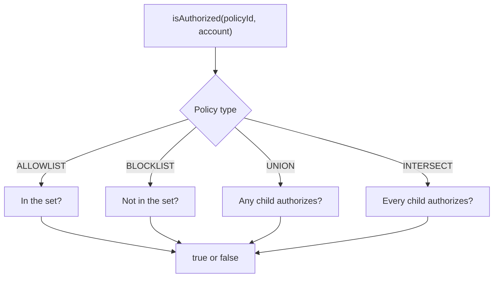

### 2.3 Inverting a policy

An issuer may want the opposite of an existing policy without a second member set. Bit 63 of a policy ID is the invert (NOT) flag. That is not a new policy type and not a create path. Members stay on the base. An update to the base updates the inverse.

Call `invertedPolicyId(policyId)` to set or clear that bit. You can also set bit 63 yourself. Bind the inverted ID to a token scope, or pass it as a composite child ("A AND NOT X"). The flag applies to every type: `ALLOWLIST`, `BLOCKLIST`, `UNION`, and `INTERSECT`.

`isAuthorized` on an inverted ID returns the opposite of the base. If the base does not exist, the result is `false`. That fail-closed guard prevents a mistyped inverted ID from becoming allow-everyone.

Read views strip bit 63 and load the base. `policyExists` and `policyAdmin` on an inverted ID match the base. An inverted ID has no record of its own.

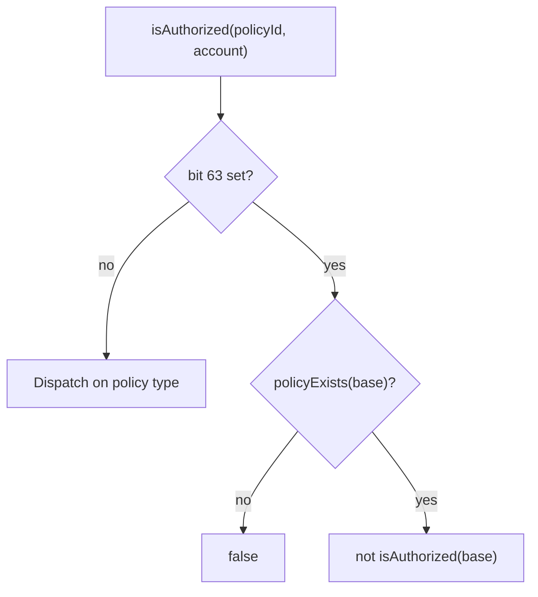

A composite child ID may carry the invert bit. The registry checks existence and simple type against the base. An inverted simple child is valid. An inverted composite child reverts `InvalidChildPolicy`. Across the whole child set, `PolicyNotFound` still takes precedence over `InvalidChildPolicy`.

### 2.4 Creating and updating

Anyone can create a policy. The create call names a single `admin`. That address is the only one that can later change membership, replace a composite's children, transfer administration, or renounce. The creator does not have to be the admin. `admin` cannot be `address(0)`.

You can also skip creation and reuse an existing policy. If another issuer already maintains the list you need, bind their policy ID to your token. You do not become that policy's admin by attaching it.

#### 2.4.1 Creating a policy

A simple policy starts as an `ALLOWLIST` or a `BLOCKLIST`. Call `createPolicy(admin, ALLOWLIST)` or `createPolicy(admin, BLOCKLIST)`. The registry assigns a new policy ID and returns it. The member set is empty. `createPolicyWithAccounts(admin, policyType, accounts)` does the same and seeds the set in that call. Membership batches are capped at 64 accounts.

A composite starts from policies that already exist. Call `createCompositePolicy(admin, UNION | INTERSECT, childPolicyIds)`. The child count must be in `[MIN_COMPOSITE_CHILD_POLICIES, MAX_COMPOSITE_CHILD_POLICIES]` (`2` through `4`). The registry stores references, not a snapshot of the children's members. A child ID may be inverted. The registry validates the base and stores the child ID with the invert bit set. See [§2.3](#23-inverting-a-policy).

Both paths emit `PolicyCreated` and `PolicyAdminUpdated(policyId, address(0), admin)`. `policyAdmin(policyId)` then returns that admin.

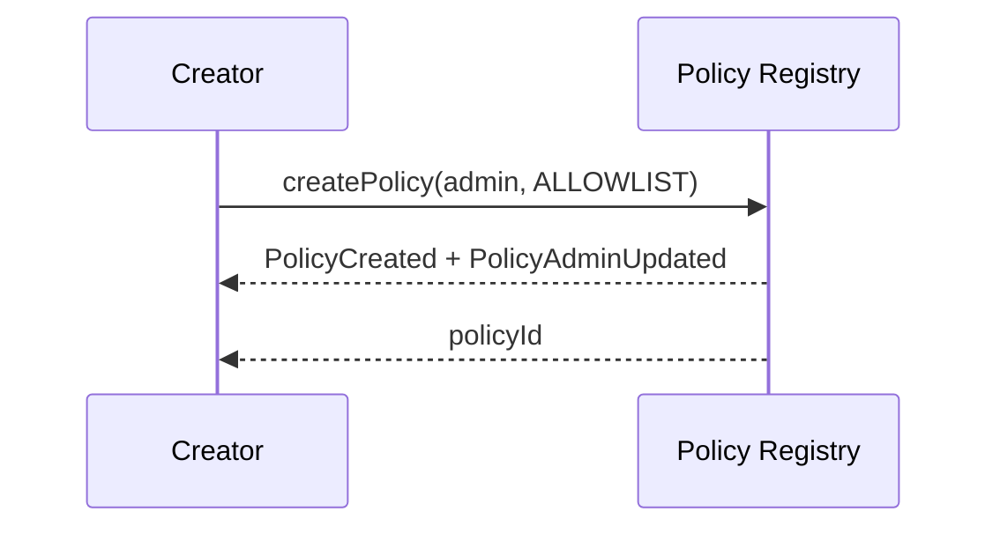

#### 2.4.2 Updating a policy

After creation, only the current admin can change the policy. Any other caller reverts `Unauthorized`. The update must match the policy's type or it reverts `IncompatiblePolicyType`.

The admin of an allowlist calls `updateAllowlist(policyId, allowed, accounts)` to add or remove members. The admin of a blocklist calls `updateBlocklist(policyId, blocked, accounts)`. The admin of a composite calls `updateComposite(policyId, childPolicyIds)` to replace the child set in full. There is no partial child edit.

Those writes change what `isAuthorized` returns on the next query. Every token that already stores this policy ID sees the new result. The token does not need a second `updatePolicy`.

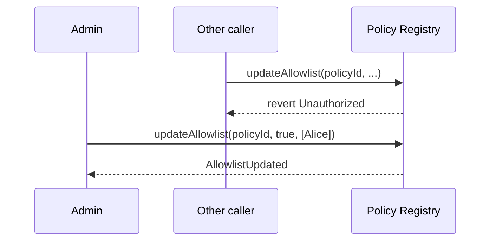

#### 2.4.3 Changing the admin

A policy has one admin at a time. To hand it off, the current admin calls `stageUpdateAdmin(policyId, newAdmin)`. That does not change who can update the policy yet. `policyAdmin` still returns the current admin. `pendingPolicyAdmin` returns `newAdmin`. Passing `address(0)` clears a nomination that has not been finalized.

The pending admin then calls `finalizeUpdateAdmin(policyId)`. The caller must be the staged address, or the call reverts `Unauthorized`. If nothing is staged, it reverts `NoPendingAdmin`. On success the pending admin becomes the current admin, the pending slot clears, and the previous admin can no longer update the policy.

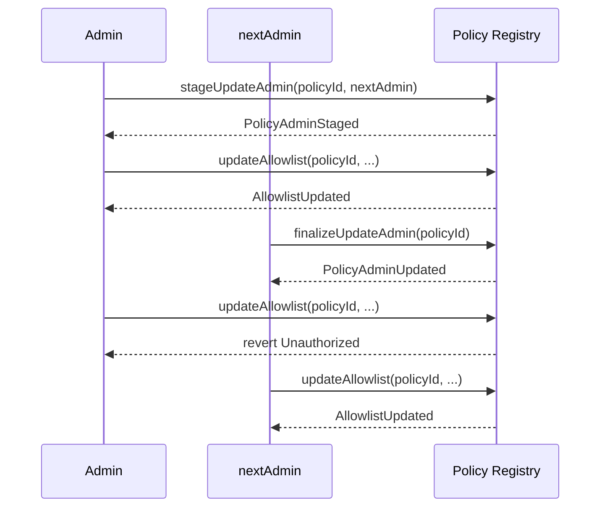

To freeze a policy instead of handing it off, the current admin calls `renounceAdmin(policyId)`. Administration is gone for good. Membership and child sets cannot change. `isAuthorized` keeps working. There is no call that assigns a new admin after renounce.

### 2.5 Built-in sentinels

Two policy IDs exist without being created:

| ID                   | `isAuthorized`            | Typical use                                             |
| -------------------- | ------------------------- | ------------------------------------------------------- |
| `ALWAYS_ALLOW` (`0`) | `true` for every account  | No compliance on that scope. This is the unset default. |
| `ALWAYS_BLOCK`       | `false` for every account | Deny every account on that scope.                       |

## 3. How policies attach to a token

A scope is an identifier for the policy that runs on a specific function. It works like a hook. When that function is called, the token reads the policy ID bound to the scope and asks the registry `isAuthorized` about the address the scope checks. The registry still holds the list. The token stores only the ID.

### 3.1 Updating a scope

`updatePolicy(policyScope, newPolicyId)` binds a policy ID to a scope. It requires `DEFAULT_ADMIN_ROLE`. The ID must be a built-in sentinel or an existing registry policy. Otherwise the call reverts `PolicyNotFound`. An inverted ID is valid when its base exists, because `policyExists` strips bit 63. The token treats the ID as an opaque `uint64`. An unknown `policyScope` reverts `UnsupportedPolicyType`.

The write takes effect on the next call that hits that scope. It emits `PolicyUpdated`. Until you update a scope, it reads as `0` (`ALWAYS_ALLOW`), so the check passes for every address. The same policy ID can sit on more than one scope and on more than one token. `policyId(policyScope)` reads the current binding.

You can also bind a policy in `createB20` `initCalls`, in the same transaction that creates the token.

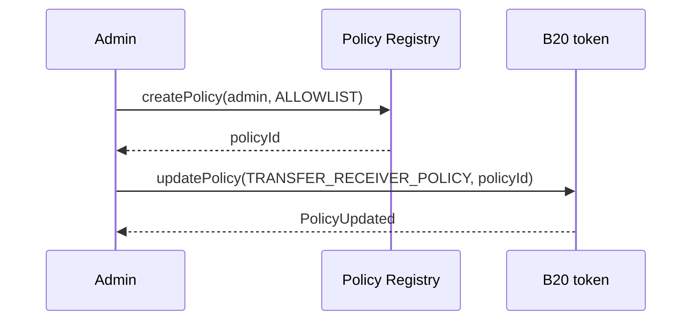

### 3.2 Policy scopes

Most scopes deny when `isAuthorized` is `false` and revert `PolicyForbids`. `SEIZE_HOLDER_POLICY` denies when `isAuthorized` is `true` and reverts `AccountNotSeizable`.

| Scope                      | Runs on                                                                                         | Account checked                     | Denies when `isAuthorized` is | Error                |
| -------------------------- | ----------------------------------------------------------------------------------------------- | ----------------------------------- | ----------------------------- | -------------------- |
| `TRANSFER_SENDER_POLICY`   | `transfer`, `transferFrom`, and memo'd variants. Skipped on factory `initCalls` transfers.      | `from` (`msg.sender` on `transfer`) | `false`                       | `PolicyForbids`      |
| `TRANSFER_RECEIVER_POLICY` | `transfer`, `transferFrom`, and memo'd variants. Skipped on factory `initCalls` transfers.      | `to`                                | `false`                       | `PolicyForbids`      |
| `TRANSFER_EXECUTOR_POLICY` | `transfer`, `transferFrom`, and memo'd variants. Skipped on factory `initCalls` transfers.      | `msg.sender`                        | `false`                       | `PolicyForbids`      |
| `MINT_RECEIVER_POLICY`     | `mint`, `mintWithMemo`, and Asset `batchMint`. Always checked, including factory `initCalls` mints. | `to`                                | `false`                       | `PolicyForbids`      |
| `SEIZE_HOLDER_POLICY`      | `seizeWithMemo`. Unset (`ALWAYS_ALLOW`) means no account is seizable.                            | `from`                              | `true`                        | `AccountNotSeizable` |
| `SEIZE_RECEIVER_POLICY`    | `seizeWithMemo`. Unset (`ALWAYS_ALLOW`) means seize may send to any destination.                 | `to`                                | `false`                       | `PolicyForbids`      |

## 4. Example

Start with a receiver allowlist. Then combine it with a sanctions blocklist so a transfer requires both. Then invert an exclusion allowlist so the same gate can say "on KYC and not on that list" without a second member set.

### 4.1 One allowlist

Create an allowlist, add the KYC'd accounts, and bind it to `TRANSFER_RECEIVER_POLICY`. Alice is on the list. Bob is not. A holder can send to Alice. A send to Bob reverts.

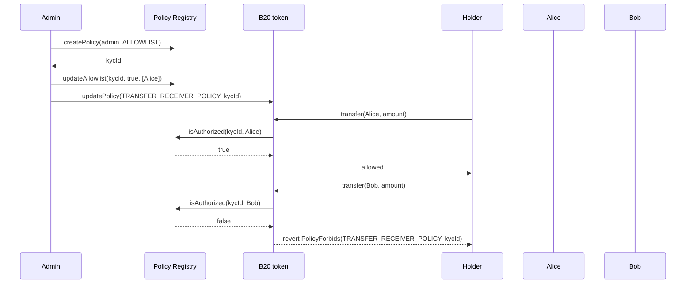

Adding Bob to the allowlist later authorizes him on every token that already points at `kycId`. There is no second write on the token.

### 4.2 Composite: KYC and sanctions

A single allowlist cannot express "on the KYC list and not on the sanctions list" when those lists are maintained separately. Create both simple policies, then an `INTERSECT` composite, then bind the composite to the transfer and mint scopes.

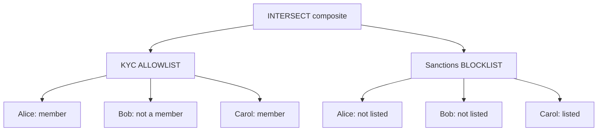

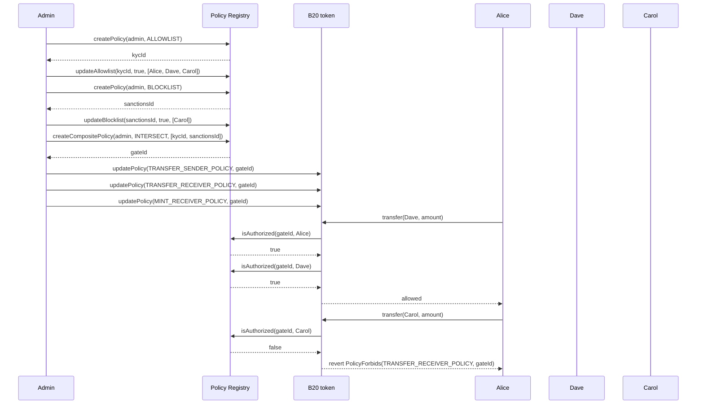

Alice and Dave are on the KYC list and not on the sanctions list, so both children authorize them and the `INTERSECT` returns `true`. Carol is KYC'd but sanctioned: the blocklist returns `false`, so the composite returns `false` and the transfer reverts. Bob is not on the KYC list, so he is denied even though he is not sanctioned.

A later `updateBlocklist` that adds or removes Carol changes the composite on the next call. The token still holds `gateId`. The issuer does not call `updatePolicy` again.

If the issuer later needs the same KYC list or-ed with a token-specific partner allowlist, they create a `UNION` of those two allowlists instead. The token bind step is the same.

### 4.3 Invert: KYC and not on an exclusion allowlist

Section 4.2 stores sanctioned addresses as a `BLOCKLIST`, so "not sanctioned" is already the blocklist's authorization result. Invert is for the other case: the exclusion list is an `ALLOWLIST` of addresses you want to keep out, and you need the opposite of that list without copying it into a blocklist.

Create a KYC allowlist and an exclusion allowlist. Invert the exclusion ID. Pass both into an `INTERSECT` composite.

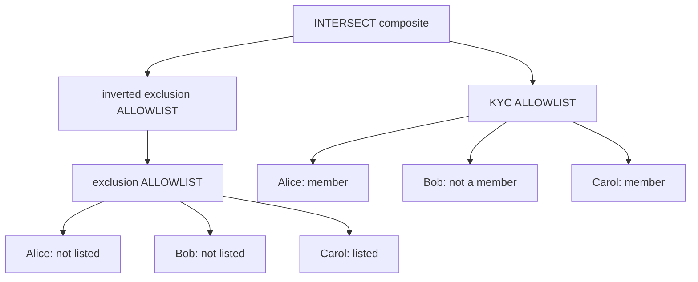

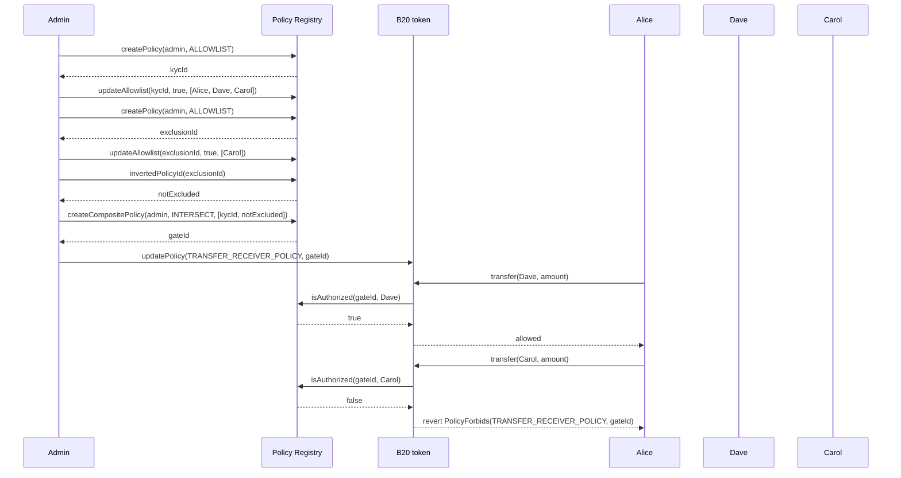

Alice and Dave are on the KYC list and not on the exclusion list. The inverted child authorizes them, so the `INTERSECT` returns `true`. Carol is KYC'd but on the exclusion list. The inverted child returns `false`, so the composite returns `false` and the transfer reverts. Bob is not on the KYC list, so he is denied even though he is not excluded.

A later `updateAllowlist` that adds or removes Carol on `exclusionId` changes the inverted child on the next call. The token still holds `gateId`. The issuer does not call `updatePolicy` again.

## Events and Errors

### Token

| Event                                                  | Emitted by                                               |
| ------------------------------------------------------ | -------------------------------------------------------- |
| `PolicyUpdated(policyScope, oldPolicyId, newPolicyId)` | `updatePolicy`; also token creation (`oldPolicyId == 0`) |

| Error                                  | Thrown when                                                                              |
| -------------------------------------- | ---------------------------------------------------------------------------------------- |
| `PolicyForbids(policyScope, policyId)` | A deny-on-false scope rejected the account                                               |
| `PolicyNotFound(policyId)`             | `updatePolicy` was given an ID that is not a sentinel and does not exist in the registry |
| `UnsupportedPolicyType(policyScope)`   | `policyScope` is not a slot this token supports                                          |
| `AccountNotSeizable(account)`          | `seizeWithMemo` `from` is still authorized under `SEIZE_HOLDER_POLICY`                   |
| `AccountNotBlocked(account)`           | Deprecated `burnBlocked` `from` is still authorized under `TRANSFER_SENDER_POLICY`       |

### Policy Registry

| Event                                                       | Emitted by                                                          |
| ----------------------------------------------------------- | ------------------------------------------------------------------- |
| `PolicyCreated(policyId, creator, policyType)`              | `createPolicy`, `createPolicyWithAccounts`, `createCompositePolicy` |
| `PolicyAdminStaged(policyId, currentAdmin, pendingAdmin)`   | `stageUpdateAdmin`                                                  |
| `PolicyAdminUpdated(policyId, previousAdmin, newAdmin)`     | `finalizeUpdateAdmin`, `renounceAdmin`; also policy creation        |
| `AllowlistUpdated(policyId, updater, allowed, accounts)`    | `updateAllowlist`                                                   |
| `BlocklistUpdated(policyId, updater, blocked, accounts)`    | `updateBlocklist`                                                   |
| `CompositePolicyUpdated(policyId, updater, childPolicyIds)` | `createCompositePolicy`, `updateComposite`                          |

| Error                               | Thrown when                                                                        |
| ----------------------------------- | ---------------------------------------------------------------------------------- |
| `Unauthorized()`                    | Caller is not the policy admin (or not the pending admin on `finalizeUpdateAdmin`) |
| `PolicyNotFound()`                  | The referenced policy ID does not exist                                            |
| `IncompatiblePolicyType()`          | The call does not match the policy's type                                          |
| `ZeroAddress()`                     | A required address argument was `address(0)`                                       |
| `BatchSizeTooLarge(maxBatchSize)`   | A membership batch exceeded 64 accounts                                            |
| `NoPendingAdmin()`                  | `finalizeUpdateAdmin` was called with no staged admin                              |
| `ChildPoliciesOutsideOfRange()`     | A composite's child count is outside `[2, 4]`                                      |
| `InvalidChildPolicy(childPolicyId)` | A composite child is not an existing simple policy                                 |
| `NonPayable()`                      | ETH was attached to a registry call                                                |

