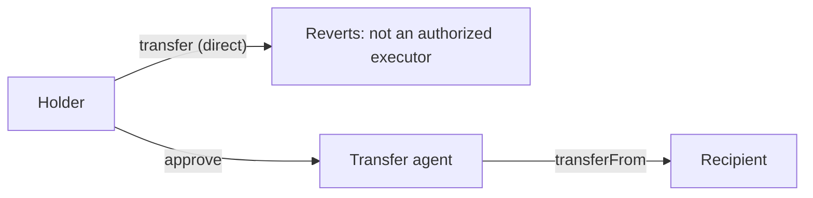
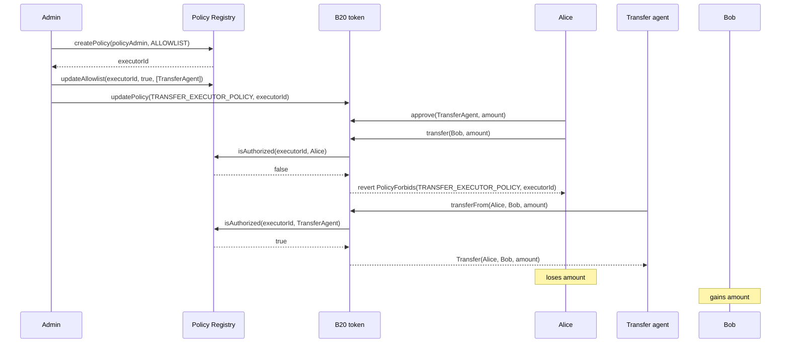
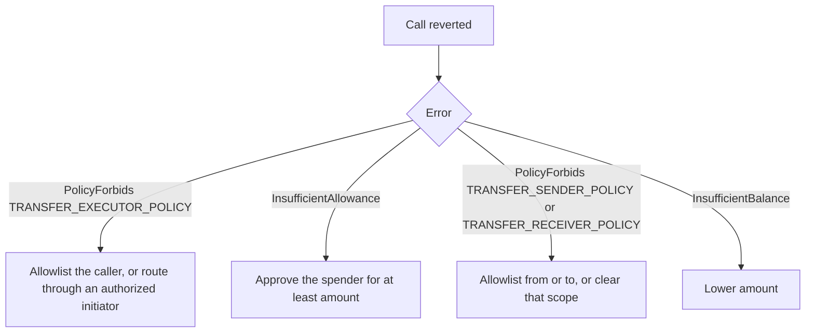

# Restrict who can initiate transfers

## Goal

Restrict which account may act as the initiator of a transfer, separate from who may send or receive. `TRANSFER_EXECUTOR_POLICY` gates `msg.sender` on every transfer path — `transfer`, `transferFrom`, and their memo variants — including when the initiator is also the holder (`msg.sender == from`).

A restricted security token needs this control. Regulation can require every transfer to go through a registered transfer agent, so a holder cannot self-initiate a `transfer` even to an already-eligible counterparty. Only the transfer agent's contract may move tokens, using its own `transferFrom` call against an allowance the holder grants in advance.



This surface exists on both B20 Asset and B20 Stablecoin. The rest of this guide uses "the token" for either variant.

## Before You Start

You need all of the following:

- A B20 token you administer.
- `DEFAULT_ADMIN_ROLE` on that token, so you can call `updatePolicy`.
- A policy admin able to create and manage a policy in the Policy Registry. Token admin and policy admin are separate roles; the same account can hold both.
- The address of the sole intended initiator (the transfer agent contract, or any account you want to allow).
- `TRANSFER` not paused.

### Which account is checked

Transfer has three independent policy scopes. All three are enforced inside the same shared transfer path, so they apply the same way to `transfer`, `transferFrom`, and their memo variants:

| Scope | Account checked | Default when unset (`0`) |
| --- | --- | --- |
| `TRANSFER_SENDER_POLICY` | `from` | Always allow |
| `TRANSFER_RECEIVER_POLICY` | `to` | Always allow |
| `TRANSFER_EXECUTOR_POLICY` | `msg.sender` | Always allow |

`TRANSFER_EXECUTOR_POLICY` checks the initiator, not the holder. On `transfer`, the initiator is also `from` — the same account. On `transferFrom`, the initiator is the caller, which may be a different account than `from`. Both paths run the same check against `msg.sender`. There is no carve-out for a holder acting on their own behalf: once you attach a restrictive executor policy, a holder must be authorized under it to call `transfer`, or to call `transferFrom` with themselves as `from`.

### Allowance is a separate gate

`transferFrom` still requires the caller to hold an ERC-20 allowance from `from`. The executor policy and the allowance answer different questions: the allowance says "this caller may spend up to this amount," and the executor policy says "this caller may initiate a transfer at all." A transfer agent needs both — an allowance from each holder it moves tokens for, and a place on the executor allowlist. Granting one does not grant the other.

## Steps

Configure the executor allowlist, then confirm both the denied and allowed paths.

1. Create an `ALLOWLIST` policy for authorized initiators.
2. Add the transfer agent to that allowlist.
3. Attach the allowlist to `TRANSFER_EXECUTOR_POLICY`.
4. Have the holder approve the transfer agent for the amount it will move.
5. Confirm a direct transfer from the holder is denied.
6. Confirm the transfer agent's `transferFrom` is allowed.

### 1. Create an executor allowlist

```solidity
uint64 executorId = POLICY_REGISTRY.createPolicy(policyAdmin, IPolicyRegistry.PolicyType.ALLOWLIST);
```

The member set starts empty. Every account is still authorized until you attach this ID — creating the policy alone changes nothing.

### 2. Add the transfer agent

Only the policy admin can change membership.

```solidity
address[] memory initiators = new address[](1);
initiators[0] = transferAgent;
POLICY_REGISTRY.updateAllowlist(executorId, true, initiators);
```

`createPolicyWithAccounts` can create the policy and seed the first member in one call. Batches are capped at 64 accounts.

### 3. Attach the allowlist to `TRANSFER_EXECUTOR_POLICY`

```solidity
token.updatePolicy(token.TRANSFER_EXECUTOR_POLICY(), executorId);
```

From this call forward, every `transfer` and `transferFrom` on this token checks `msg.sender` against `executorId`. A holder who is not on the allowlist can no longer initiate a transfer, including one of their own tokens.

### 4. Approve the transfer agent

The executor allowlist controls who may initiate. It does not grant spending rights. Each holder still approves the transfer agent for the amount it will move on their behalf:

```solidity
vm.prank(alice);
token.approve(transferAgent, amount);
```

### 5. Confirm the direct path is denied

```solidity
vm.prank(alice);
token.transfer(bob, amount); // reverts PolicyForbids(TRANSFER_EXECUTOR_POLICY, executorId)
```

Alice holds a balance and, after step 4, an allowance for the transfer agent — but she is not on the executor allowlist, so the call reverts before balance is checked.

### 6. Confirm the transfer agent's path succeeds

```solidity
vm.prank(transferAgent);
token.transferFrom(alice, bob, amount);
```

The transfer agent is on the executor allowlist and holds an allowance from Alice, so both gates pass and the transfer completes.

## Example

A transfer agent is the only account allowed to move tokens on this asset. Alice holds a balance and has approved the transfer agent. Her own direct `transfer` reverts; the transfer agent's `transferFrom` succeeds.



```solidity
import {IB20} from "base-std/interfaces/IB20.sol";
import {IPolicyRegistry} from "base-std/interfaces/IPolicyRegistry.sol";
import {StdPrecompiles} from "base-std/StdPrecompiles.sol";

IB20 token = IB20(tokenAddr);
IPolicyRegistry registry = StdPrecompiles.POLICY_REGISTRY;

uint64 executorId = registry.createPolicy(policyAdmin, IPolicyRegistry.PolicyType.ALLOWLIST);
address[] memory initiators = new address[](1);
initiators[0] = transferAgent;
registry.updateAllowlist(executorId, true, initiators);
token.updatePolicy(token.TRANSFER_EXECUTOR_POLICY(), executorId);

// Alice approves the transfer agent, but is not herself an authorized initiator.
vm.prank(alice);
token.approve(transferAgent, amount);

vm.prank(alice);
token.transfer(bob, amount); // reverts PolicyForbids(TRANSFER_EXECUTOR_POLICY, executorId)

vm.prank(transferAgent);
token.transferFrom(alice, bob, amount); // succeeds
```

## Verify

Look for `Transfer(from, to, amount)` on the transfer agent's `transferFrom` call. That event is the success signal.

A revert on the holder's own `transfer` or self-`transferFrom` with `PolicyForbids(TRANSFER_EXECUTOR_POLICY, executorId)` confirms the restriction is active — it means the holder is not on the executor allowlist, not that anything is misconfigured.

To confirm the allowlist itself, call `isAuthorized(executorId, account)` on the Policy Registry for both the transfer agent (`true`) and the holder (`false`).

## Common Errors

These errors follow the order the shared transfer path checks them.

| Error | Why it happened | What to do |
| --- | --- | --- |
| `PolicyForbids(TRANSFER_EXECUTOR_POLICY, policyId)` | The caller is not authorized under the attached executor policy. This fires for `transfer`, for `transferFrom`, and for a holder's self-`transferFrom` — there is no exemption for `msg.sender == from`. | Add the caller to the executor allowlist, or route the call through an already-authorized initiator such as the transfer agent. |
| `InsufficientAllowance(spender, allowance, needed)` | `transferFrom` ran with an allowance below `needed`. Passing the executor check does not grant spending rights. | Have `from` call `approve(spender, amount)` for at least `amount`. |
| `PolicyForbids(TRANSFER_SENDER_POLICY, policyId)` | `from` is not authorized under the sender policy. Independent of the executor check. | Add `from` to the sender allowlist, or clear the sender policy back to `0`. |
| `PolicyForbids(TRANSFER_RECEIVER_POLICY, policyId)` | `to` is not authorized under the receiver policy. Independent of the executor check. | Add `to` to the receiver allowlist, or clear the receiver policy back to `0`. |
| `InsufficientBalance(sender, balance, needed)` | `sender`'s balance is less than `needed`. | Transfer `balanceOf(from)` or less. |
| `PolicyNotFound(uint64 policyId)` | `updatePolicy` received an ID that is not a sentinel and does not exist in the registry. | Create the policy first, then attach the returned ID. |
| `Unauthorized()` | A non-admin called `updateAllowlist` or `updateBlocklist` on the executor policy. | Call as the policy's `policyAdmin`. |



## Related Concepts

- [Policies](../concepts/policies.md)
- [Roles and Pause](../concepts/roles-and-pause.md)

## Reference

```solidity
function TRANSFER_EXECUTOR_POLICY() external view returns (bytes32);
function TRANSFER_SENDER_POLICY() external view returns (bytes32);
function TRANSFER_RECEIVER_POLICY() external view returns (bytes32);

function transfer(address to, uint256 amount) external returns (bool);
function transferFrom(address from, address to, uint256 amount) external returns (bool);
function approve(address spender, uint256 amount) external returns (bool);
function allowance(address owner, address spender) external view returns (uint256);

function updatePolicy(bytes32 policyScope, uint64 newPolicyId) external;
function policyId(bytes32 policyScope) external view returns (uint64);

// Policy Registry
function createPolicy(address admin, PolicyType policyType) external returns (uint64 newPolicyId);
function createPolicyWithAccounts(address admin, PolicyType policyType, address[] calldata accounts) external returns (uint64 newPolicyId);
function updateAllowlist(uint64 policyId, bool allowed, address[] calldata accounts) external;
function isAuthorized(uint64 policyId, address account) external view returns (bool);
```

`transfer(address,uint256)` selector: `0xa9059cbb`.

`transferFrom(address,address,uint256)` selector: `0x23b872dd`.

`approve(address,uint256)` selector: `0x095ea7b3`.

`updatePolicy(bytes32,uint64)` selector: `0xadf9c4ea`.

`PolicyForbids(bytes32,uint64)` selector: `0xa43fec12`.

`TRANSFER_EXECUTOR_POLICY` value: `keccak256("TRANSFER_EXECUTOR_POLICY")` = `0x10be5173aff2a44e748bd9acd8b19fe34689581398a9db7ba2fb671e786ff7d8`.
