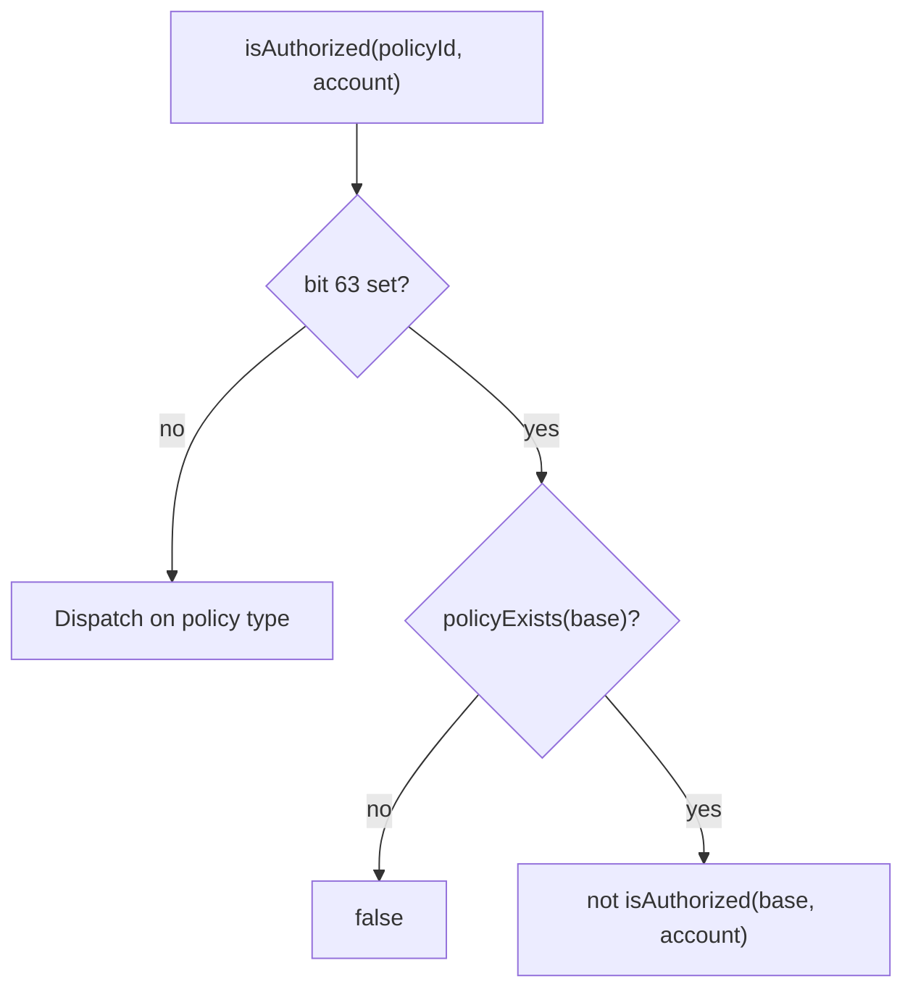

## Signature

```solidity IPolicyRegistry.sol
function isAuthorized(uint64 policyId, address account) external view returns (bool);
```

| Field | Value |
|---|---|
| Selector | `0x55a1179e` |
| Canonical signature | `isAuthorized(uint64,address)` |

## Description

Returns whether `account` is authorized under `policyId`. Never reverts.

Unknown or malformed IDs collapse to empty-member-set semantics (`ALLOWLIST` → `false`, `BLOCKLIST` → `true`).

Callers that store policy IDs MUST validate `policyExists(policyId)` at write time.

### Invert (NOT) semantics

When bit 63 of `policyId` is set (the invert flag), `isAuthorized` resolves the base policy (`policyId & ~INVERT_BIT`) and returns the **opposite** of its result:

- If the base policy does not exist, returns `false` (fail-closed). A missing or malformed base is never treated as allow-everyone.
- If the base policy exists, returns `!isAuthorized(base, account)`.

This applies to every policy type: `ALLOWLIST`, `BLOCKLIST`, `UNION`, and `INTERSECT`.

Use `invertedPolicyId(policyId)` to set or clear bit 63. The inverted ID has no record of its own; members live on the base.



## Parameters

| Name | Type | Description |
|---|---|---|
| `policyId` | `uint64` | Policy to query. Bit 63 may be set to invert the result. |
| `account` | `address` | Account to check. |

## Returns

`bool` — `true` if `account` is authorized under `policyId`, `false` otherwise.

## Access Control

View function. No role or admin restriction.

## Policy Interaction

This is part of the singleton PolicyRegistry surface used by B20 policy scopes.

## Example

```solidity Usage Example
// Plain policy
bool ok = StdPrecompiles.POLICY_REGISTRY.isAuthorized(policyId, account);

// Inverted policy: authorized if account is NOT in the base policy's member set
uint64 notExcluded = StdPrecompiles.POLICY_REGISTRY.invertedPolicyId(exclusionId);
bool notOnExclusionList = StdPrecompiles.POLICY_REGISTRY.isAuthorized(notExcluded, account);
```
