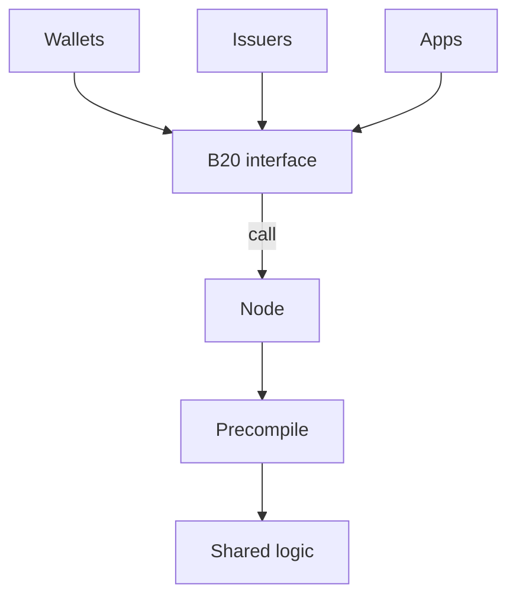
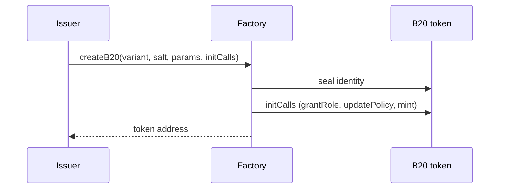
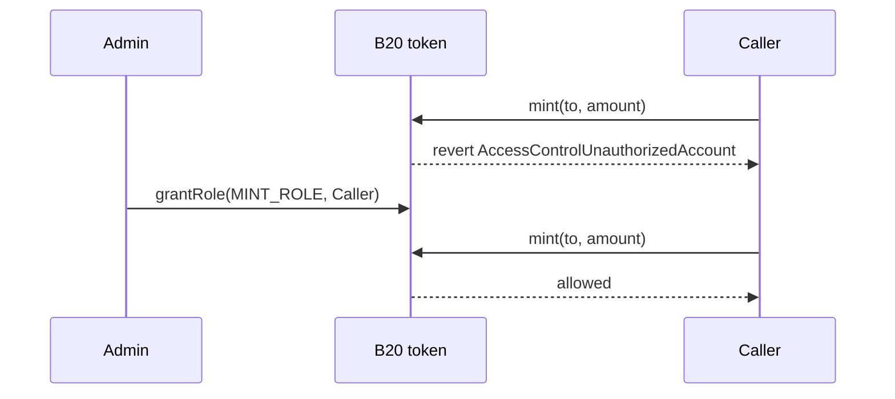
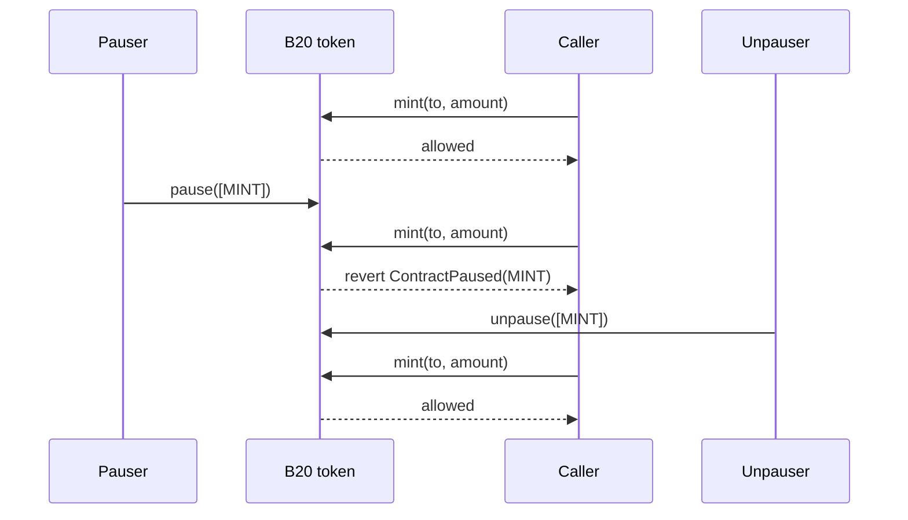
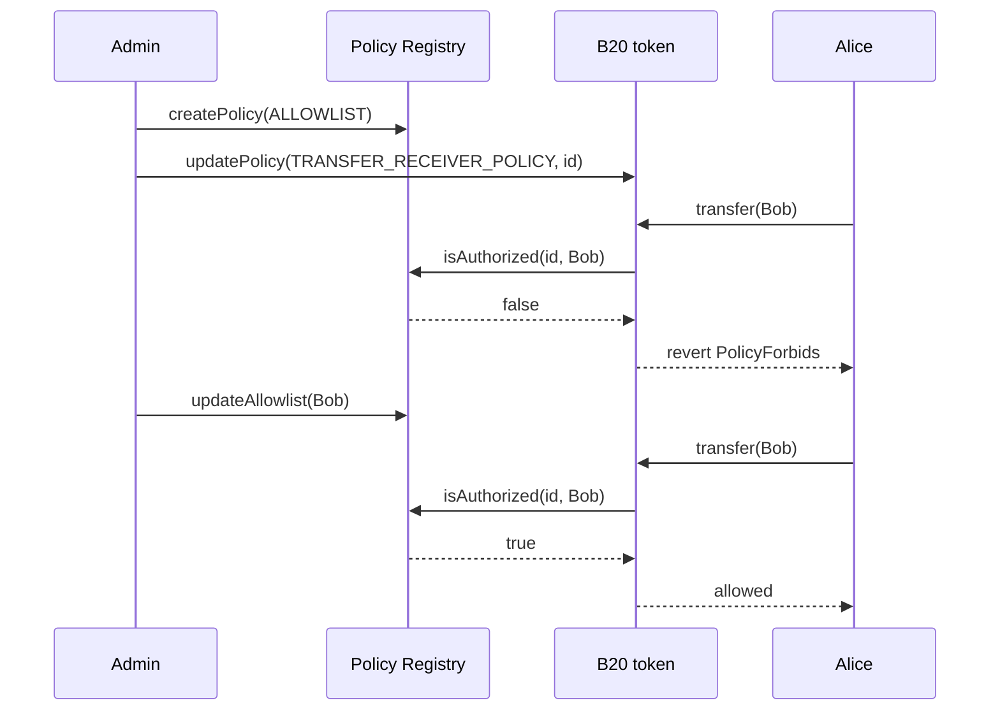

B20 is Base's native token standard for issuing and managing programmable assets onchain.

This document provides a high-level introduction to B20: what it is, why it exists, the core primitives it exposes, and how those pieces fit together.

---

## What is B20?

B20 is Base's native token standard for issuing and managing programmable assets onchain. It standardizes real-world asset (RWA) and stablecoin issuance. B20 is an ERC-20 superset: balances, transfers, and approvals work like ERC-20. B20 assets also use shared interfaces and protocol logic instead of requiring an issuer to deploy a custom token implementation for each asset.

The standard also includes compliance and administrative controls. Issuers can configure roles and permissions, attach policies, mint and burn supply, pause operations, and perform other administrative actions that regulated-asset workflows typically require.

B20 runs as precompiles in the Base node, not as per-token Solidity. Wallets, issuers, and apps call ERC-20-style interfaces, and the node runs shared B20 logic natively. Base upgrades that logic through hardforks.

### At a Glance

You call a B20 asset through its interface at the asset address. Integrators can target the shared B20 interface and precompile logic.

---

## Why B20?

Real-world asset (RWA) issuance onchain can require a shared token standard with compliance built into the asset. ERC-20 covers balances, transfers, and approvals. Regulated-asset workflows can also require eligibility checks, roles, mint and burn, pausing, and other administrative controls. Without a shared standard, issuers can need to implement these primitives separately.

Separate token implementations can differ in behavior and require wallets and apps to integrate the implementations they support. With B20, you create an asset and configure its roles and policies instead of writing and maintaining a one-off token. Compliance controls are built into the token standard rather than added around transfers.

A shared standard gives integrators and issuers a common interface. Wallets and apps can integrate against that interface. It can also support shared services, such as oracles, without a new integration for each asset.

---

## Creating a B20 Asset

To create a B20 token, submit `createB20` to the [Factory](/specifications/b20/reference/interfaces/ib20-factory), a singleton precompile, through a Base node.

1. The issuer calls `createB20` with a variant, a salt, and creation parameters (name, symbol, initial admin, and variant-specific fields).
2. The Factory assigns a deterministic address from `(variant, sender, salt)` and seals the token's identity.
3. Optional `initCalls` run on the new token so the issuer can grant roles, attach policies, or mint in the same transaction.
4. `createB20` returns. The Factory retains no ongoing access to the token.

For general-purpose issuance, including RWAs, choose [**Asset**](/build-on-base/issue-rwa/create-an-asset-token). For a fiat-pegged token with a fixed currency code, choose [**Stablecoin**](/build-on-base/issue-stablecoins/issue-your-stablecoin). Both variants share roles, policies, and the ERC-20 surface.

The [Activation Registry](/specifications/b20/reference/interfaces/i-activation-registry) is a Base-operated switch that turns Factory and token features on. Issuers and apps do not operate it.

---

## Configuring Roles

Roles let an issuer assign each privileged operation to a specific account. An admin can grant minting to a minter or seizing to a compliance operator. An admin can also pause one feature (`TRANSFER`, `MINT`, `BURN`, or `SEIZE`) without pausing the rest of the token.

B20 uses an [OpenZeppelin AccessControl](https://docs.openzeppelin.com/contracts/5.x/access-control)-compatible role model on the token. Roles are not a separate registry. A `DEFAULT_ADMIN_ROLE` holder grants and revokes operating roles. A privileged call checks the role first, then the matching pause vector. A holder `transfer` skips the role check, but it still checks the `TRANSFER` pause vector and policy.

The full role list and what each role gates is in [Roles](/specifications/b20/reference/interfaces/ib20). A role-gated call looks like this:

1. At creation, `initialAdmin` holds `DEFAULT_ADMIN_ROLE`.
2. That admin grants operating roles such as `MINT_ROLE` and `PAUSE_ROLE`.
3. A caller without the required role is rejected with `AccessControlUnauthorizedAccount`.

---

## Pause Vectors

When an offchain workflow needs a feature frozen, such as during a settlement window or incident response, an issuer can use a pause vector. A pause vector stops that class of operations without pausing the rest of the asset.

Pause is per feature, not global. The four vectors are `TRANSFER`, `MINT`, `BURN`, and `SEIZE`. Pausing `MINT` halts new issuance while transfers continue. `approve` is not pause-gated.

`pause` requires `PAUSE_ROLE`. `unpause` requires `UNPAUSE_ROLE`. Those roles are separate, so the account that pauses does not have to be the account that resumes.

A paused call looks like this:

1. A caller who holds `MINT_ROLE` can mint while `MINT` is unpaused.
2. An account with `PAUSE_ROLE` pauses `MINT`. Other features stay live.
3. The next `mint` reverts with `ContractPaused(MINT)`, even if the caller still holds `MINT_ROLE`.
4. An account with `UNPAUSE_ROLE` unpauses `MINT`. Minting works again.

---

## Integrating Compliance Checks

B20 models compliance checks as a set of addresses and an allow-or-deny decision for a specific function. To enforce a check, you maintain an allowlist or blocklist and bind it to a token function. The call then proceeds or reverts.

Those lists live in the [Policy Registry](/specifications/b20/reference/interfaces/i-policy-registry), a global singleton precompile, not on the token. Allowlists, blocklists, and composite policies (union or intersect) are stored there and referenced by policy ID. A policy ID can be bound to multiple tokens. Updating its membership changes authorization results for tokens that reference it.

To bind a policy ID to a policy scope, a token admin calls `updatePolicy`. A scope runs on a specific function, similar to a hook. When that function runs, the token asks the registry `isAuthorized(policyId, account)` and reverts with `PolicyForbids` if the check fails. See [Policies](/specifications/b20/reference/interfaces/ib20/policy-id#policy-scopes) for the scope that runs on each function.

A policy-gated transfer looks like this:

1. Create an allowlist or blocklist on the registry.
2. The token admin binds that policy ID to a scope.
3. On `transfer`, the token asks the registry whether the receiver is authorized.
4. Authorized: the call continues. Denied: the call reverts with `PolicyForbids`.
5. Unset scopes default to always-allow. `approve` is not policy-gated.

---

## See Also

<CardGroup cols={2}>
  <Card title="B20 Interfaces" icon="code" href="/specifications/b20/reference/constants-addresses">
    View B20 precompile addresses, roles, policy scopes, and variant constants.
  </Card>
</CardGroup>
