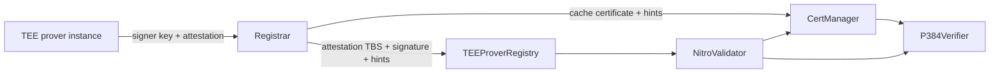

The registrar is an offchain service that maintains the signer set in
[`TEEProverRegistry`](https://github.com/base/contracts/blob/main/src/L1/proofs/tee/TEEProverRegistry.sol).
It discovers Base TEE prover instances, obtains an AWS Nitro attestation for each enclave signer,
generates P-384 verification hints locally, caches the attestation certificate chain on L1, and
submits the final signer registration.

This flow replaces the previous RISC Zero attestation proof and external Boundless proving path.
There is no runtime backend selector or fallback to ZK verification. The TEE proof format,
`TEEVerifier`, `AggregateVerifier`, `TEE_IMAGE_HASH`, and SP1 state-proof behavior are unchanged.
Registration requires the hinted-compatible registrar and prover-host signer API.

## Responsibilities

A conforming registrar performs the following work:

1. Discover TEE prover instances behind the configured AWS load balancer.
2. Fetch each enclave's secp256k1 public key and a fresh Nitro attestation bound to that signer.
3. Parse the COSE and X.509 data without changing the signed encodings.
4. Validate the expected signer, nonce, PCR0, trust anchor, certificate order, and freshness locally.
5. Generate the checked P-384 inverse hints required by the onchain verifier.
6. Reuse valid cached certificates and cache missing certificates in parent-first order.
7. Submit the final attestation to `TEEProverRegistry.registerSigner()`.
8. Optionally monitor AWS certificate revocation lists and persist confirmed revocations on L1.
9. Deregister signers whose backing prover instances are no longer active.

The registrar does not select the accepted enclave image. Registration records the attested PCR0,
but [`TEEVerifier`](https://github.com/base/contracts/blob/main/src/L1/proofs/tee/TEEVerifier.sol)
accepts a signer only when its recorded image hash matches the active `TEE_IMAGE_HASH`. This allows
the next image's signers to be registered before an image rotation without allowing them to produce
accepted proofs early.

## Architecture



The onchain validation stack contains three contracts:

| Contract | Role |
| --- | --- |
| `P384Verifier` | Verifies P-384 signatures while checking caller-supplied modular inverse hints. |
| `CertManager` | Pins the AWS Nitro root, verifies and caches non-root certificates, and enforces certificate expiry and revocation. |
| `NitroValidator` | Parses the signed Nitro attestation, re-walks the cached certificate chain, and verifies the final COSE signature. |

`TEEProverRegistry` holds an immutable `NitroValidator` reference. The registrar discovers
`CertManager` through `TEEProverRegistry.NITRO_VALIDATOR()` and `NitroValidator.certManager()`;
operators do not configure those addresses separately.

## Driver Loop

The registrar runs one polling loop:

1. Query AWS ALB and EC2 for the current prover instances.
2. Probe `/readyz` on every non-draining target. The load balancer's `/healthz` is registration-gated,
   so it cannot be used to bootstrap registration.
3. Resolve signer public keys and attestations concurrently, bounded by `max_concurrency`.
4. Start one registration task per eligible signer and cancel tasks whose signer is no longer eligible.
5. Read the onchain signer set and deregister unprotected signers when discovery was conclusive.
6. Sleep for `poll_interval`, or stop on cancellation.

Only instances that pass `/readyz` are eligible for new registrations. Draining instances still
contribute their known signer addresses to the active set so a rotation does not immediately
deregister them.

When an instance disappears or becomes unhealthy, the registrar preserves its last-known signers
for `instance_cache_ttl_cycles`. It skips the entire orphan pass while any instance remains
unresolved. Pending registration tasks are also protected from orphan cleanup.

Discovery supports AWS ELBv2 target groups whose targets are EC2 instances. Targets whose IDs do
not start with `i-` are ignored. AWS API errors and missing EC2 data abort the tick and skip orphan
cleanup, but an empty target group is a conclusive result. The last-known-signer cache is in memory
and starts empty after a process restart. Operators must therefore configure and monitor the target
group carefully: a cold registrar pointed at an empty target group has no cached signers to protect.

## Attestation Challenge

Each signer receives a deterministic 32-byte nonce:

```text Attestation Nonce
keccak256(
  "base-proof-tee-registrar:attestation-nonce:v1" ||
  teeProverRegistryAddress ||
  signerAddress
)
```

The registrar requests one attestation per signer with that nonce. It rejects the response unless:

- the attested `public_key` derives to the expected signer address;
- the attested nonce exactly matches the deterministic challenge;
- PCR0 is present, is 48 bytes, and is not the all-zero debug-mode measurement;
- the certificate chain starts at the pinned AWS Nitro root;
- the certificate chain is ordered parent-first and ends in one leaf certificate; and
- the attestation remains within the configured local freshness window.

The deterministic challenge binds the attestation to one registry and signer without requiring
registrar state across restarts. `TEEProverRegistry` independently enforces timestamp freshness,
but nonce matching is a registrar policy check because `NitroValidator` only exposes the signed
nonce to its caller.

## Registration Plan

The registrar preserves the exact protected-header and payload encodings from the input
`COSE_Sign1` document when constructing the signed `Sig_structure`. Re-encoding signed CBOR would
change the message and invalidate the AWS signature.

For parity with the pinned `NitroValidator`, the registrar accepts an optional compact `0xD2` tag
followed by the compact `0x84` `COSE_Sign1` array, the ES384 protected header `0x44a1013822`, a
96-byte P-384 signature, and no trailing COSE or TBS data. The payload, `pcrs`, and `cabundle`
containers may use definite or indefinite lengths. Unknown payload keys are skipped, but recognized
keys must be unique.

The parsed plan contains:

- the signer derived from the 65-byte `0x04 || x || y` secp256k1 public key;
- PCR0, timestamp, and nonce;
- the pinned root certificate;
- non-root CA certificates followed by the leaf certificate;
- the exact attestation to-be-signed bytes and 96-byte P-384 signature; and
- cache and revocation identifiers matching `CertManager`.

The pinned root cache key is `keccak256(root DER)`. Every non-root cache key is
`keccak256(TBSCertificate DER)`, excluding the malleable outer ECDSA signature. Non-root revocation
uses `keccak256(issuerHash || serialHash)`. `issuerHash` hashes the issuer Name content octets,
excluding its DER tag and length. `serialHash` hashes the serial INTEGER content octets, including a
leading `0x00` used for DER sign extension. These identities remain stable across equivalent outer
certificate encodings.

## P-384 Hints

AWS signs Nitro certificates and attestations with ECDSA over P-384. P-384 verification requires
many modular inversions, which are expensive to compute in the EVM. The registrar computes each
inverse offchain and supplies it as a hint.

For every division by `b` modulo a prime `m`, the contract checks:

```text Inverse Check
b * hint == 1 (mod m)
```

The hint is used only after this equality holds. Since an invertible value has one inverse modulo a
prime, a passing hint is the same value the contract would have computed. Incorrect, truncated, or
surplus hints revert. Hints affect liveness, not correctness: a faulty generator can prevent a
registration but cannot make an invalid signature pass.

Each hint stream is a concatenation of 48-byte big-endian inverses in the verifier's deterministic
consumption order. The registrar generates one stream for every non-root certificate signature and
one for the final attestation signature. Production hint generation is native Rust and does not
invoke Node, Go, or an external proving service.

## Certificate Cache

`CertManager` stores the pinned AWS Nitro root at deployment. The registrar processes every
remaining certificate in parent-first order:

1. Read the candidate's cached metadata and revocation state.
2. If cached, require the expected CA or leaf role, an unexpired validity period, the original
   parent binding, and a complete unrevoked path to the pinned root.
3. If not cached, call `verifyCACertWithHints()` or `verifyClientCertWithHints()` with the DER
   certificate, parent cache key, and signature hints.
4. Re-read state after the transaction. A transaction error is treated as success if the expected
   usable cache entry is now present.

Cache writes are permissionless because all certificate data and hints are verified onchain.
Per-certificate locks prevent concurrent signer tasks from submitting duplicate cache transactions
for a shared chain. On restart or after a partial failure, the registrar reads the cache again and
continues from the first missing certificate.

For a typical Nitro chain with three non-root CAs, transaction counts are:

| Cache state | Transactions |
| --- | ---: |
| Empty | 5: three CA cache writes, one leaf cache write, one registration |
| CA chain cached, new leaf | 2: one leaf cache write, one registration |
| CA chain and leaf cached | 1: registration only |

Each signature verification is split into its own transaction so it remains below the EIP-7825
per-transaction gas limit. Final registration intentionally supplies no certificate hints;
`NitroValidator` succeeds only if the complete chain is already cached and usable.

## Final Registration

After the cache is ready, the registrar calls:

```solidity Registration Call
TEEProverRegistry.registerSigner(attestationTbs, signature, hints)
```

The registry permits only its owner or manager to call this method. It delegates cryptographic and
certificate validation to `NitroValidator`, then applies Base-specific policy:

1. Reject attestations at least 60 minutes old.
2. Reject attestations whose second-level timestamp is greater than or equal to `block.timestamp`.
3. Require PCR0 at index zero, exactly 48 bytes, and not the debug-mode measurement.
4. Require a 65-byte uncompressed secp256k1 public key.
5. Derive the signer as the last 20 bytes of `keccak256(x || y)`.
6. Store the signer as registered and record `keccak256(PCR0)` as its image hash.

The registrar uses a 3,300-second default local freshness limit, leaving submission headroom under
the registry's 3,600-second limit. It checks freshness before every certificate, revocation, and
registration transaction so a multi-transaction cold flow stops before submitting stale material.

Before each registration attempt, and after ambiguous transaction errors, the registrar reads
`isRegisteredSigner(signer)`. An observed registration is treated as success. Retryable transaction
errors use bounded exponential backoff; reverted receipts and non-retryable errors fail the current
task.

## Certificate Revocation

`CertManager` maintains a durable revocation set and an immutable pinned AWS Nitro root. The owner
can revoke or unrevoke the root as an emergency halt, set the non-root revoker, and unrevoke
certificate identities. The revoker role can revoke non-root issuer/serial identities. Revocation
is checked during cold verification, cache reuse, and the final cached-chain walk.

For every registration attempt, the registrar checks the pinned root and every planned certificate
against `CertManager.isRevoked()`. A confirmed onchain revocation rejects the registration.

When CRL fetching is additionally enabled, the registrar:

1. Fetches CRLs only from allowlisted AWS Nitro hosts, without redirects and with a 10 MiB response
   limit.
2. Matches intermediate certificate serial numbers against the CRLs.
3. Calls `CertManager.revokeCert()` for confirmed revocations before rejecting the registration.

CRL fetch and parse failures are fail-open and retried on later cycles. Confirmed onchain
revocations always fail closed.

## Orphan Deregistration

After registration task reconciliation, the registrar computes:

```text Orphan Formula
orphans = registered signers - active signers - pending signers
```

It calls `deregisterSigner()` for each orphan only when discovery completed without unresolved
instances and the configured last-known-signer grace period has expired. Deregistration removes the
registered flag and stored image hash. This flow assumes one registrar controls a given registry;
independent registrars would otherwise classify each other's signers as orphans.

## Upgrade Compatibility

The hinted migration upgrades the existing `TEEProverRegistry` proxy implementation. It preserves
the proxy storage layout, owner, manager, game type, proposers, registered signers, and stored signer
image hashes. The active registrar and registry support only the new three-argument hinted API.

The migration does not change:

- Nitro enclave signer generation or attestation production;
- PCR0-based image selection in `TEEVerifier`;
- `AggregateVerifier` behavior;
- TEE proposal and dispute proof formats; or
- SP1 state-proof behavior.

## Operator Inputs

A registrar requires:

- an L1 RPC endpoint and `TEEProverRegistry` address;
- AWS region and ALB target group ARN;
- the prover JSON-RPC port;
- an L1 transaction signer and transaction-manager limits;
- attestation freshness, polling, timeout, concurrency, cache-grace, and retry settings; and
- health, logging, and Prometheus metrics settings.

No Boundless wallet, marketplace endpoint, RISC Zero program identifier, guest ELF, or proof-backend
selection is used. CRL monitoring is optional and requires the registrar transaction signer to hold
the configured `CertManager` revoker role. In the current CLI,
`--crl-nitro-verifier-address` or `BASE_REGISTRAR_CRL_NITRO_VERIFIER_ADDRESS` enables CRL fetching.
This legacy-named value is only an enable flag; contract discovery still follows the registry to
`NitroValidator` and then `CertManager`.

## Safety Requirements

A conforming implementation must preserve these properties:

- Preserve the exact signed COSE encodings when constructing the attestation TBS.
- Match the attested signer and deterministic nonce before any transaction is submitted.
- Pin the AWS Nitro root and reject malformed, expired, revoked, or parent-mismatched chains.
- Generate hints in the exact verifier order and rely on onchain checks for every supplied inverse.
- Cache certificates parent-first and recover by reading onchain state after every ambiguous result.
- Recheck freshness before each costly transaction in a cold registration.
- Recheck registration state before submission and after ambiguous transaction errors.
- Do not deregister signers while discovery is unresolved or during the configured grace period.
- Keep PCR0 acceptance at proof-submission time so image rotations can be staged safely.
- Do not add an unhinted, ZK, or externally proved runtime fallback to the hinted registration path.
